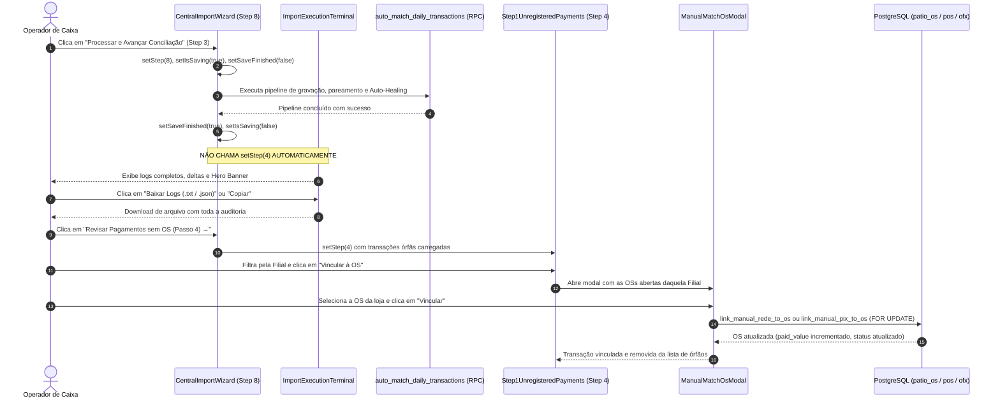

# SDD Design: Controle Total de Logs do Motor & Vínculo de OS Manual com Transações Órfãs

**Feature ID:** `326-controle-logs-motor-e-vinculo-os-manual-transacoes-orfas`  
**Data:** 08/09/2026  
**Status:** DESIGN TÉCNICO (Aguardando /apply)  

---

## 1. Arquitetura de Estados e Fluxo no Wizard



---

## 2. Detalhamento dos Componentes Afetados

### 2.1. `src/components/importacoes/CentralImportWizard.tsx`
- **Controle de Transição no `handleConfirm`:**
  - **Localização:** Linhas 1937–1947.
  - **Comportamento Atual:**
    ```typescript
    const realUnmatched = await fetchRealUnmatchedTransactions(targetDate);
    setUnmatchedTransactions(realUnmatched);
    if (realUnmatched.length > 0) {
      toast.info(`Automações e IA concluídas! ${realUnmatched.length} transação(ões) pendentes para revisão manual.`);
    } else {
      toast.success('🎉 100% das transações e OSs foram conciliadas automaticamente pelo motor e IA!');
    }
    setStep(4); // <--- O Salto Forçado
    ```
  - **Novo Comportamento:**
    ```typescript
    const realUnmatched = await fetchRealUnmatchedTransactions(targetDate);
    setUnmatchedTransactions(realUnmatched);
    setSaveFinished(true); // Marca finalização do processamento no Step 8
    
    // Se o usuário optou explicitamente por auto-avanço:
    if (autoAdvanceToStep4) {
      setStep(4);
    } else {
      toast.success('🎉 Motor de conciliação e IA concluídos com sucesso! Revise os logs e métricas abaixo.');
    }
    ```
- **Navegação de Retorno do Step 4 para o Step 8:**
  - Na linha 3211:
    ```tsx
    onBack={() => setStep(saveFinished ? 8 : 3)}
    ```
  - Permite ao operador retornar ao Step 8 para reinspecionar os logs do terminal a qualquer momento da conferência.

---

### 2.2. `src/components/importacoes/ImportExecutionTerminal.tsx`
- **Novas Funcionalidades de Exportação e Controle:**
  - **Estado Local / Props:**
    - `targetDate?: string`
    - `autoAdvance?: boolean`
    - `onToggleAutoAdvance?: (val: boolean) => void`
  - **Exportação de Logs em Texto (`.txt`):**
    ```typescript
    const handleDownloadTxt = () => {
      const textLogs = logs.map(l => `[${l.timestamp}] [${l.type.toUpperCase()}] ${l.message}${l.error?.details ? ` - ${l.error.details}` : ''}`).join('\n');
      const blob = new Blob([textLogs], { type: 'text/plain;charset=utf-8' });
      const url = URL.createObjectURL(blob);
      const a = document.createElement('a');
      a.href = url;
      a.download = `logs-conciliacao-${targetDate || new Date().toISOString().split('T')[0]}.txt`;
      a.click();
      URL.revokeObjectURL(url);
      toast.success('Download dos logs em .txt iniciado!');
    };
    ```
  - **Exportação Estruturada em JSON (`.json`):**
    ```typescript
    const handleDownloadJson = () => {
      const dataStr = JSON.stringify(logs, null, 2);
      const blob = new Blob([dataStr], { type: 'application/json;charset=utf-8' });
      const url = URL.createObjectURL(blob);
      const a = document.createElement('a');
      a.href = url;
      a.download = `auditoria-logs-${targetDate || new Date().toISOString().split('T')[0]}.json`;
      a.click();
      URL.revokeObjectURL(url);
      toast.success('Download dos logs em .json iniciado!');
    };
    ```
  - **Barra de Ferramentas do Terminal:**
    - Botões compactos com ícones: `[Copiar]`, `[Baixar TXT]`, `[Baixar JSON]`.
    - Indicador de status concluído com contagem de avisos e erros filtráveis.

---

### 2.3. `src/components/importacoes/MissingPatioOsEditor.tsx` (Step 2.5)
- **Blindagem do Valor Total vs Valor Pago:**
  - O campo `total_value` permanece totalmente editável pelo operador (orçamento e peças).
  - O campo `paid_value` passa a ser `readOnly` ou `disabled` com estilo sutil e tooltip instrutivo:
    ```tsx
    <div className="relative group">
      <input
        type="number"
        step="0.01"
        disabled
        value={item.paid_value}
        className="w-24 bg-zinc-950/60 border border-zinc-800 rounded px-2 py-1 text-right font-mono text-xs text-zinc-400 cursor-not-allowed opacity-75"
      />
      <div className="hidden group-hover:block absolute bottom-full mb-1 right-0 bg-zinc-900 border border-zinc-700 text-zinc-300 text-[10px] p-2 rounded shadow-xl z-20 w-48 text-left">
        O valor pago é liquidado automaticamente associando créditos de Cartão (Rede), PIX ou Dinheiro no Passo 4.
      </div>
    </div>
    ```
  - Remoção ou adaptação do botão "Dar Baixa em Todas": em vez de forçar `paid_value = total_value` arbitrário sem extrato, ele marca `status = 'finalizada'` apenas quando `paid_value >= total_value`, ou oferece confirmação explícita de baixa por cancelamento/dispensa de cobrança.

---

### 2.4. `src/components/importacoes/wizard/Step1UnregisteredPayments.tsx` & `ManualMatchOsModal.tsx`
- **Mesa de Liquidação por Filial:**
  - `Step1UnregisteredPayments.tsx` já agrupa órfãos por loja (`selectedStoreId`).
  - Ao clicar em `"Vincular à OS"` para uma transação de uma loja, o modal abre carregando as OSs de `patio_os` daquela mesma filial cujo saldo remanescente seja maior que zero:
    ```sql
    WHERE store_id = :storeId 
      AND (total_value - paid_value) > 0.05
    ```
  - Ao selecionar a OS candidata:
    - O modal exibe:
      - Número da OS e Placa;
      - Valor Total da OS;
      - Valor Já Pago;
      - Saldo em Aberto Restante;
      - Novo Saldo após o Vínculo ($\max(0, \text{Saldo} - \text{Valor da Transação})$).
    - Botão de Confirmação dispara `linkTransactionToOs(transaction.id, os.os_number, storeId, source, transaction.amount)`:
      - Se transação for Rede $\rightarrow$ RPC `link_manual_rede_to_os`;
      - Se transação for PIX $\rightarrow$ RPC `link_manual_pix_to_os`.
  - **Ação Rápida para Pagamento em Dinheiro no Balcão:**
    - No modal ou na listagem, caso o operador identifique que o cliente pagou em notas de dinheiro físico na oficina, disponibilizar o botão *"Registrar Recebimento em Espécie (Cofre Loja)"*, que incrementa `patio_os.cash_value` e atualiza `patio_os.paid_value`, debitando do saldo sem gerar registros órfãos em adquirentes ou bancos.

---

## 3. Matriz de Segurança e Não-Regressão

1. **Locks Pessimistas de Banco:** As RPCs `link_manual_rede_to_os` e `link_manual_pix_to_os` já utilizam `SELECT ... FOR UPDATE` tanto na transação (`pos_transactions` / `ofx_transactions`) quanto na OS (`patio_os`). Isso impede concorrência e dupla baixa.
2. **Revalidação Imediata do TanStack Query:**
   - Invalidação das chaves: `['reconciliation_views']`, `['available_store_os']`, `['daily-reconciliation-summary']`, `['patio_os']`, `['transactions']`.
3. **Cálculo da Diferença Final:**
   - O cálculo do fechamento diário soma:
     $$\text{Diferença} = (\text{Banco Itaú} + \text{Dinheiro Cofre} + \text{A Receber Cartões} + \text{Pátio Restante}) - \text{Faturamento DRE}$$
   - Ao vincular o PIX/Rede à OS, o Pátio Restante cai no mesmo valor em que o Banco/Cartão já estava contabilizado, mantendo a equação em perfeito equilíbrio zero.
