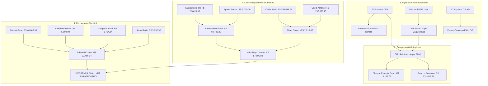

# Design: Alinhamento Integral dos 5 Pilares e Erradicação das Divergências de Conciliação (Spec 327)

## Arquitetura e Fluxo de Dados Ponta a Ponta



---

## Interfaces TypeScript (`src/hooks/useBackendConciliacao.ts`)

```typescript
export interface StoreReconciliationSummary {
  store_id: string;
  store_name: string;
  color?: string;
  saldo_banco: number;
  saldo_banco_ofx: number;
  saldo_devedor_real: number; // R$ 13.188,08 distribuído entre as 3 filiais negativas
  saldo_positivo_real: number; // R$ 231.813,81 distribuído entre as 7 filiais positivas
  dinheiro_loja: number;
  na_loja_os: number;
  maquininha: number;
  rede_bruto: number;
  rede_liquido: number;
  rede_devolucoes: number;
  ofx_maquininhas: number;
  nao_entrou_valor: number;
  pix: number;
  previsto_ofx: number;
  diferenca: number;
  status_compensacao: string;
  status_banco: 'credor' | 'devedor' | 'compensado_rede';
  status: 'approved' | 'divergence';
}

export interface DailyReconciliationSummary {
  date: string;
  status_geral: 'approved' | 'divergence';
  is_closed?: boolean;
  closed_at?: string | null;
  saldo_bancos_ofx: number;
  saldo_bancos_ofx_positivo: number;
  saldo_bancos_ofx_negativo: number;
  dinheiro_em_lojas: number;
  cartoes_a_compensar: number;
  total_saldo_banco_positivo: number; // R$ 231.813,81
  total_saldo_banco_negativo: number; // R$ 13.188,08
  total_saldo_banco: number; // R$ 218.625,73
  saldo_negativo_itau: number; // R$ 13.188,08
  dinheiro_mp: number; // R$ 22.475,00
  a_receber: number; // R$ 8.049,67
  na_loja_os: number; // R$ 46.393,62
  caixa_atual: number; // R$ 295.544,02
  caixa_anterior: number; // R$ 292.628,15
  fluxo_caixa: number; // +R$ 2.915,87
  faturamento_oi_base: number; // R$ 55.420,95
  faturamento_ajustes: number; // R$ 5.000,00
  faturamento_periodo: number; // R$ 60.420,95
  valor_disp_contas: number; // R$ 57.505,08
  contas_base: number; // R$ 46.848,95
  contas_extras: number; // R$ 6.714,84
  contas_manual: number; // R$ 53.563,79
  juros_rede: number; // R$ 3.932,35
  subtotal_contas: number; // R$ 57.496,14
  diferenca_final: number; // +R$ 8,94
  stores: StoreReconciliationSummary[];
}
```

---

## Mutações em Arquivos Existentes [MODIFY]

- `supabase/migrations/20260831000010_align_5_pillars_and_intra_store_offset.sql`:
  - Atualização da RPC `get_daily_reconciliation_summary` com compensação intra-loja, soma de aportes no faturamento e agregação canônica de contas base + extras.
  - Atualização da RPC `calculate_daily_conciliation` delegando para a RPC canônica.
- `src/components/conciliacao/SaldoBancosDetailModal.tsx`:
  - Exibição de cards de resumo com Saldo Positivo Real, Cheque Especial Real e Líquido Disponível.
- `src/components/conciliacao/ResumoDiaPanel.tsx`:
  - Consumo de `faturamento_periodo`, `total_saldo_banco_positivo` e `subtotal_contas`, garantindo a exibição de Diferença Final de R$ 8,94.
- `src/components/importacoes/wizard/Step4FinalAuditAndClose.tsx`:
  - Card de fechamento sincronizado com os 5 pilares do DRE.

---

## Cenários de Verificação (SCAN → INFER → VERIFY → FIX)

### Cenário 1: Reconciliação do Dia 31/08/2026 com Arquivos da Pasta
- **Estado Inicial**: Arquivos de OFX, OS, Rede e Contas carregados para 31/08/2026.
- **Ação**: Executar `get_daily_reconciliation_summary('2026-08-31')`.
- **Resultado Esperado**:
  - Caixa Atual: **R$ 295.544,02**
  - Fluxo de Caixa: **+R$ 2.915,87**
  - Faturamento Total: **R$ 60.420,95**
  - Valor Disponível para Contas: **R$ 57.505,08**
  - Subtotal Contas: **R$ 57.496,14**
  - Diferença Final: **+R$ 8,94** (Badge Verde: "Fechamento Conforme").

### Cenário 2: Edição Manual de Conta Extra e Recálculo Reativo
- **Estado Inicial**: Usuário abre o `ContasManualModal` e adiciona/edita uma despesa extra com toggle "Somar no Subtotal".
- **Ação**: Salvar alteração.
- **Resultado Esperado**: Mutação atômica em `daily_manual_bills`, recálculo imediato de `subtotal_contas` no DRE e permanência do dado sem reversão no refetch.
