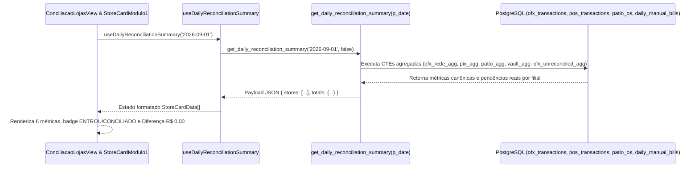

# Design: Correção da Diferença no Fechamento por Loja e Pendências OFX (332)

## Arquitetura e Fluxo de Dados



---

## Interfaces TypeScript

```typescript
export interface StoreReconciliationSummary {
  store_id: string;
  store_name: string;
  color?: string;
  saldo_banco: number;
  saldo_banco_ofx: number;
  saldo_devedor_real?: number;
  saldo_positivo_real?: number;
  dinheiro_loja: number;
  vault_entries: Array<{ id: string; amount: number; status: string; entry_date: string }>;
  maquininha: number;
  rede_bruto: number;
  rede_liquido: number;
  rede_taxas: number;
  rede_devolucoes: number;
  ofx_maquininhas: number;
  nao_entrou_valor: number;
  pix: number;
  pix_os: number;
  na_loja_os: number;
  patio_os: number;
  previsto_ofx: number;
  diferenca: number;
  status_compensacao: 'entrou' | 'parcial' | 'a_compensar' | 'sem_movimento';
  status: 'approved' | 'divergence';
}

export interface StoreCardData {
  storeId: string;
  storeName: string;
  avatarUrl?: string | null;
  saldoBanco: number | null;
  saldoBancoOfx?: number | null;
  dinheiroLoja?: number | null;
  maquininha: number | null;
  pix: number | null;
  naLojaOs: number | null;
  previsto: number | null;
  diferenca: number | null;
  statusCompensacao: 'entrou' | 'parcial' | 'nao_entrou' | 'a_compensar' | 'sem_movimento' | string;
  naoEntrouValor: number | null;
  status: 'approved' | 'divergence' | 'conciliado' | 'pending';
  isMissingData?: boolean;
}
```

---

## Mutações em Arquivos Existentes [MODIFY]

### 1. `supabase/migrations/20260901000009_fix_store_difference_and_ofx_pendencias.sql` `[NEW]`
- Atualiza a RPC `get_daily_reconciliation_summary(p_date, p_force_dynamic)` para:
  - Isolar a CTE `ofx_unreconciled_agg`:
    $$\text{Entradas Órfãs} = \sum \text{amount} \text{ (credit, is\_reconciled = false, manual\_category IS NULL, fitid NOT ILIKE '\%REDE\%')}$$
    $$\text{Saídas Órfãs} = \sum \text{ABS(amount)} \text{ (debit, is\_reconciled = false, manual\_category IS NULL)}$$
    $$\text{Diferença da Loja} = \text{Entradas Órfãs} - \text{Saídas Órfãs}$$
  - Manter `previsto_ofx = rede_liquido + pix`.
  - Definir `status = 'approved'` quando `ABS(diferenca) <= 0.05`.

### 2. `src/components/conciliacao/StoreCardModulo1.tsx` `[MODIFY]`
- Corrigir typo `"Diferena"` -> `"Diferença"`.
- Tratar estilo de zero / `approved` com destaque esmeralda.
- Exibir badge `A COMPENSAR (+ R$ ...)` quando `naoEntrouValor > 0` e `statusCompensacao !== 'entrou'`.

### 3. `src/routes/conciliacao.$lojaId.tsx` `[MODIFY]`
- Corrigir o painel das 6 métricas da filial para consumir `storeRecon` canônico com a mesma formatação e tratamento de status.

### 4. `src/hooks/useBackendConciliacao.ts` `[MODIFY]`
- Estender as interfaces `StoreReconciliationSummary` e `StoreCardData`.

---

## Cenários de Verificação (SCAN → INFER → VERIFY → FIX)

### Cenário 1: Fechamento por loja para Dom Pedro (`st-01`) em `2026-09-01`
- **SCAN:** Acessar `http://localhost:8080/conciliacao/st-01?date=2026-09-01` e `http://localhost:8080/conciliacao?date=2026-09-01`.
- **INFER:** O card de Dom Pedro deve exibir:
  - Saldo Total: R$ 29.372,27
  - Maquininha: R$ 4.710,20
  - PIX: R$ 3.000,00
  - Na Loja OS: R$ 13.373,80
  - Previsto: R$ 7.710,20
  - Diferença: **R$ 0,00** (Verde / `ENTROU` ou `CONCILIADO`)
- **VERIFY:** A aba Extrato Bancário mostra 5 de 5 lançamentos identificados e a diferença no card é R$ 0,00.
- **FIX:** Se houver centavos pendentes, verificar o filtro de tolerância `ABS(diferenca) <= 0.05`.

### Cenário 2: Loja com entrada OFX órfã real (Pendência Contábil)
- **SCAN:** Simular ou verificar loja com lançamento de crédito de R$ 500 sem OS ou conta vinculada.
- **INFER:** O card da loja deve exibir Diferença: `+R$ 500,00` e badge `DIVERGÊNCIA` (vermelho).
- **VERIFY:** Ao categorizar ou vincular a transação na Aba 2, a diferença zera em tempo real via RPC dinâmica.
- **FIX:** Garantir que o `invalidation` do React Query atualize o `useDailyReconciliationSummary`.
