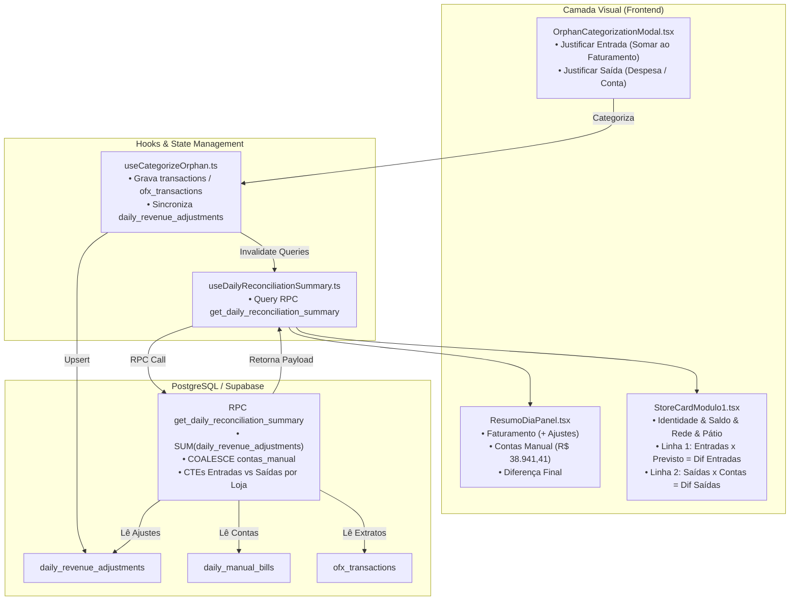

# Design: Contabilização de Justificativas no Faturamento, Correção de Contas a Pagar e Split Dual de Entradas/Saídas nos Cards de Filiais (333)

## Arquitetura e Fluxo de Dados



---

## Interfaces TypeScript

```typescript
export interface StoreReconciliationSummary {
  store_id: string;
  store_name: string;
  saldo_banco: number;
  saldo_banco_ofx: number;
  saldo_banco_itau?: number;
  maquininha: number;
  rede_liquido?: number;
  pix: number;
  pix_os?: number;
  na_loja_os: number;
  patio_os?: number;
  previsto_ofx: number;
  diferenca: number;
  status: 'approved' | 'divergence' | 'conciliado' | 'pending';
  status_compensacao: 'entrou' | 'parcial' | 'nao_entrou' | 'a_compensar' | 'sem_movimento';
  nao_entrou_valor: number;
  
  // Split Dual de Diagnóstico
  entradas_realizadas: number;
  entradas_previsto: number;
  diferenca_entradas: number;
  saidas_ofx: number;
  contas_loja: number;
  diferenca_saidas: number;
}

export interface DailyReconciliationSummary {
  date: string;
  is_closed?: boolean;
  saldo_bancos_ofx: number;
  saldo_bancos_positivo: number;
  saldo_negativo_itau: number;
  dinheiro_lojas: number;
  cartoes_a_compensar: number;
  devolucoes_rede: number;
  total_saldo_banco_positivo: number;
  total_saldo_banco: number;
  dinheiro_mp: number;
  a_receber: number;
  na_loja_os: number;
  caixa_atual: number;
  caixa_anterior: number;
  fluxo_caixa: number;
  faturamento_oi_base: number;
  faturamento_anterior: number;
  faturamento_ajustes: number;
  faturamento_periodo: number;
  valor_disp_contas: number;
  contas_base: number;
  contas_extras: number;
  contas_manual: number;
  juros_rede: number;
  subtotal_contas: number;
  diferenca_final: number;
  status_geral: 'approved' | 'divergence';
  stores: StoreReconciliationSummary[];
  stores_detail?: StoreReconciliationSummary[];
}
```

---

## Mutações em Arquivos Existentes [MODIFY]

- `supabase/migrations/20260901000010_fix_revenue_adjustments_contas_and_store_split.sql` `[NEW]`:
  - Atualização da RPC `get_daily_reconciliation_summary` com inclusão de todos os tipos de `daily_revenue_adjustments`, fallback seguro de `v_contas_manual` e geração do split de entradas/saídas por loja.
- `src/hooks/useCategorizeOrphan.ts` `[MODIFY]`:
  - Compatibilização do payload de `daily_revenue_adjustments` e invalidação assertiva de React Query caches.
- `src/hooks/useBackendConciliacao.ts` `[MODIFY]`:
  - Adição dos campos do split nas interfaces `StoreReconciliationSummary` e `StoreCardData`.
- `src/components/conciliacao/ResumoDiaPanel.tsx` `[MODIFY]`:
  - Correção da regra de fallback de `contasManualValor` para nunca zerar quando `summary.contas_base` possuir valor.
- `src/components/conciliacao/ConciliacaoLojasView.tsx` `[MODIFY]`:
  - Mapeamento dos novos campos do split de cada filial para repasse ao `StoreCardModulo1`.
- `src/components/conciliacao/StoreCardModulo1.tsx` `[MODIFY]`:
  - Redesign do interior do card com o split em 2 sub-linhas (Entradas x Previsto e Saídas x Contas), com números compactos `font-mono` e badges de conformidade.

---

## Cenários de Verificação (SCAN → INFER → VERIFY → FIX)

### Cenário 1: Entrada Justificada (Seguro Itaú R$ 11.208,87) e Contas a Pagar (R$ 38.941,41)
- **Estado Inicial:** Faturamento do Dia exibindo R$ 19.434,70 e Contas (Manual) exibindo R$ 0,00.
- **Ação:** Aplicação da migration e recarga da tela de conciliação do dia 01/09/2026.
- **Resultado Esperado:** Faturamento do Dia computa `19.434,70 + 11.208,87 = 30.643,57` e Contas (Manual) exibe em destaque `R$ 38.941,41`.

### Cenário 2: Card de Filial com Split Dual (Dom Pedro `st-01` e Santo André `st-08`)
- **Estado Inicial:** Card em 1 linha única misturada.
- **Ação:** Renderização do novo card dividido internamente.
- **Resultado Esperado:**
  - Lado esquerdo com Saldo Total, Rede Total e Carros em Pátio.
  - Sub-bloco superior exibindo Entradas (PIX + Rede) vs Previsto $\to$ Diferença de Entradas.
  - Sub-bloco inferior exibindo Saídas OFX vs Contas a Pagar $\to$ Diferença de Saídas.
