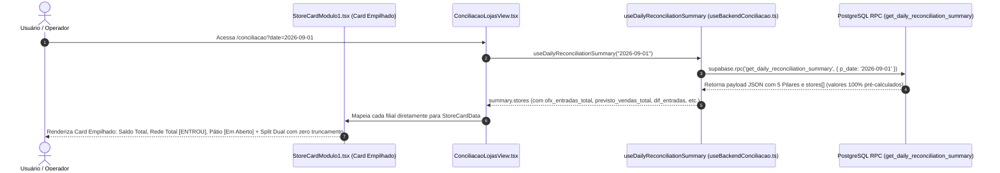

# Design: Transparência de Entradas OFX, Empilhamento Visual de Saldos e Governança Contábil na RPC (334)

## Arquitetura e Fluxo de Dados



---

## Interfaces TypeScript

```typescript
// src/hooks/useBackendConciliacao.ts

export interface StoreReconciliationSummary {
  store_id: string;
  store_name: string;
  saldo_banco: number;
  saldo_banco_ofx?: number;
  saldo_banco_itau?: number;
  rede_total?: number;
  maquininha: number;
  rede_bruto?: number;
  rede_liquido?: number;
  rede_taxas?: number;
  ofx_maquininhas?: number;
  pix_total?: number;
  pix_os?: number;
  pix: number;
  na_loja_os: number;
  patio_os?: number;
  dinheiro_loja?: number;
  
  // Entradas
  ofx_entradas_total?: number;
  entradas_realizadas?: number;
  previsto_vendas_total?: number;
  entradas_previsto?: number;
  previsto_ofx?: number;
  dif_entradas?: number;
  diferenca_entradas?: number;
  
  // Saídas
  ofx_saidas_total?: number;
  saidas_ofx?: number;
  contas_loja_total?: number;
  contas_loja?: number;
  dif_saidas?: number;
  diferenca_saidas?: number;
  
  // Diferença Líquida & Status
  diferenca_total?: number;
  diferenca: number;
  status_compensacao: 'entrou' | 'parcial' | 'nao_entrou' | 'a_compensar' | 'sem_movimento';
  nao_entrou_valor: number;
  status: 'approved' | 'divergent' | 'conciliado' | 'pending';
}
```

---

## Mutações em Arquivos Existentes [MODIFY]

### 1. `supabase/migrations/20260901000011_fix_canonical_store_ofx_entries_and_split.sql` `[NEW]`
- Atualiza a RPC `get_daily_reconciliation_summary`:
  - `ofx_entradas_total`: `COALESCE(oe.ofx_entradas_total, 0)`.
  - `previsto_vendas_total`: `COALESCE(rd.rede_liquido, 0) + COALESCE(oe.pix_total, 0) + COALESCE(v.vault_total, 0)`.
  - `dif_entradas`: `COALESCE(oe.entradas_orfas, 0)`.
  - `ofx_saidas_total`: `COALESCE(sofx.ofx_saidas_total, 0)`.
  - `contas_loja_total`: `COALESCE(bst.contas_loja_total, 0)`.
  - `dif_saidas`: `COALESCE(sofx.saidas_orfas, 0)`.
  - `diferenca_total`: `COALESCE(oe.entradas_orfas, 0) - COALESCE(sofx.saidas_orfas, 0)`.

### 2. `src/components/conciliacao/StoreCardModulo1.tsx` `[MODIFY]`
- Substitui o grid horizontal de 3 colunas por um **Vertical Stack** empilhado com `flex flex-col gap-2`.
- Vincula o badge de compensação (`ENTROU` / `A COMPENSAR` / `SEM MOV.`) diretamente ao lado do valor de `REDE TOTAL`.
- Adiciona badge de estado (`Em Aberto` / `Zerado`) para `PÁTIO (OS)`.
- Atualiza os rótulos do Split Dual no Bloco Direito:
  - `OFX Entradas` (Crédito Real no Banco) vs `Previsto Vendas` (Vendas Apuradas) $\to$ `Dif. Entradas`.
  - `Saídas OFX` (Débito Real no Banco) vs `Contas a Pagar` (Despesas da Filial) $\to$ `Dif. Saídas`.
- Consumo estrito das propriedades pré-calculadas sem qualquer lógica matemática no JSX.

### 3. `src/components/conciliacao/ConciliacaoLojasView.tsx` `[MODIFY]`
- Mapeamento transparente de todas as propriedades do backend para o `cardsData`.

---

## Cenários de Verificação (SCAN → INFER → VERIFY → FIX)

- **Cenário 1 (Auditoria Forense de Planalto `st-06`):**
  - *Estado Inicial:* Vendas POS Rede de `R$ 2.060,05` e crédito órfão de `R$ 1.812,00` no OFX.
  - *Ação:* Visualizar o card de Planalto em `/conciliacao?date=2026-09-01`.
  - *Resultado Esperado:* OFX Entradas: `R$ 3.872,05` | Previsto Vendas: `R$ 2.060,05` | Dif. Entradas: `+R$ 1.812,00`. A matemática fica cristalina e explicada pela diferença entre o crédito bancário e o faturamento registrado.
- **Cenário 2 (Responsividade e Empilhamento Visual):**
  - *Estado Inicial:* Filiais com saldos grandes (ex: `R$ 167.940,20`).
  - *Ação:* Renderizar a tela em 1440px e 1280px via Playwright.
  - *Resultado Esperado:* Todos os valores exibidos sem qualquer reticência (`...`), com layout empilhado nítido e badges alinhados à direita.
