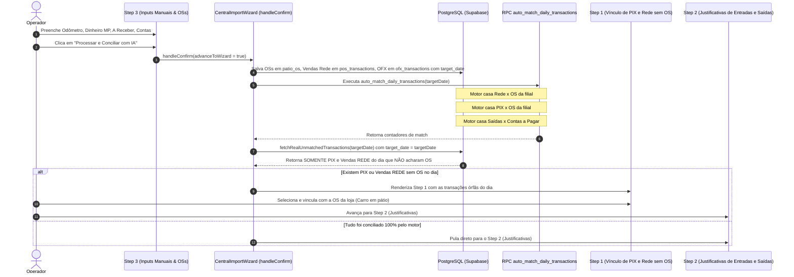

# Design: Motor de Auto-Match de PIX e Rede x OS (Pátio), Isolamento Temporal Estrito e Vínculo Manual Residual (339)

## Arquitetura e Fluxo de Dados



---

## Interfaces TypeScript

```typescript
export interface AutoMatchDailyResult {
  success: boolean;
  date: string;
  matched_pos_count: number;
  matched_pix_count: number;
  remaining_pos_count: number;
  remaining_pix_count: number;
  saidas_result?: any;
}
```

---

## Mutações em Arquivos Existentes [MODIFY]

- **`supabase/migrations/20260901000014_unified_auto_match_daily_transactions.sql` [NEW]:**
  - Implementa a RPC `auto_match_daily_transactions(p_date DATE)` com casamento atômico por loja (`store_id`):
    1. `pos_transactions` $\leftrightarrow$ `patio_os` (match por valor líquido/bruto).
    2. `ofx_transactions` (in) $\leftrightarrow$ `patio_os` (match por OS no texto, valor ou nome do cliente).
    3. `ofx_transactions` (out) $\leftrightarrow$ `daily_manual_bills` via `auto_match_saidas`.
- **`src/components/importacoes/CentralImportWizard.tsx` [MODIFY]:**
  - No `handleConfirm`: adiciona a invocação de `supabase.rpc('auto_match_daily_transactions', { p_date: targetDate })` após persistir os dados e antes de consultar os órfãos.
  - No `fetchRealUnmatchedTransactions`: restringe estritamente para `.eq('target_date', tDate)`.
- **`src/components/importacoes/wizard/Step1UnregisteredPayments.tsx` [MODIFY]:**
  - Exibe e gerencia os PIX e vendas da REDE do dia que o motor não achou OS, permitindo seleção rápida da OS correspondente.
- **`src/components/importacoes/wizard/Step2NonRevenueJustifications.tsx` [MODIFY]:**
  - Restringe as queries de entradas e saídas pendentes com `.eq('target_date', targetDate)`.

---

## Cenários de Verificação (SCAN → INFER → VERIFY → FIX)

### Cenário 1: Fechamento do dia 2026-09-01
- **Ação:** Operador envia arquivos do dia 01/09, preenche os inputs manuais e clica no botão "Processar e Conciliar com IA".
- **Resultado Esperado:**
  - O motor concilia automaticamente os pagamentos de cartão da Rede e PIX que batem com OSs da filial.
  - No Step 1 aparecem **apenas** os PIX e vendas da REDE do dia 01/09 que não acharam OS.
  - Nenhuma das 110 transações de agosto aparece na tela.

### Cenário 2 (Edge Case): Vínculo Manual no Step 1
- **Ação:** O operador tem um PIX de R$ 3.000,00 que não bateu com nenhuma OS automaticamente.
- **Resultado Esperado:** O operador clica na linha do PIX, seleciona a OS da filial e o sistema quita a OS e remove a pendência.
