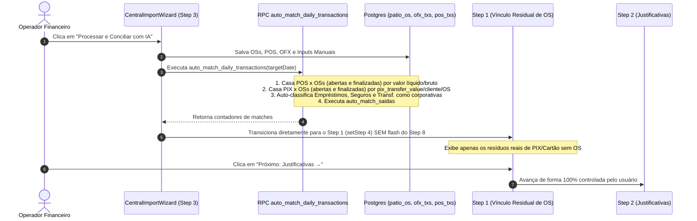

# Design: Motor de Auto-Match com OSs Finalizadas, Direcionamento de Transações Corporativas e Orquestração Linear Determinística de Steps (340)

## Arquitetura e Fluxo de Dados



## Interfaces TypeScript

```typescript
export interface AutoMatchDailyResponse {
  success: boolean;
  date: string;
  matched_pos_count: number;
  matched_pix_count: number;
  auto_categorized_corporate_count: number;
  saidas_result: {
    success: boolean;
    date: string;
    matched_saidas_count: number;
  };
}
```

## Mutações em Arquivos Existentes [MODIFY]

- **`supabase/migrations/20260901000015_auto_match_finalized_os_and_corporate_routing.sql` [NEW]:**
  - Atualiza a RPC `auto_match_daily_transactions` para incluir OSs finalizadas com `pix_transfer_value` e `credit_value`/`debit_value`, e categorizar transações bancárias corporativas (`EMPREST`, `CAPITAL DE GIRO`, `SEGURO`, etc.).
- **`src/components/importacoes/CentralImportWizard.tsx` [MODIFY]:**
  - Em `handleConfirm`: Remove `setStep(8)` para eliminar o flash visual da tela de sucesso.
  - Em `fetchRealUnmatchedTransactions`: Ignora transações que já possuem categoria corporativa atribuída.
- **`src/components/importacoes/wizard/Step1UnregisteredPayments.tsx` [MODIFY]:**
  - Garante visualização clara das transações residuais e botão explícito de avanço.

## Cenários de Verificação (SCAN → INFER → VERIFY → FIX)

### Cenário 1: Casamento de PIX e Cartões com OSs Finalizadas do Dia (01/09/2026)
- **Estado Inicial:** PIX de Francisco Prado (R$ 3.332), Wellington (R$ 385), Enio Vinicius (R$ 900), Leonardo (R$ 3.000), Planalto (R$ 1.812) e Piraporinha (R$ 5.300) importados; OSs correspondentes com `status = 'finalizado'` e `pix_transfer_value` preenchidos.
- **Ação:** Executar `auto_match_daily_transactions('2026-09-01')`.
- **Resultado Esperado:** As transações são casadas com as OSs no banco (`matched_os_number` preenchido) e saem da fila de pagamentos sem OS do Step 1.

### Cenário 2: Direcionamento de Empréstimos e Seguros para o Step 2 (Justificativas)
- **Estado Inicial:** Transações `EMPREST CAPITAL DE GIRO R$ 100.000,00` e `PAGTO ITAU SEGUROS R$ 11.208,87` importadas no OFX.
- **Ação:** Processar o motor no Step 3.
- **Resultado Esperado:** Não aparecem no Step 1 (Vínculo de OS); aparecem no Step 2 (Justificativas) já pré-categorizadas.

### Cenário 3: Transição Limpa e Sem Saltos Automáticos
- **Estado Inicial:** Usuário na tela de Inputs Manuais do Step 3.
- **Ação:** Clicar em "Processar e Conciliar com IA".
- **Resultado Esperado:** Exibe overlay de progresso e transiciona diretamente para o Step 1, sem flash do Step 8 e sem saltar etapas sozinho.
