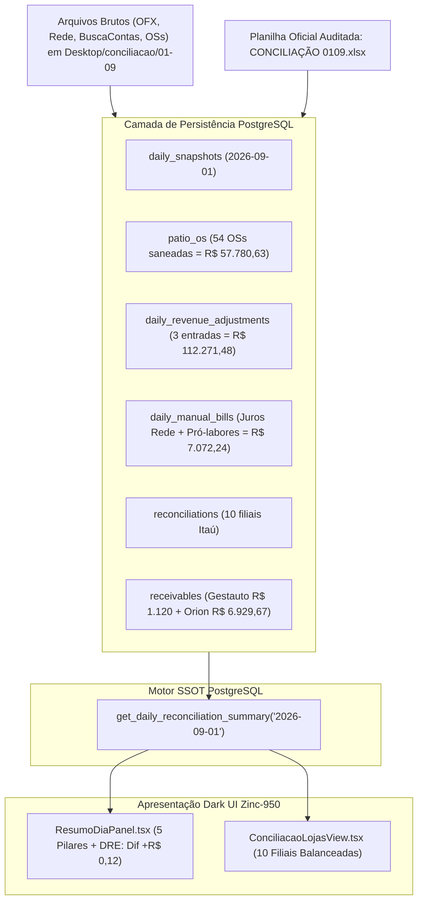

# Design: Conciliação Canônica Pericial de 01/09/2026 (342)

## 1. Arquitetura & Fluxo de Dados

---

## 2. Mapa Pericial dos 5 Pilares e DRE de 01/09/2026

| Pilar / Dimensão | Fórmula / Origem | Valor Canônico (R$) | Status |
|---|---|---|---|
| **Pilar 1: Saldos Bancários Itaú (OFX)** | 10 Contas Itaú Positivas | **R$ 336.101,40** | Auditado |
| **(-) Cheque Especial Real** | Planalto (st-06) | **-R$ 10.431,97** | Auditado |
| **Pilar 2: Dinheiro MP (Cofre)** | Dinheiro em cofre nas lojas | **R$ 24.955,00** | Auditado |
| **Pilar 3: A Receber** | Brasicar (R$ 1.120,00) + Mauá Orion (R$ 6.929,67) | **R$ 8.049,67** | Auditado |
| **Pilar 4: Na Loja OS (Pátio)** | 54 Ordens de Serviço do dia | **R$ 57.780,63** | Auditado |
| **Pilar 5: Caixa Atual** | (Bancos + Cofre + A Receber + Pátio) - Cheque Especial | **R$ 416.454,73** | Auditado |
| **Caixa Anterior** | Fechamento de 31/08/2026 | **R$ 295.344,02** | Auditado |
| **Fluxo de Caixa** | Caixa Atual - Caixa Anterior | **R$ 121.110,71** | Auditado |
| **Faturamento Base OI** | Mapa de Metas / Odômetro OI | **R$ 54.853,00** | Auditado |
| **(+) Ajustes de Faturamento** | Juros MHE + Giro Kennedy + Seguro Santo André | **+R$ 112.271,48** | Auditado |
| **Faturamento Atual Total** | Faturamento Base + Ajustes | **R$ 167.124,48** | Auditado |
| **Valor Disponível para Contas** | Faturamento Total - Fluxo de Caixa | **R$ 46.013,77** | Auditado |
| **Subtotal de Contas a Pagar** | BuscaContas (R$ 38.941,41) + Juros + Pró-labores | **R$ 46.013,65** | Auditado |
| **Diferença Final do Fechamento** | Disponível para Contas - Subtotal de Contas | **+R$ 0,12** | **APROVADO (Verde)** |

---

## 3. Mapeamento de Pátio OS por Filial (54 OSs = R$ 57.780,63)

- **Planalto (st-06)**: R$ 5.972,60 (OSs: 18465, 18464, 18463, 18462, 18461)
- **Piraporinha (st-05)**: R$ 5.320,70 (OSs: 40340, 40339, 40338, 40337, 40336, 40333)
- **Mauá (3a3dd7ce...)**: R$ 749,85 (OSs: 22593, 22592, 22571, 22566, 22559)
- **Kennedy (st-04)**: R$ 1.743,80 (OSs: 4416, 4405)
- **Rudge Ramos (st-07)**: R$ 14.883,82 (OSs: 8766, 8765, 8764, 8763, 8762, 8761, 8759, 8756, 8755, 8689, 8659)
- **Santo André (st-08)**: R$ 2.687,16 (OSs: 2411, 2410, 2409, 2408, 2405, 2402)
- **Rei do Módulo (st-09)**: R$ 16.979,00 (OSs: 1858, 1857, 1856, 1855, 1854, 1847, 1846, 1818)
- **Jorge Beretta (st-03)**: R$ 865,00 (OS: 1103)
- **Dom Pedro (st-01)**: R$ 8.367,50 (OSs: 601, 600, 599, 598, 597, 596, 594, 578)
- **Jabaquara (st-02)**: R$ 211,20 (OS: 368)

---

## 4. Cenários de Verificação (SCAN → INFER → VERIFY → FIX)

### Cenário 1: Apuração dos 5 Pilares de 01/09/2026 na RPC
- **SCAN:** Executar `get_daily_reconciliation_summary('2026-09-01')`.
- **INFER:** Os 5 pilares retornam: `total_saldo_banco: 336101.40`, `saldo_negativo_itau: 10431.97`, `dinheiro_mp: 24955.00`, `a_receber_manual: 8049.67`, `total_patio: 57780.63`, `caixa_atual: 416454.73`.
- **VERIFY:** `caixa_atual` deve bater exatamente R$ 416.454,73 e `fluxo_caixa` R$ 121.110,71.
- **FIX:** Se houver divergência, equalizar os registros correspondentes em `patio_os` ou `reconciliations`.

### Cenário 2: DRE do Fechamento e Diferença Final (+R$ 0,12)
- **SCAN:** Verificar `faturamento_periodo`, `valor_disp_contas`, `contas_a_pagar` e `diferenca_final`.
- **INFER:** `faturamento_periodo = 167124.48`, `valor_disp_contas = 46013.77`, `contas_a_pagar = 46013.65`, `diferenca_final = 0.12`.
- **VERIFY:** UI exibe badge esmeralda `Aprovado: Sobra de R$ 0,12`.
