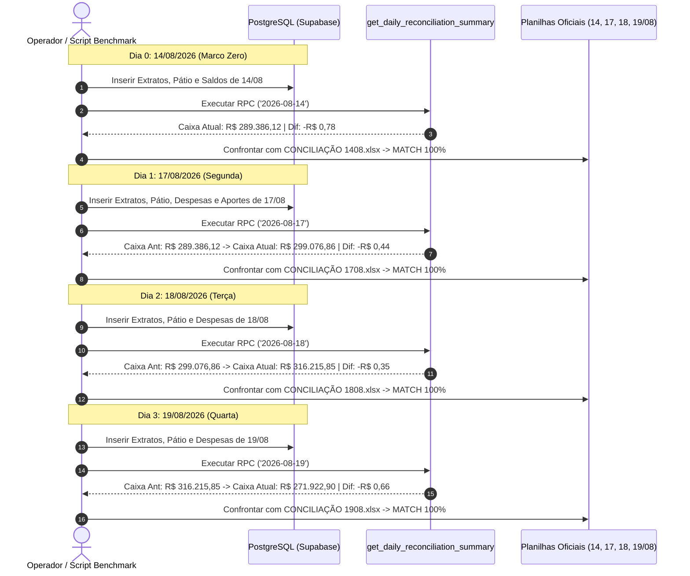

# Design: Teste Pericial Sequencial Isolado de Conciliação Multi-Dias (343)

## 1. Arquitetura do Benchmark Sequencial

---

## 2. Mapa Detalhado dos 4 Dias de Prova Real

### Dia 14/08/2026 (Marco Zero de Implantação)
- **Saldos Bancários (10 Lojas Itaú):** Positivos R$ 170.244,95 | (-) Cheque Especial Planalto: R$ 11.849,09
- **Dinheiro MP:** R$ 13.066,00
- **A Receber:** R$ 10.694,50
- **Na Loja OS (Pátio):** R$ 107.229,76
- **Caixa Atual:** **R$ 289.386,12**
- **Caixa Anterior:** R$ 258.736,15
- **Fluxo de Caixa:** R$ 30.649,97
- **Faturamento Base OI:** R$ 75.005,10
- **Ajustes DRE:** +R$ 1.182,15 (Reembolso Limpa Baú R$ 300,00 + Venda de Juros Mauá R$ 882,15)
- **Faturamento Atual Total:** **R$ 76.187,25**
- **Disponível para Contas:** R$ 45.537,28
- **Subtotal Contas:** R$ 45.538,06
- **Diferença Final:** **-R$ 0,78 (Aprovado)**

---

### Dia 17/08/2026 (Segunda-Feira)
- **Saldos Bancários:** Positivos R$ 190.819,65 | Cheque Especial: R$ 0,00
- **Dinheiro MP:** R$ 9.066,00
- **A Receber:** R$ 10.694,50
- **Na Loja OS (Pátio):** R$ 88.496,71
- **Caixa Atual:** **R$ 299.076,86**
- **Caixa Anterior:** **R$ 289.386,12** (herdado exatamente do Marco Zero 14/08)
- **Fluxo de Caixa:** **R$ 9.690,74**
- **Faturamento Base OI:** R$ 70.820,43
- **Ajustes DRE:** +R$ 25.351,63 (Aporte RM R$ 5.000 + Aporte JAB R$ 4.600 + Reemb Cartão R$ 29,93 + Transf Óleo R$ 15.721,70)
- **Faturamento Atual Total:** **R$ 96.172,06**
- **Disponível para Contas:** R$ 86.481,32
- **Subtotal Contas:** R$ 86.481,76
- **Diferença Final:** **-R$ 0,44 (Aprovado)**

---

### Dia 18/08/2026 (Terça-Feira)
- **Saldos Bancários:** Positivos R$ 211.003,28 | Cheque Especial: R$ 0,00
- **Dinheiro MP:** R$ 8.466,00
- **A Receber:** R$ 10.694,50
- **Na Loja OS (Pátio):** R$ 86.052,07
- **Caixa Atual:** **R$ 316.215,85**
- **Caixa Anterior:** **R$ 299.076,86** (herdado de 17/08)
- **Fluxo de Caixa:** **R$ 17.138,99**
- **Faturamento Base OI:** R$ 41.857,57
- **Ajustes DRE:** R$ 0,00
- **Faturamento Atual Total:** **R$ 41.857,57**
- **Disponível para Contas:** R$ 24.718,58
- **Subtotal Contas:** R$ 24.718,93
- **Diferença Final:** **-R$ 0,35 (Aprovado)**

---

### Dia 19/08/2026 (Quarta-Feira)
- **Saldos Bancários:** Positivos R$ 152.608,71 | Cheque Especial: R$ 0,00
- **Dinheiro MP:** R$ 8.466,00
- **A Receber:** R$ 10.694,50
- **Na Loja OS (Pátio):** R$ 100.153,69
- **Caixa Atual:** **R$ 271.922,90**
- **Caixa Anterior:** **R$ 316.215,85** (herdado de 18/08)
- **Fluxo de Caixa:** **-R$ 44.292,95**
- **Faturamento Base OI:** R$ 73.813,07
- **Ajustes DRE:** R$ 0,00
- **Faturamento Atual Total:** **R$ 73.813,07**
- **Disponível para Contas:** R$ 118.106,02
- **Subtotal Contas:** R$ 118.106,68
- **Diferença Final:** **-R$ 0,66 (Aprovado)**

---

## 3. Cenários de Verificação (SCAN → INFER → VERIFY → FIX)

### Cenário 1: Encadeamento Temporal Contínuo
- **SCAN:** Executar `benchmark-august-multi-days.cjs` processando a sequência $14 \to 17 \to 18 \to 19/08$.
- **INFER:** O Caixa Atual de cada dia é exatamente igual ao Caixa Anterior do dia seguinte:
  - $14/08: 289.386,12 \to 17/08$
  - $17/08: 299.076,86 \to 18/08$
  - $18/08: 316.215,85 \to 19/08$
- **VERIFY:** A RPC `get_daily_reconciliation_summary` entrega a diferença exata em todos os 4 dias ($|\text{dif}| \le 1,00$).
- **FIX:** Ajustar eventuais divergências de centavos em `daily_snapshots`.

### Cenário 2: Validação Visual no Frontend
- **SCAN:** Navegar no painel `/conciliacao` alterando a data entre 14/08, 17/08, 18/08 e 19/08.
- **INFER:** O painel renderiza os 5 pilares, o fluxo de caixa, as contas a pagar e a badge esmeralda de aprovação em todos os 4 dias.
- **VERIFY:** Zero erros no console do navegador e zero discrepâncias visuais.
