# Design: Refatoração Completa da Tela de Visão Geral (344)

## 1. Arquitetura de Componentes

```mermaid
graph TD
    A[DashboardPage: src/routes/index.tsx] --> B[useExecutiveDashboard: Hook Canônico]
    B --> C[RPC: get_dashboard_metrics / get_daily_reconciliation_summary]
    
    A --> D[ExecutiveHeader]
    D --> D1[DateSelectorWithFechamentos]
    D --> D2[ExecutiveQuickInsightsBar]
    
    A --> E[ExecutiveKpiBentoGrid]
    E --> E1[CaixaAtualCard]
    E --> E2[FaturamentoCard]
    E --> E3[ContasPagarCard]
    E --> E4[FluxoCaixaCard]
    E --> E5[SaldoBancosCard]
    E --> E6[PatioVeiculosCard]
    
    A --> F[ExecutiveFivePillarsBar]
    F --> F1[PilarBancosPositivos]
    F --> F2[PilarChequeEspecial]
    F --> F3[PilarDinheiroMp]
    F --> F4[PilarAReceber]
    F --> F5[PilarNaLojaOs]
    
    A --> G[ExecutiveStoreMatrix]
    G --> G1[RankingBarLoja]
    G --> G2[ConciliationStatusBadge]
    G --> G3[LinkToLojaDetail]
    
    A --> H[ExecutiveMacroTrendChart]
```



---

## 2. Padrões Visuais e Design Tokens (Zinc-950 / Emerald / Indigo)

| Elemento | Tailwind Class / Padrão | Função |
|---|---|---|
| **Canvas Global** | `bg-zinc-950 text-zinc-100 min-h-screen` | Fundo principal da aplicação |
| **Card Executivo** | `bg-zinc-900/90 border border-zinc-800/80 rounded-2xl p-5 shadow-lg shadow-black/40 backdrop-blur-sm` | Superfície de cartões |
| **KPI Card Destacado** | `bg-gradient-to-b from-zinc-900 via-zinc-900 to-indigo-950/30 border border-indigo-500/30` | Caixa e Faturamento |
| **Tipografia Financeira** | `font-mono tracking-tight font-bold tabular-nums` | Valores em Real (R$) |
| **Badges de Status** | `bg-emerald-500/10 text-emerald-400 border border-emerald-500/20` | Fechamento Aprovado |
| **Alerta Cheque Especial** | `bg-rose-500/10 text-rose-400 border border-rose-500/20` | Saldos Negativos |
| **Barra de Progresso Loja** | `h-2 rounded-full bg-indigo-500/20 overflow-hidden` | Proporção de Faturamento |

---

## 3. Contrato de Dados da Interface (`ExecutiveDashboardData`)

```typescript
export interface ExecutiveStoreData {
  storeId: string;
  storeName: string;
  saldoBanco: number;
  faturamento: number;
  faturamentoProporcao: number; // 0 a 100%
  contas: number;
  resultadoLiquido: number;
  naLojaOs: number;
  veiculosPatioCount: number;
  status: 'approved' | 'divergent' | 'pending' | 'sem_movimento';
  isNegativeBank: boolean;
}

export interface ExecutiveDashboardData {
  date: string;
  previousDate: string;
  isClosed: boolean;
  statusGeral: 'approved' | 'divergent' | 'pending';
  
  // 5 Pilares
  saldoBancosPositivo: number;
  saldoNegativoItau: number;
  saldoBancosLiquido: number;
  dinheiroMp: number;
  aReceber: number;
  naLojaOs: number;
  caixaAtual: number;
  caixaAnterior: number;
  fluxoCaixa: number;
  
  // DRE
  faturamentoTotal: number;
  faturamentoOiBase: number;
  faturamentoAjustes: number;
  odometroHoje: number;
  odometroAnterior: number;
  contasSubtotal: number;
  contasBase: number;
  jurosRede: number;
  diferencaFinal: number;
  
  // Pátio & Lojas
  totalVeiculosPatio: number;
  lojaLider: { name: string; faturamento: number };
  stores: ExecutiveStoreData[];
  historicoMacro: Array<{
    date: string;
    faturamento: number;
    contas: number;
    caixaAtual: number;
  }>;
}
```
