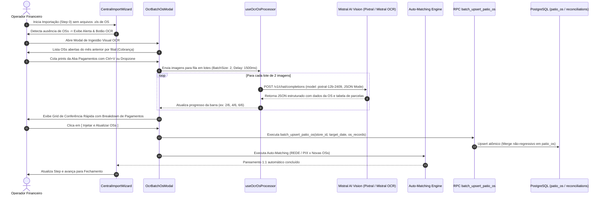

# Design: Ingestão de OSs via Mistral OCR/Vision com Aba Pagamentos (345)

## 1. Arquitetura e Fluxo de Dados Ponta a Ponta



---

## 2. Configuração & Chamada da API Mistral

### Endpoint & Headers
- **Base URL:** `https://api.mistral.ai`
- **Endpoint:** `POST /v1/chat/completions`
- **Headers:**
  - `Authorization: Bearer <VITE_MISTRAL_API_KEY>`
  - `Content-Type: application/json`

### Prompt do Mistral Vision com Foco na Aba Pagamentos:
```typescript
const promptText = `Extract all data from this Ordem de Servico screen (especially the Pagamentos tab):
- empresa_loja: string (store name, e.g. "ReiDoOleoMaua", "Santo Andre", "Planalto")
- os_number: string (codigo)
- client_name: string
- client_cpf: string
- plate: string
- vehicle: string
- total_value: number (Total da OS in BRL)
- paid_value: number (Valor Pago in BRL)
- open_value: number (Restante in BRL)
- opened_at: string (YYYY-MM-DD)
- closed_at: string (YYYY-MM-DD or null)
- status: string ("finalizada" if open_value == 0 or paid_value >= total_value, else "em_aberto" or "pago_parcial")
- payments: array of objects { installment: number, due_date: string (YYYY-MM-DD), method: string ("Debito" | "Credito" | "Pix" | "Dinheiro" | "Boleto"), amount: number }
- debit_value: number (sum of Debito amounts)
- credit_value: number (sum of Credito amounts)
- pix_transfer_value: number (sum of Pix amounts)
- cash_value: number (sum of Dinheiro amounts)

Return JSON object: { "service_order": { ... } }`;
```

---

## 3. Interfaces TypeScript

```typescript
export interface OcrPaymentInstallment {
  installment: number;
  due_date: string;
  method: string; // "Débito" | "Crédito" | "PIX" | "Dinheiro" | "Boleto"
  amount: number;
}

export interface ExtractedOcrOsItem {
  id: string;
  os_number: string;
  store_id: string;
  store_name: string;
  client_name: string;
  client_cpf?: string;
  plate: string;
  vehicle?: string;
  total_value: number;
  paid_value: number;
  open_value: number;
  opened_at: string;
  closed_at: string | null;
  status: 'em_aberto' | 'pago_parcial' | 'finalizada' | 'cancelada';
  raw_status: string;
  payment_method: string;
  payments?: OcrPaymentInstallment[];
  pix_transfer_value: number;
  credit_value: number;
  debit_value: number;
  cash_value: number;
  is_verified: boolean;
  confidence?: number;
  source_image_name?: string;
}

export interface OcrBatchQueueItem {
  id: string;
  file?: File;
  base64: string;
  name: string;
  status: 'queued' | 'processing' | 'done' | 'error';
  error?: string;
  extractedItem?: ExtractedOcrOsItem;
}
```

---

## 4. Mutações em Arquivos Existentes `[MODIFY]` & `[NEW]`

- `[NEW] supabase/migrations/20260902000020_create_batch_upsert_patio_os.sql`: Cria a RPC `batch_upsert_patio_os`.
- `[NEW] src/hooks/useOcrOsProcessor.ts`: Fila assíncrona com processamento em lotes de 2 imagens, delay de 1.5s, integração Mistral AI com extração de parcelas e retry automático.
- `[NEW] src/components/importacoes/OcrBatchOsModal.tsx`: Modal executivo Dark Zinc-950 com lista de cobrança por loja, dropzone, `Ctrl+V`, barra de progresso, breakdown de parcelas e grid de conferência.
- `[NEW] src/components/importacoes/OcrBatchStoreCarryoverList.tsx`: Painel lateral exibindo as OSs que estavam no pátio anterior por filial.
- `[NEW] src/components/importacoes/OcrBatchDropzoneAndPaste.tsx`: Área de captura de imagens com listener global de paste.
- `[NEW] src/components/importacoes/OcrBatchReviewGrid.tsx`: Tabela de conferência rápida com edição inline e detalhe de parcelas/métodos.
- `[MODIFY] src/components/importacoes/CentralImportWizard.tsx`: Detecção automática de ausência de planilha de OS e integração com `OcrBatchOsModal`.

---

## 5. Cenários de Verificação (SCAN $\to$ INFER $\to$ VERIFY $\to$ FIX)

### Cenário 1: Virada de Mês com Print Real da Aba Pagamentos (OS 22593)
- **SCAN:** O operador sobe extratos `.ofx` e vendas `.xlsx` da Rede. No modal OCR, cola o print da OS `22593` na aba Pagamentos.
- **INFER:** O Mistral Vision extrai:
  - 2 parcelas de Débito (R$ 720,00 e R$ 1.900,00) = Total R$ 2.620,00.
  - Status: `finalizada`, `open_value: 0.00`.
- **VERIFY:** Ao confirmar no Grid de Revisão:
  - `patio_os` é atualizado na loja Mauá com `debit_value = 2620.00` e `status = 'finalizada'`.
  - As 2 transações de cartão da Rede de Mauá em 01/09 são pareadas automaticamente com a OS `22593` sem nenhuma intervenção manual.
  - O pátio é baixado e a OS compõe a conciliação do dia.
