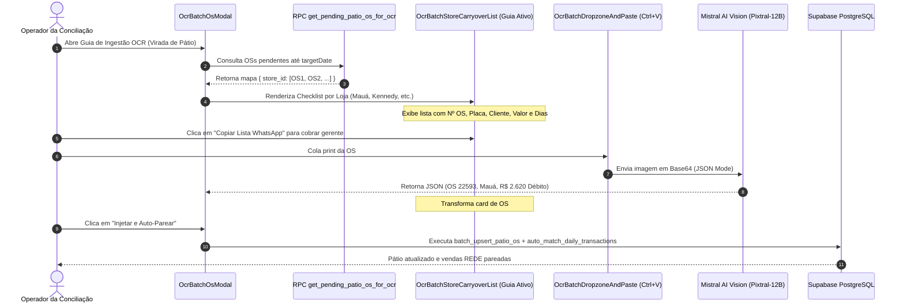

# Design: Guia Ativo de Cobrança de Prints de OS por Loja (Feature 346)

## Arquitetura e Fluxo de Dados



---

## Interfaces TypeScript

```typescript
export interface PendingPatioOsItem {
  id: string;
  os_number: string;
  store_id: string;
  store_name: string;
  client_name: string;
  plate: string;
  total_value: number;
  paid_value: number;
  open_value: number;
  status: string;
  days_open: number;
  opened_at: string;
  isCaptured?: boolean;
  capturedData?: ExtractedOcrOsItem;
  isExtraManual?: boolean;
}

export interface StorePatioSummary {
  storeId: string;
  storeName: string;
  pendingCount: number;
  capturedCount: number;
  totalOpenAmount: number;
  osList: PendingPatioOsItem[];
}
```

---

## Mutações em Arquivos Existentes `[MODIFY]`

### 1. `supabase/migrations/20260902000021_create_get_pending_patio_os_rpc.sql` `[NEW]`
- Cria a função `public.get_pending_patio_os_for_ocr(p_target_date date)`.

### 2. `src/components/importacoes/OcrBatchStoreCarryoverList.tsx` `[MODIFY]`
- Substitui a lista passiva por um **Guia de Missão Interativo**:
  - Exibe cada OS com cards detalhados contendo Nº OS, Placa, Cliente, Valor Aberto e Dias em Pátio.
  - Checkbox/Badge de status dinâmico: `[⚠️ Aguardando Print]` $\to$ `[✅ Print Capturado]`.
  - Botão **"Copiar Lista (WhatsApp)"** com formatação de texto pronta para envio.
  - Mini formulário **"+ Adicionar OS Extra"**.

### 3. `src/components/importacoes/OcrBatchOsModal.tsx` `[MODIFY]`
- Carrega as OSs pendentes via RPC `get_pending_patio_os_for_ocr`.
- Cruza em tempo real o array `extractedItems` do OCR com a lista de OSs pendentes para atualizar os estados visuais.

---

## Cenários de Verificação (SCAN $\to$ INFER $\to$ VERIFY $\to$ FIX)

### Cenário 1: Operador visualiza a cobrança por filial e copia lista para WhatsApp
- **SCAN:** O operador abre o modal de OCR para o fechamento de 01/09.
- **INFER:** A loja Mauá deve exibir suas OSs pendentes (ex: #22593, #22566) com placa e valor aberto.
- **VERIFY:** Ao clicar em "Copiar Lista WhatsApp", a área de transferência recebe o texto formatado e um toast de sucesso é disparado.

### Cenário 2: Colagem de print marca a OS pendente como capturada imediatamente
- **SCAN:** O operador cola o print da OS #22593.
- **INFER:** O Mistral OCR extrai os dados da aba Pagamentos.
- **VERIFY:** A OS #22593 na lista da filial Mauá passa de `[⚠️ Aguardando Print]` para `[✅ Print Capturado]` e o contador da filial atualiza para `1 capturada`.
