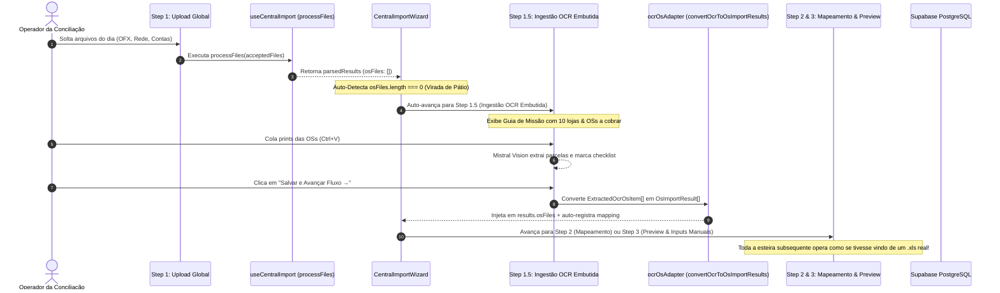

# Design: Fluxo Seamless de Transição Automática para OCR e Injeção no Pipeline (Feature 347)

## Arquitetura e Fluxo de Dados



---

## Interfaces TypeScript

```typescript
export interface ConvertOcrOptions {
  targetDate?: string;
  defaultStoreAlias?: string;
  queryDbForDelta?: boolean;
}

export interface OsImportResult {
  fileName: string;
  storeAlias: string;
  success: boolean;
  osArray: ParsedOS[];
  receivablesArray: ParsedReceivable[];
  osCount: number;
  error?: string;
}
```

---

## Mutações em Arquivos Existentes `[MODIFY]`

### 1. `src/lib/parsers/ocrOsAdapter.ts` `[NEW]`
- Implementa `convertOcrToOsImportResults(items, stores, targetDate)` para sintetizar `OsImportResult[]` a partir de `ExtractedOcrOsItem[]`.

### 2. `src/components/importacoes/CentralImportWizard.tsx` `[MODIFY]`
- Suporte para `step === 1.5` (`STEP_OCR_INGESTION`) embutido no Wizard.
- No `onDrop`: se `parsedResults.osFiles.length === 0`, avança automaticamente para `setStep(1.5)`.
- No Step 1.5: renderiza o **Guia Ativo de Missão**, Dropzone de prints com `Ctrl+V`, barra de progresso e tabela de conferência embutidos.
- Botão **"Salvar e Avançar Fluxo $\to$"**: executa o adapter, injeta em `results.osFiles`, auto-registra o `mapping` e avança para o Step 2/Step 3.
- Remove o botão/modal avulso desconexo.

---

## Cenários de Verificação (SCAN $\to$ INFER $\to$ VERIFY $\to$ FIX)

### Cenário 1: Upload de arquivos sem planilha de OS dispara o OCR automaticamente
- **SCAN:** O operador solta arquivos `.ofx` e `rede.xlsx` no Dropzone do Step 1 (sem `.xls` de OS).
- **INFER:** O `processFiles` detecta `osFiles.length === 0`.
- **VERIFY:** O Wizard transiciona automaticamente para o Step 1.5 exibindo as pendências das 10 lojas sem exigir cliques extras.

### Cenário 2: Conclusão do OCR avança para o Preview com faturamento e pátio calculados
- **SCAN:** O operador cola prints no Step 1.5 e clica em "Salvar e Avançar Fluxo".
- **INFER:** As OSs extraídas são sintetizadas em `results.osFiles`.
- **VERIFY:** O Step 3 exibe o total de OSs, faturamento do dia e pátio em estoque, permitindo seguir até o fechamento normalmente.
