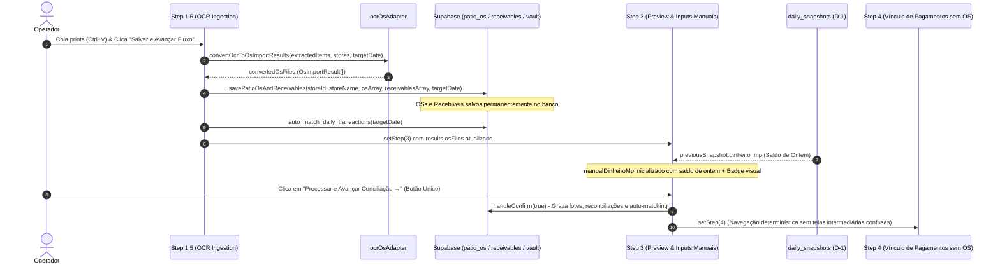

# Design: Persistência Atômica de OSs OCR, Botão Único no Step 3 e Herança de Dinheiro MP (348)

## 1. Arquitetura e Fluxo de Dados



---

## 2. Interfaces TypeScript

```typescript
// src/hooks/useImportProcessor.ts
export interface ParsedOS {
  os_number: string;
  plate: string;
  client_name?: string | null;
  opened_at: string;
  closed_at: string | null;
  total_value: number;
  paid_value: number;
  payment_method: string | null;
  status: 'em_aberto' | 'pago_parcial' | 'finalizado';
  raw_status?: string | null;
  parsed_credit?: number;
  parsed_debit?: number;
  parsed_pix_transfer?: number;
  parsed_cash?: number;
  cash_value?: number;
  is_new_os?: boolean;
  days_open?: number;
  pending_value?: number;
  delta_paid?: number;
}

// src/hooks/useDailySnapshot.ts
export interface DailySnapshotRow {
  id: string;
  date: string;
  total_saldo_banco_positivo: number;
  total_saldo_banco_negativo: number;
  saldo_bancos_ofx: number;
  dinheiro_mp: number;
  a_receber_manual: number;
  faturamento: number;
  caixa_atual: number;
  is_closed: boolean;
  metadata?: Record<string, any>;
}
```

---

## 3. Mutações em Arquivos Existentes [MODIFY]

### `src/components/importacoes/CentralImportWizard.tsx`:
1. **`handleSaveAndAdvanceOcr`**:
   - Adicionar chamada assíncrona a `savePatioOsAndReceivables` para cada item em `convertedOsFiles`.
   - Adicionar chamada assíncrona a `supabase.rpc('auto_match_daily_transactions', { p_date: targetDate })`.
   - Manter atualização de `results.osFiles` e `mapping`.
2. **`loadDefaultsForDate` & `useEffect` de Dinheiro MP**:
   - Preencher `manualDinheiroMp` com `previousSnapshot.dinheiro_mp` quando não houver snapshot cadastrado para a data alvo.
   - Adicionar flag `isDinheiroMpUserEdited` para não sobrescrever caso o usuário altere o valor.
3. **Card de Inputs Manuais no Step 3**:
   - Uniformizar alturas dos cabeçalhos dos 4 cards com `min-h-[22px]`.
   - Adicionar badge `Saldo de ontem: R$ ...` no card de Dinheiro MP.
4. **Rodapé de Ações do Step 3**:
   - Remover o botão `Gravar Direto (sem Wizard)`.
   - Manter apenas o botão `Processar e Avançar Conciliação →` estilizado em Emerald-500 com ícone `ArrowRight`.

---

## 4. Cenários de Verificação (SCAN → INFER → VERIFY → FIX)

### Cenário 1: Persistência Resiliente de OSs no Step 1.5
- **Estado Inicial**: 1 print de OS extraído via OCR no Step 1.5.
- **Ação**: Operador clica em "Salvar e Avançar Fluxo".
- **Resultado Esperado**:
  - `patio_os` contém o registro da OS no PostgreSQL.
  - Se a página for recarregada ou ocorrer erro nos steps 4-7, a OS continua existindo no banco.
  - O Wizard avança para o Step 3 com o card de Total OSs exibindo o valor correto.

### Cenário 2: Herança de Dinheiro MP e Botão Único no Step 3
- **Estado Inicial**: Snapshot de D-1 homologado com `dinheiro_mp = 24.955,00`.
- **Ação**: Iniciar importação para D-0.
- **Resultado Esperado**:
  - O input "Dinheiro MP" exibe automaticamente `24955` com a badge `Saldo de ontem: R$ 24.955,00`.
  - No rodapé do Step 3 existe APENAS 1 botão de ação (`Processar e Avançar Conciliação →`).
  - Ao clicar no botão, o sistema executa a conciliação e avança determinísticamente para o Step 4 (Vínculo de Pagamentos sem OS).
