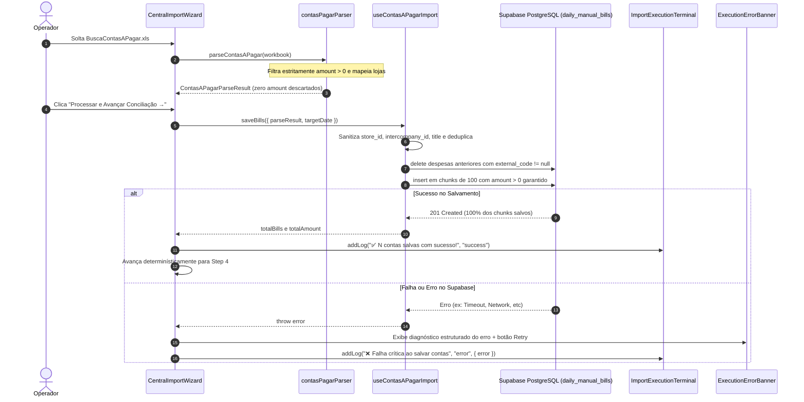

# Design: Blindagem do Salvamento de Contas a Pagar (Constraint Violations) e Refatoração do Terminal de Logs (349)

## 1. Arquitetura e Fluxo de Dados



---

## 2. Interfaces TypeScript

```typescript
// src/components/importacoes/ImportExecutionTerminal.tsx
export interface ImportLogErrorDetails {
  code?: string;
  message?: string;
  details?: string;
  hint?: string;
  stack?: string;
  payload?: any;
}

export interface ImportLogEntry {
  id: string;
  timestamp: string;
  type: 'info' | 'success' | 'warning' | 'error';
  message: string;
  source?: 'ofx' | 'rede' | 'patio' | 'contas' | 'database' | 'ai' | 'system' | 'rpc';
  error?: ImportLogErrorDetails;
  details?: any;
}

export interface ImportExecutionTerminalProps {
  logs: ImportLogEntry[];
  isRunning: boolean;
  isFinished: boolean;
  hasError: boolean;
  onRetry?: () => void;
  onClear?: () => void;
  title?: string;
  targetDate?: string;
}

// src/components/importacoes/ExecutionErrorBanner.tsx
export interface ExecutionErrorBannerProps {
  error: {
    message: string;
    code?: string;
    details?: string;
    hint?: string;
    stack?: string;
    source?: string;
  } | string | null;
  isRetrying: boolean;
  onRetry: () => void;
  onViewLogs?: () => void;
  title?: string;
}
```

---

## 3. Mutações em Arquivos Existentes [MODIFY]

### 1. `src/lib/parsers/contasPagarParser.ts`
- Alterar linha 170:
  ```typescript
  // Substituir: if (amount <= 0 && !codRaw) continue;
  // Por:
  if (amount <= 0) continue;
  ```

### 2. `src/hooks/useContasAPagarImport.ts`
- Sanitização rigorosa no `rowsToInsert`:
  * Validar `store_id` (deixar `null` se `'master'` ou se for string não reconhecida).
  * Validar `amount > 0`.
  * Deduplicação em memória por chave única `external_code + installment + due_date + amount`.
  * Sanitizar `title` com fallback para `recipient_name || description || 'Conta a Pagar'`.

### 3. `src/components/importacoes/CentralImportWizard.tsx`
- Saneamento de todas as strings corrompidas com Mojibake.
- Integração de `ImportExecutionTerminal` e `ExecutionErrorBanner` no painel final e no modal de logs.
- Garantir que o botão "Tentar Novamente" execute `handleConfirm(true)` para preservar a navegação do Wizard.

---

## 4. Cenários de Verificação (SCAN → INFER → VERIFY → FIX)

### Cenário 1: Arquivo de Contas com Linhas Zeradas ou Canceladas
- **Estado Inicial**: Planilha com 150 linhas, das quais 12 possuem `amount = 0,00` ou valor negativo.
- **Ação**: Importar a planilha e avançar no Wizard.
- **Resultado Esperado**:
  - As 12 linhas zeradas são descartadas silenciosamente no parser.
  - As 138 linhas válidas (`amount > 0`) são inseridas com sucesso no banco em chunks sem violar a check constraint `daily_manual_bills_amount_check`.
  - O terminal de logs exibe `✅ 138 contas salvas com sucesso!`.

### Cenário 2: Visualização de Logs e Diagnóstico Estruturado
- **Estado Inicial**: Ocorre qualquer erro de simulação de rede ou validação.
- **Ação**: Observar o Terminal de Logs e o Banner de Erro no Step 8.
- **Resultado Esperado**:
  - O `ExecutionErrorBanner` exibe o código do erro, mensagem amigável em português e botão "Tentar Novamente".
  - O `ImportExecutionTerminal` exibe tags de severidade, texto sem caracteres corrompidos, syntax highlighting do erro e botão "Copiar Logs".
