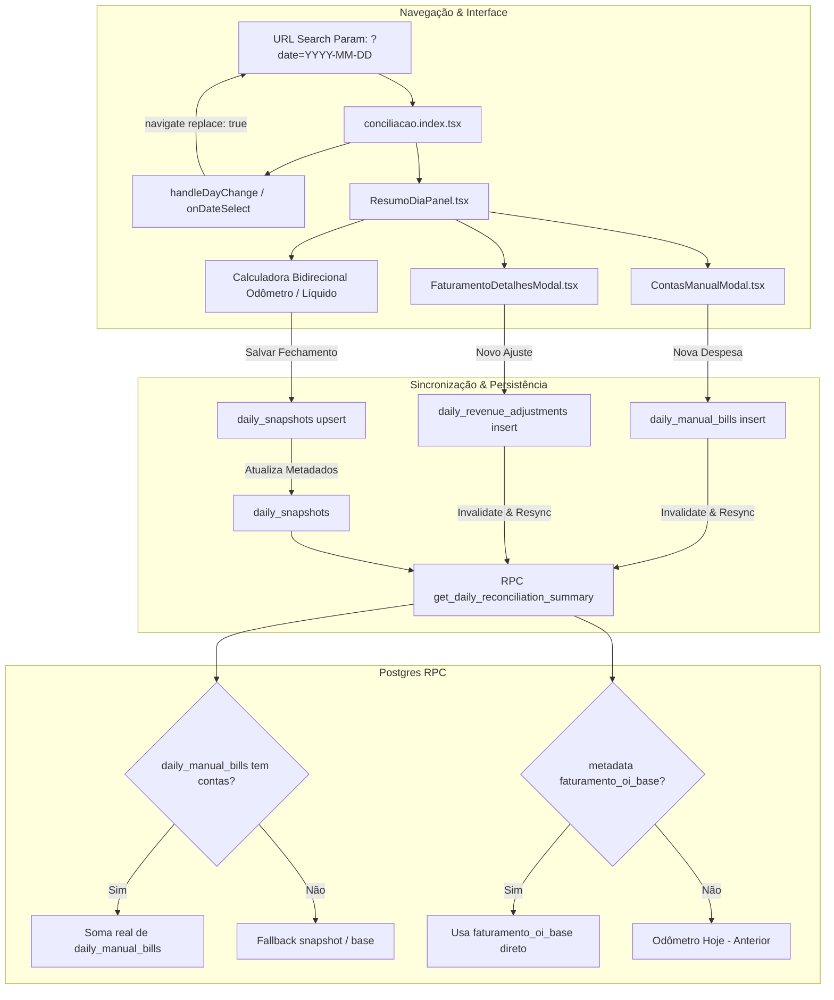

# 🏗️ SDD Design: Spec 361 — Arquitetura de Correção da Conciliação Diária

## 1. Arquitetura de Fluxo Ponta a Ponta



---

## 2. Interfaces TypeScript Reais

```typescript
// Contrato de Faturamento Bidirecional
export interface FaturamentoCalculationState {
  odometroHoje: number;              // Odômetro acumulado atual informado
  odometroAnterior: number;          // Odômetro acumulado anterior (herdado ou ajustado)
  faturamentoLiquidoDia: number;     // Diferença calculada (Hoje - Anterior) OU digitada
  faturamentoAjustes: number;        // Soma de daily_revenue_adjustments
  faturamentoTotalPeriodo: number;   // Líquido do Dia + Ajustes
  isAutoCalculated: boolean;         // Indicador se foi derivado de odômetro ou entrada direta
}

// Payload de Snapshot Consolidado
export interface DailySnapshotPayload {
  date: string;
  is_closed: boolean;
  closed_at: string;
  saldo_bancario: number;
  dinheiro_mp: number;
  a_receber_manual: number;
  total_recebiveis: number;
  total_patio: number;
  caixa_atual: number;
  faturamento: number;
  faturamento_outros_valor: number;
  faturamento_outros_desc: string | null;
  contas_a_pagar: number;
  provisao: number;
  saldo_negativo_itau: number;
  juros_rede: number;
  notes: string;
  metadata: {
    caixa_atual: number;
    caixa_anterior: number;
    fluxo_caixa: number;
    faturamento_anterior: number;
    faturamento_oi_base: number;
    faturamento_ajustes: number;
    faturamento_periodo: number;
    faturamento_liquido: number;
    odometro_hoje: number;
    valor_disp_contas: number;
    contas_base: number;
    contas_extras: number;
    contas_manual: number;
    subtotal_contas: number;
    diferenca_final: number;
    status_geral: 'approved' | 'divergent';
    [key: string]: any;
  };
}

// Retorno da RPC get_daily_reconciliation_summary
export interface DailyReconciliationSummary {
  date: string;
  is_closed: boolean;
  saldo_bancos_ofx: number;
  saldo_bancos_positivo: number;
  saldo_negativo_itau: number;
  dinheiro_lojas: number;
  cartoes_a_compensar: number;
  devolucoes_rede: number;
  total_saldo_banco_positivo: number;
  total_saldo_banco: number;
  dinheiro_mp: number;
  a_receber: number;
  a_receber_manual: number;
  na_loja_os: number;
  total_patio: number;
  caixa_atual: number;
  caixa_anterior: number;
  fluxo_caixa: number;
  odometro_hoje: number;
  faturamento_oi_base: number;
  faturamento_anterior: number;
  faturamento_ajustes: number;
  faturamento_periodo: number;
  faturamento: number;
  valor_disp_contas: number;
  contas_base: number;
  contas_extras: number;
  contas_manual: number;
  contas_a_pagar: number;
  juros_rede: number;
  subtotal_contas: number;
  diferenca_final: number;
  status_geral: 'approved' | 'divergent';
  faturamento_itens: any[];
  contas_itens: any[];
  stores_detail: any[];
  stores: any[];
  caixa_tesouraria: number;
  status_tesouraria: string;
  patio_wip: number;
  variacao_patio_delta_p4: number;
  fast_path_eligible: boolean;
}
```

---

## 3. Lista de Módulos Modificados

1. **`src/routes/conciliacao.index.tsx`**:
   - Remoção do estado duplo `selectedDate` e do `useEffect` colidente.
   - Vinculação estrita de navegação ao TanStack Router Search: `navigate({ search: (prev) => ({ ...prev, date: newDate }), replace: true })`.
2. **`src/components/conciliacao/ResumoDiaPanel.tsx`**:
   - Implementação da calculadora bidirecional de Faturamento (Odômetro Hoje, Odômetro Anterior, Líquido do Dia).
   - Inclusão do fallback canônico para `a_receber_manual` herdando de `previousSnapshot`.
   - Ajuste da exibição e auditoria do Pátio (OSs).
   - Atualização da persistência de metadados para gravar `odometro_hoje` e `faturamento_oi_base`.
3. **`src/components/conciliacao/ContasManualModal.tsx`**:
   - Adicionar invalidação e recálculo sincronizado pós-inserção/edição/exclusão de despesas, atualizando o snapshot ativo.
4. **`src/components/conciliacao/FaturamentoDetalhesModal.tsx`**:
   - Permitir conferência e edição transparente do faturamento base OI e dos ajustes extras.
5. **`src/components/importacoes/CentralImportWizard.tsx`**:
   - Garantir que `manualAReceber` herde `previousSnapshot.a_receber_manual` caso o dia não tenha saldo gravado.
6. **`supabase/migrations/20260904000033_reactive_reconciliation_summary.sql`**:
   - Atualização da RPC `get_daily_reconciliation_summary` para calcular `contas_manual` a partir de `daily_manual_bills` sem ser bloqueada por snapshots estáticos, e respeitar `faturamento_oi_base`.

---

## 4. Cenários de Teste [SCAN -> INFER -> VERIFY -> FIX]

### Cenário 1: Navegação de Datas sem Travamento
- **SCAN:** Usuário abre `/conciliacao?date=2026-09-04` e clica na seta "Dia anterior".
- **INFER:** A URL deve mudar para `?date=2026-09-03`, e a página inteira deve renderizar a conciliação de 03/09 sem piscar de volta para 04/09.
- **VERIFY:** Data no badge e cabeçalho exibe 03/09/2026, métricas correspondem a 03/09 e nenhum `useEffect` reverte a seleção.
- **FIX:** Eliminar o `useEffect` reverso em `conciliacao.index.tsx` e unificar a navegação via TanStack Router.

### Cenário 2: Lançamento de Conta Manual com Soma Imediata
- **SCAN:** Usuário clica em "Ver Contas" no card Contas (Manual) de 04/09/2026 e adiciona uma nova despesa de R$ 500,00.
- **INFER:** O valor total exibido em "Contas (Manual)" e no "Subtotal a Cobrir" deve aumentar imediatamente em R$ 500,00, recalculando a diferença final.
- **VERIFY:** A RPC `get_daily_reconciliation_summary` retorna o novo valor somado das contas de `daily_manual_bills` e o snapshot é sincronizado.
- **FIX:** Corrigir a lógica da RPC para somar `daily_manual_bills` dinamicamente em vez de usar estaticamente o `metadata->subtotal_contas` anterior.
