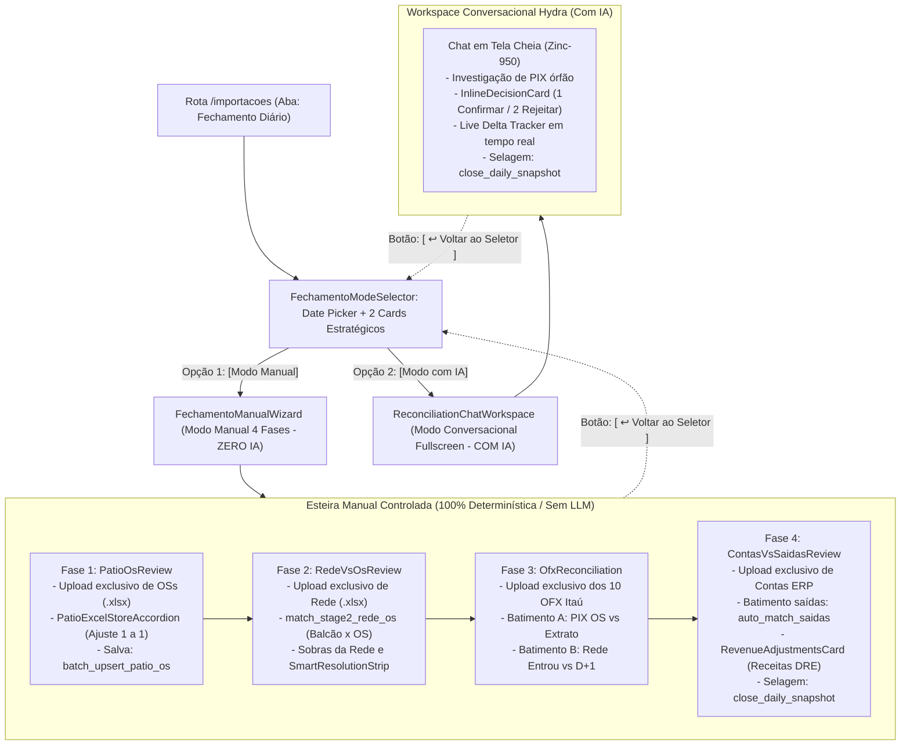

# Design: Bifurcação Inicial da Central de Fechamento — Modo Manual Passo a Passo (Sem IA) vs Modo Conversacional Hydra (Com IA) (361)

## Arquitetura de Roteamento e Bifurcação Inicial



---

## Interfaces TypeScript

```typescript
// Modalidade de fechamento diário
export type FechamentoMode = 'manual' | 'ai';

// Fases do modo manual (ZERO IA)
export type ManualPhaseNumber = 1 | 2 | 3 | 4;

// Props do Seletor Inicial de Modalidade
export interface FechamentoModeSelectorProps {
  selectedDate: string;
  onDateChange: (date: string) => void;
  onSelectMode: (mode: FechamentoMode) => void;
  isDayClosed?: boolean;
  deltaCurrent?: number;
  className?: string;
}

// Props do Container do Modo Manual
export interface FechamentoManualWizardProps {
  targetDate: string;
  currentPhase?: ManualPhaseNumber;
  onPhaseChange?: (phase: ManualPhaseNumber) => void;
  onBackToSelector: () => void;
  onSwitchToAi: () => void;
  onCompleteClose?: () => void;
  className?: string;
}

// Props das 4 Fases Manuais
export interface Fase1PatioOsReviewProps {
  targetDate: string;
  onAdvance: () => void;
}

export interface Fase2RedeVsOsReviewProps {
  targetDate: string;
  onAdvance: () => void;
  onBack: () => void;
}

export interface Fase3OfxReconciliationProps {
  targetDate: string;
  onAdvance: () => void;
  onBack: () => void;
}

export interface Fase4ContasVsSaidasReviewProps {
  targetDate: string;
  onBack: () => void;
  onCloseDaySuccess: () => void;
}
```

---

## Mutações em Arquivos Existentes [MODIFY]

### 1. `src/components/importacoes/CentralImportWizard.tsx`
- **Exclusão:** Remover integralmente o bloco do banner *"Virada de Mês / Pátio sem relatório do ERP? Mistral OCR Vision Integrado"* (L2193-L2219) e o ícone supérfluo de carro, limpando a poluição visual.

### 2. `src/routes/importacoes.tsx`
- **Search Params:** Adicionar suporte a `mode?: 'manual' | 'ai'` e `phase?: 1 | 2 | 3 | 4`.
- **Roteamento Inteligente na Aba `diario`:**
  - Se `!mode`: renderiza `FechamentoModeSelector` (Date Picker + 2 Cards de Escolha).
  - Se `mode === 'manual'`: renderiza `FechamentoManualWizard` (4 fases estritas sem IA).
  - Se `mode === 'ai'`: renderiza `ReconciliationChatWorkspace` em tela cheia com botão superior de retorno ao seletor.

### 3. `src/components/conciliacao/chat/ReconciliationChatWorkspace.tsx`
- Suporte à prop opcional `onReturnToSelector?: () => void`, renderizando o botão `[ ↩ Voltar para Escolha de Modo ]` no cabeçalho superior.

---

## Novos Componentes Modulares [NEW]

- **`src/components/importacoes/bifurcacao/FechamentoModeSelector.tsx`:**
  - Date Picker corporativo Dark Zinc-950 com botões de navegação rápida (`Ontem`, `Hoje`, `<` e `>`).
  - 2 Cards de escolha de modalidade com alto contraste:
    - Card 1: `Modo Manual Passo a Passo (Sem IA)` -> Borda `zinc-800`, hover `emerald-500/30`.
    - Card 2: `Modo Conversacional com IA (Hydra)` -> Borda `zinc-800`, hover `indigo-500/30`.
- **`src/components/importacoes/manual/FechamentoManualWizard.tsx`:**
  - Header com Stepper das 4 etapas lineares (`1. OSs`, `2. Rede`, `3. OFX`, `4. Contas`).
  - Container dinâmico que alterna entre as 4 fases sem re-renderizar a página.
- **`src/components/importacoes/manual/Fase1PatioOsReview.tsx`:**
  - Dropzone exclusiva de OSs + embed direto de `PatioExcelStoreAccordion.tsx`.
- **`src/components/importacoes/manual/Fase2RedeVsOsReview.tsx`:**
  - Dropzone exclusiva de Rede + batimento com OSs + tabela de resíduos/sobras da Rede + `SmartResolutionStrip.tsx`.
- **`src/components/importacoes/manual/Fase3OfxReconciliation.tsx`:**
  - Dropzone exclusiva dos 10 OFX + batimento PIX x OS + apuração de lotes da Rede (Entrou vs A Compensar).
- **`src/components/importacoes/manual/Fase4ContasVsSaidasReview.tsx`:**
  - Dropzone exclusiva de Contas a Pagar + batimento de saídas bancárias + `RevenueAdjustmentsCard.tsx` + selagem final.

---

## Cenários de Verificação (SCAN → INFER → VERIFY → FIX)

### Cenário 1: Fechamento Manual Completo (100% Sem IA)
1. **SCAN:**
   - O operador acessa `/importacoes?tab=diario`.
   - Visualiza a tela de seleção inicial sem banners poluídos.
   - Seleciona a data `2026-09-02` e clica no card `[ Modo Manual Passo a Passo (Sem IA) ]`.
2. **INFER:**
   - A esteira abre na **Fase 1 (OSs)**.
   - O operador carrega as planilhas de OS e ajusta 2 ordens no acordeão Excel.
   - Avança para a **Fase 2 (Rede)**: carrega as maquininhas, a RPC `match_stage2_rede_os` casa as vendas com as OSs da Fase 1 e o operador vincula 1 sobra manualmente.
   - Avança para a **Fase 3 (OFX)**: carrega os 10 extratos, confere os PIXs casados e os valores a compensar.
   - Avança para a **Fase 4 (Contas)**: carrega as contas a pagar, categoriza uma saída extra operacional e adiciona o Aluguel Rei do Módulo via `RevenueAdjustmentsCard`.
3. **VERIFY:**
   - O Scoreboard dos 5 Pilares no topo atinge `Diferença (Δ) = R$ 0,00` e status `approved`.
   - NENHUMA chamada para `supabase.functions.invoke('ai-chat')` foi disparada durante todo o processo.
   - O operador clica em `[ 🔒 Selar Fechamento Manual ]`.
4. **FIX:**
   - A RPC `close_daily_snapshot` congela o fechamento em `daily_snapshots`.
   - O dia aparece como homologado em toda a holding.

---

### Cenário 2: Escolha do Modo Conversacional com IA (Hydra em Tela Cheia)
1. **SCAN:**
   - O operador acessa `/importacoes?tab=diario`, seleciona a data e clica no card `[ Modo Conversacional com IA (Hydra) ]`.
2. **INFER:**
   - A tela transiciona imediatamente para o `ReconciliationChatWorkspace` em tela cheia.
   - A IA Hydra inicializa e emite a saudação de auditoria contábil com os números canônicos do PostgreSQL.
3. **VERIFY:**
   - A IA formula uma proposta no `InlineDecisionCard` para vincular um PIX órfão.
   - O operador pressiona a tecla `1` ou clica em `[ Confirmar Ação ]`.
   - A RPC `resolve_orphan_transaction` é executada com sucesso no PostgreSQL e o Live Delta no cabeçalho é atualizado em tempo real.
4. **FIX:**
   - O operador clica no botão do topo `[ ↩ Voltar para Escolha de Modo ]`.
   - A tela retorna com segurança para o seletor inicial sem descompasso contábil.
