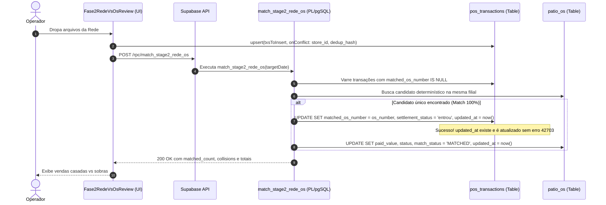

# Design: Correção de `updated_at` em `pos_transactions` e na RPC `match_stage2_rede_os` (364)

## Arquitetura e Fluxo de Dados



---

## Interfaces TypeScript

```typescript
// Atualização em src/integrations/supabase/types.ts
export interface PosTransactionRow {
  created_at: string | null;
  updated_at: string | null; // <-- Nova coluna
  dedup_hash: string | null;
  fee_amount: number;
  gross_amount: number;
  id: string;
  import_batch_id: string | null;
  machine_name: string;
  manual_category: string | null;
  manual_justification: string | null;
  matched_os_number: string | null;
  net_amount: number;
  occurred_at: string;
  payment_method: string;
  settled_amount: number | null;
  settled_date: string | null;
  settlement_status: string | null;
  store_id: string | null;
  target_date: string | null;
  transaction_type: string;
}
```

---

## Mutações em Arquivos Existentes [MODIFY] e Novos [NEW]

1. **`supabase/migrations/20260903000028_add_updated_at_to_pos_transactions.sql` [NEW]:**
   - Adicionar coluna `updated_at TIMESTAMPTZ DEFAULT now()`.
   - Backfill em registros antigos.
   - Criar trigger `trg_pos_transactions_updated_at`.
   - Recompilar `match_stage2_rede_os`.
   - Atribuir `GRANT EXECUTE`.

2. **`src/integrations/supabase/types.ts` [MODIFY]:**
   - Adicionar `updated_at?: string | null` no tipo `pos_transactions`.

---

## Cenários de Verificação (SCAN → INFER → VERIFY → FIX)

### Cenário 1: Execução da RPC `match_stage2_rede_os` com vendas elegíveis
- **SCAN:** O operador importa um lote de vendas da Rede na Fase 2 e o frontend dispara a RPC `match_stage2_rede_os`.
- **INFER:** A RPC deve atualizar `pos_transactions` com `matched_os_number`, `settlement_status = 'entrou'` e `updated_at = now()` sem lançar exceção 42703.
- **VERIFY:** A resposta HTTP retorna status 200 (não mais 400 Bad Request) com `success: true` e contagem de correspondências realizadas.
