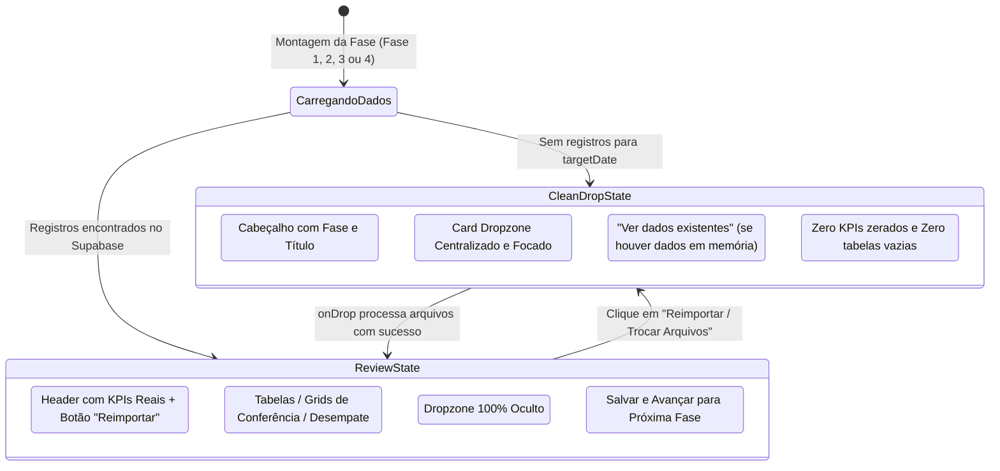
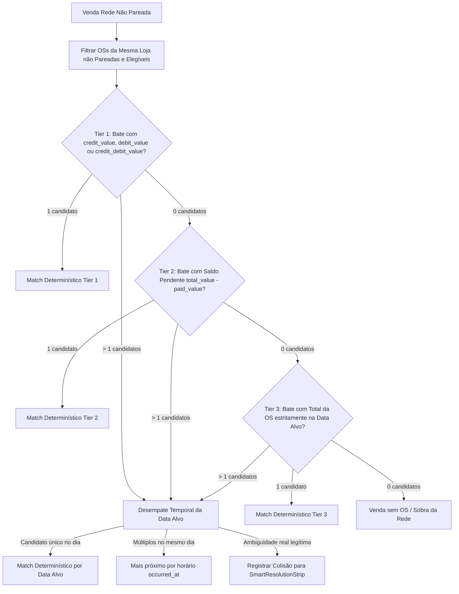

# Design: Fluxo Visual Limpo por Etapas e Recalibração do Motor de Matching Rede x OS (365)

## Arquitetura e Fluxo de Estados da UI

---

## Fluxo da Heurística em Cascata da RPC `match_stage2_rede_os`

---

## Mutações em Arquivos Existentes [MODIFY] e Novos [NEW]

1. **`supabase/migrations/20260903000029_recalibrate_match_stage2_rede_os.sql` [NEW]:**
   - Implementa a nova RPC `public.match_stage2_rede_os(p_target_date date, p_store_id text)` com janela temporal estrita, cascata de 3 tiers, desempate temporal e exclusão de OSs já pareadas.
   - Atribui permissões `GRANT EXECUTE` para `authenticated`, `service_role` e `anon`.

2. **`src/components/importacoes/manual/Fase1PatioOsReview.tsx` [MODIFY]:**
   - Adicionar estado `viewMode: 'drop' | 'review'` e `hasInitialLoaded`.
   - No `loadPatioOs`: se houver OSs, seta `viewMode = 'review'`; se vazio, seta `viewMode = 'drop'`.
   - No `onDrop`: após importar e salvar no banco, transiciona para `viewMode = 'review'`.
   - Se `viewMode === 'drop'`: renderiza APENAS o Card Dropzone centralizado e focado, sem barra de KPIs zerados e sem `PatioExcelStoreAccordion`.
   - Se `viewMode === 'review'`: oculta o dropzone, exibe barra de KPIs com botão `[Reimportar / Trocar Arquivos]` e exibe a grade Excel sanfona completa.

3. **`src/components/importacoes/manual/Fase2RedeVsOsReview.tsx` [MODIFY]:**
   - Adicionar estado `viewMode: 'drop' | 'review'` e `hasInitialLoaded`.
   - No `loadAndMatchRede`: se houver `posList > 0`, seta `viewMode = 'review'`; se vazio, seta `viewMode = 'drop'`.
   - No `onDrop`: após inserir vendas e rodar `match_stage2_rede_os`, transiciona para `viewMode = 'review'`.
   - Se `viewMode === 'drop'`: renderiza APENAS o Card Dropzone centralizado, sem KPIs zerados e sem os cards de conferência.
   - Se `viewMode === 'review'`: oculta o dropzone, exibe barra de KPIs com botão `[Reimportar Arquivo Rede]` e exibe `SmartResolutionStrip` + Grids de Vendas Casadas vs Sobras.

4. **`src/components/importacoes/manual/Fase3OfxReconciliation.tsx` [MODIFY]:**
   - Adicionar estado `viewMode: 'drop' | 'review'` e `hasInitialLoaded`.
   - No `loadOfxData`: se houver `inflowList > 0`, seta `viewMode = 'review'`; se vazio, seta `viewMode = 'drop'`.
   - No `onDrop`: após processar extratos, transiciona para `viewMode = 'review'`.
   - Se `viewMode === 'drop'`: exibe APENAS o Card Dropzone centralizado para os arquivos OFX.
   - Se `viewMode === 'review'`: oculta o dropzone, exibe barra de KPIs com botão `[Reimportar / Adicionar Extratos OFX]` e exibe as tabelas de compensação e PIX.

5. **`src/components/importacoes/manual/Fase4ContasVsSaidasReview.tsx` [MODIFY]:**
   - Adicionar estado `viewMode: 'drop' | 'review'` e `hasInitialLoaded`.
   - No `loadData`: se houver contas importadas ou saídas, seta `viewMode = 'review'`; se vazio, seta `viewMode = 'drop'`.
   - No `onDrop`: após inserir contas e rodar `auto_match_saidas`, transiciona para `viewMode = 'review'`.
   - Se `viewMode === 'drop'`: exibe Card Dropzone centralizado com link *"Pular e ver saídas do extrato"*.
   - Se `viewMode === 'review'`: oculta o dropzone, exibe barra de KPIs com botão `[Reimportar Planilha de Contas]` e exibe conciliação completa de saídas.

---

## Cenários de Verificação (SCAN → INFER → VERIFY → FIX)

### Cenário 1: Transição Visual Limpa e Focada por Etapa
- **SCAN:** O operador abre a Fase 1 para uma nova data.
- **INFER:** A tela exibe apenas o cabeçalho e o Card Dropzone centralizado. Zero KPIs zerados, zero tabelas vazias.
- **VERIFY:** Ao soltar os arquivos de OS, o dropzone desaparece e a grade sanfona do pátio aparece imediatamente. O botão `[Reimportar]` fica visível no header.

### Cenário 2: Erradicação de Falsas Colisões e Aumento do Match Real (Fase 2)
- **SCAN:** O operador importa as vendas da Rede na Fase 2 com ordens de serviço já carregadas na Fase 1.
- **INFER:** A RPC `match_stage2_rede_os` filtra apenas OSs da data alvo e pátio ativo, sem colidir com OSs idênticas de meses anteriores.
- **VERIFY:** Vendas legítimas casam automaticamente (status `'entrou'`, OS `'MATCHED'`). A taxa de match sobe para os valores reais esperados, e a lista de colisões contém apenas casos de duplo lançamento no mesmo dia e na mesma loja.
