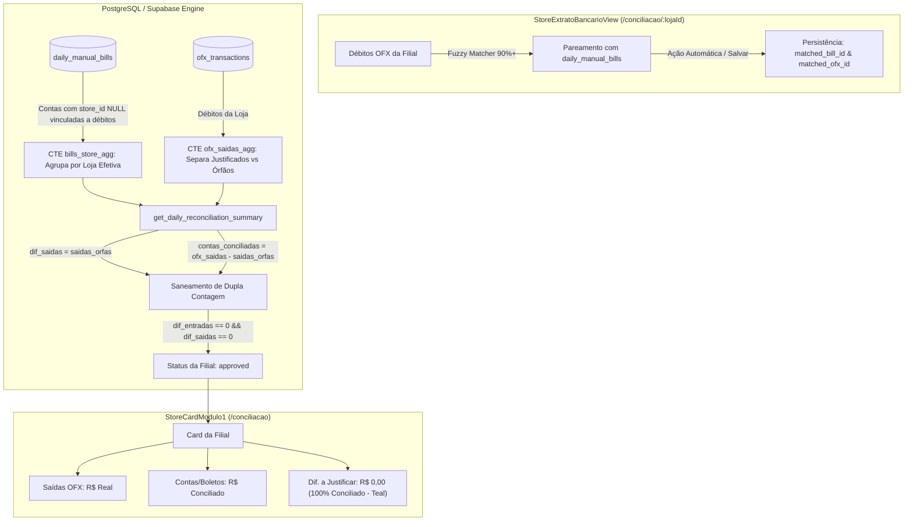

# 📐 Design Técnico: Correção de Divergências de Saídas OFX por Filial

**Spec ID:** `370-correcao-divergencia-lojas-saidas-ofx`  
**Data:** 04/09/2026  
**Status:** Design Técnico  

---

## 1. Arquitetura de Fluxo Ponta a Ponta



### 1.1 Ciclo de Vida dos Dados
1. **Extrato OFX Ingerido:** Os débitos bancários chegam em `ofx_transactions` vinculados ao `store_id` da conta bancária.
2. **Contas a Pagar Ingeridas:** Contas com filial definida (`store_id`) ou holding (`store_id IS NULL`) residem em `daily_manual_bills`.
3. **Pareamento Determinístico:**
   - Contas com identificação unívoca por valor, favorecido ou FITID são vinculadas bidirecionalmente (`ofx_transactions.matched_bill_id = bill.id` e `daily_manual_bills.matched_ofx_id = ofx.id`).
   - Se a conta holding foi paga por uma filial, seu `store_id` é herdado da transação bancária que a liquidou.
4. **Apuração da RPC `get_daily_reconciliation_summary`:**
   - Calcula `ofx_saidas_total` = $\sum \text{amount}$.
   - Calcula `saidas_orfas` = $\sum \text{amount}$ (onde `matched_bill_id IS NULL AND manual_category IS NULL`).
   - Calcula `contas_conciliadas` = `ofx_saidas_total - saidas_orfas`.
   - Calcula `dif_saidas` = `saidas_orfas`.
   - Se `saidas_orfas <= 0.05` e `entradas_orfas <= 0.05`, a filial atinge `status = 'approved'`.

---

## 2. Interfaces TypeScript Reais

### 2.1 Interface do Card por Filial (`StoreCardData`)
*(Localização: `src/hooks/useBackendConciliacao.ts`)*

```typescript
export interface StoreCardData {
  storeId: string;
  storeName: string;
  avatarUrl?: string | null;
  saldoBanco: number | null;
  maquininha: number | null;
  pix: number | null;
  naLojaOs: number | null;
  previsto: number | null;
  diferenca: number | null;
  
  // Split Dual de Diagnóstico
  entradasRealizadas?: number | null;
  entradasPrevisto?: number | null;
  diferencaEntradas?: number | null;
  
  saidasOfx?: number | null;          // Real saído do banco (ofx_saidas_total)
  contasLoja?: number | null;         // Valor conciliado / explicado (contas_conciliadas)
  diferencaSaidas?: number | null;     // Débito órfão a justificar (dif_saidas = saidas_orfas)
  
  dinheiroLoja?: number | null;
  ofxMaquininhas?: number | null;
  pixTotal?: number | null;
  statusCompensacao: 'entrou' | 'parcial' | 'nao_entrou' | 'a_compensar' | 'sem_movimento' | string;
  naoEntrouValor: number | null;
  status: 'approved' | 'divergence' | 'conciliado' | 'pending';
  isMissingData?: boolean;
}
```

### 2.2 Estrutura de Retorno da Loja na RPC
*(Localização: `src/hooks/useBackendConciliacao.ts` -> `StoreReconciliationSummary`)*

```typescript
export interface StoreReconciliationSummary {
  store_id: string;
  store_name: string;
  saldo_banco: number;
  saldo_banco_ofx?: number;
  dinheiro_loja?: number;
  maquininha: number;
  pix: number;
  na_loja_os: number;
  ofx_entradas_total: number;
  entradas_conciliadas: number;
  dif_entradas: number;
  entradas_orfas: number;
  ofx_saidas_total: number;
  contas_loja_total: number;
  saidas_justificadas: number;
  saidas_orfas: number;
  contas_conciliadas: number;
  dif_saidas: number;
  status: 'approved' | 'divergence';
}
```

---

## 3. Lista de Módulos Modificados e Criados

| Arquivo | Tipo | Operação | Responsabilidade |
|---|---|---|---|
| `supabase/migrations/20260904000034_fix_store_saidas_divergences.sql` | SQL | NEW | Atualiza RPC `get_daily_reconciliation_summary` eliminando dupla contagem, atribuindo contas holding vinculadas e corrigindo `dif_saidas = saidas_orfas`. Realiza backfill das contas de Kennedy (`st-04`) de 04/09/2026. |
| `src/components/conciliacao/ConciliacaoLojasView.tsx` | TSX | MODIFY | Consumir com segurança os campos `contas_conciliadas` e `dif_saidas` da RPC sem recálculos duplicados em tela. |
| `src/components/conciliacao/StoreExtratoBancarioView.tsx` | TSX | MODIFY | Incluir botão/gatilho para persistir vínculos de auto-match em batch no banco quando contas forem identificadas com alta confiança. |

---

## 4. Cenários de Teste Detalhados [SCAN -> INFER -> VERIFY -> FIX]

### Cenário 1: Kennedy - MP (`st-04`) com Contas Corporativas de Holding
* **SCAN:**
  - 8 débitos em `ofx_transactions` totalizando R$ 6.429,95.
  - 2 contas em `daily_manual_bills` com `store_id = 'st-04'` (R$ 1.340,75).
  - 6 contas em `daily_manual_bills` com `store_id IS NULL` (R$ 5.089,20).
* **INFER:**
  - As 6 contas correspondem unicamente aos pagamentos executados pela conta de Kennedy (MP Master, Sky Automotive, David de Oliveira, Brooow).
  - Elas devem ser vinculadas aos débitos (`matched_ofx_id` e `matched_bill_id`) e receber `store_id = 'st-04'`.
* **VERIFY:**
  - Rodar script de inspeção via Supabase Client após aplicar migration:
    - `ofx_saidas_total = 6429.95`
    - `contas_conciliadas = 6429.95`
    - `dif_saidas = 0.00`
    - `status = 'approved'`
* **FIX:**
  - O card de Kennedy em `/conciliacao` exibe barra lateral verde, badge "100% Conciliado" e zero divergências.

### Cenário 2: Santo André - HD (`st-08`) e Planalto - BRASICAR (`st-06`) com Transferências / Saques Justificados
* **SCAN:**
  - Santo André possui 2 saídas bancárias (4.944,29 e 8.000,00 = R$ 12.944,29) justificadas como `Transferência Matriz`.
  - Possui R$ 4.944,29 em contas cadastradas (Nova Daniel e PH Imports).
  - Planalto possui R$ 5.000,00 em saques justificados e R$ 270,00 em conta a pagar.
* **INFER:**
  - Em Santo André, 100% dos débitos bancários foram justificados pelo usuário (`saidas_orfas = 0`).
  - Não pode haver dupla contagem somando 12.944,29 + 4.944,29.
* **VERIFY:**
  - Consultar RPC para `st-08`:
    - `ofx_saidas_total = 12944.29`
    - `contas_conciliadas = 12944.29`
    - `dif_saidas = 0.00`
    - `status = 'approved'`
  - Consultar RPC para `st-06`:
    - `ofx_saidas_total = 5270.00`
    - `contas_conciliadas = 5000.00`
    - `saidas_orfas = 270.00` (Boleto Escap Show ainda pendente de vínculo ou justificado)
    - `dif_saidas = 270.00` (Valor exato e positivo do débito pendente)
* **FIX:**
  - Eliminação da divergência negativa de -R$ 4.944,29 em Santo André.
  - Card exibe Saídas Conciliadas R$ 12.944,29 e Dif. a Justificar R$ 0,00.
