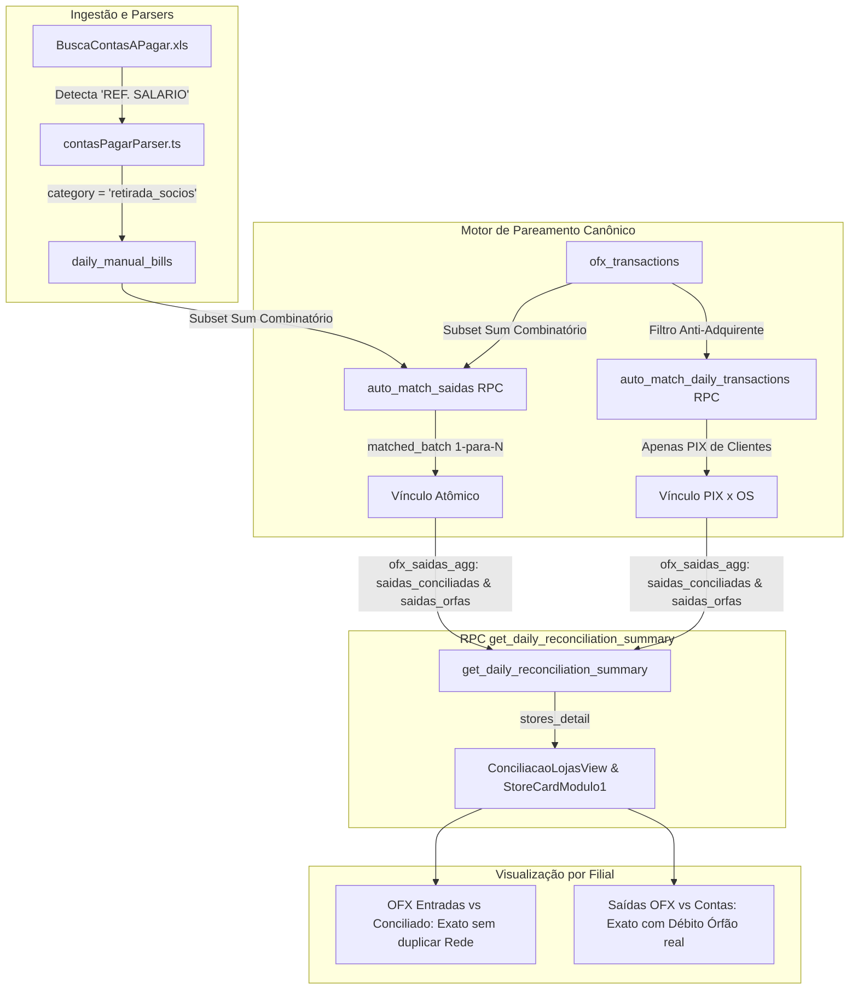

# Design: Correção Canônica de Conciliado vs OFX por Filial e Desreversão de Lotes (376)

## 1. Arquitetura e Fluxo de Dados



---

## 2. Detalhamento das Alterações

### A. Banco de Dados / Supabase Migration
**Arquivo:** `supabase/migrations/20260908000036_fix_store_canonical_matching_and_anti_hijack.sql`

1. **Descontaminação e Limpeza de Falsos Vínculos**:
   ```sql
   -- Reverte créditos da Rede indevidamente marcados como PIX de OS
   UPDATE public.ofx_transactions
   SET matched_os_number = NULL,
       manual_category = NULL,
       updated_at = now()
   WHERE type = 'in'
     AND (
         counterpart_name ILIKE '%REDE%' 
         OR counterpart_name ILIKE '%CARD%' 
         OR bank_name ILIKE '%REDE%' 
         OR bank_name ILIKE '%CARD%'
     )
     AND matched_os_number IS NOT NULL;
   ```

2. **Atualização da RPC `public.auto_match_daily_transactions(text)`**:
   - Na Fase 2 (Matching de PIX x OS), aplicar exclusão mandatória:
   ```sql
   WHERE target_date = v_target_date
     AND type = 'in'
     AND matched_os_number IS NULL
     AND (manual_category IS NULL OR manual_category = 'PIX / Recebimento OS')
     AND NOT (
         COALESCE(counterpart_name, '') ILIKE '%REDE%'
         OR COALESCE(counterpart_name, '') ILIKE '%CARD%'
         OR COALESCE(counterpart_name, '') ILIKE '%CIELO%'
         OR COALESCE(counterpart_name, '') ILIKE '%STONE%'
         OR COALESCE(counterpart_name, '') ILIKE '%PAGSEGURO%'
         OR COALESCE(bank_name, '') ILIKE '%REDE%'
         OR COALESCE(bank_name, '') ILIKE '%CARD%'
     )
   ```

3. **Atualização da RPC `public.auto_match_saidas(text)` com Subset Sum**:
   - Para cada débito SISPAG em aberto na data, iterar sobre subconjuntos de 1 a 6 títulos em aberto de salário da mesma filial (e holding) cuja soma seja igual a `t.amount` ($\pm 0.10$).
   - Ao encontrar a combinação exata:
     - `UPDATE daily_manual_bills SET matched_ofx_id = t.id, match_status = 'matched_batch' WHERE id IN (...ids_do_subconjunto...);`
     - `UPDATE ofx_transactions SET matched_bill_id = (SELECT id FROM ... LIMIT 1), match_status = 'matched_batch', manual_category = 'Folha de Pagamento / Salários' WHERE id = t.id;`

4. **Atualização da RPC `public.get_daily_reconciliation_summary(text, boolean)`**:
   - Em `ofx_entradas_agg`:
     - `pix_total`: somar apenas transações com `(matched_os_number IS NOT NULL OR manual_category = 'PIX / Recebimento OS')` que **NÃO SEJAM** adquirentes (`REDE`, `CARD`, `CIELO`, `STONE`, `PAGSEGURO`).
   - Em `ofx_saidas_agg`:
     - `saidas_conciliadas`: somar débitos cujo `matched_bill_id IS NOT NULL OR manual_category IS NOT NULL OR match_status IN ('matched', 'matched_batch', 'intercompany_paired', 'auto_cancelled')`.
     - `saidas_orfas`: somar débitos restantes sem vínculo e sem categoria.
   - No retorno JSON `stores_detail`:
     - `'contas_conciliadas', COALESCE(sofx.saidas_conciliadas, 0)`
     - `'dif_saidas', COALESCE(sofx.saidas_orfas, 0)`
     - `'diferenca_saidas', COALESCE(sofx.saidas_orfas, 0)`
     - `'status', CASE WHEN ABS(dif_entradas) <= 0.05 AND ABS(dif_saidas) <= 0.05 THEN 'approved' ELSE 'divergence' END`

---

### B. Parser de Contas a Pagar (`src/lib/parsers/contasPagarParser.ts`)
- Em `classifyExpense`:
  - Adicionar regra prioritária para folha de pagamento:
    ```typescript
    if (
      fullText.includes('SALARIO') || 
      fullText.includes('SALÁRIO') || 
      fullText.includes('FOLHA') || 
      fullText.includes('RESCISAO') || 
      fullText.includes('RESCISÃO') || 
      fullText.includes('FERIAS') || 
      fullText.includes('FÉRIAS') || 
      fullText.includes('ADIANTAMENTO') || 
      fullText.includes('VALE')
    ) {
      return { category: 'retirada_socios', isIntercompany: false };
    }
    ```

---

### C. Motor em Memória (`src/lib/expenseMatcher.ts`)
- Em `matchDailyExpensesBatch`:
  - No matching 1-para-N de SISPAG, adicionar algoritmo de busca combinatória de subconjuntos (para 2 a 6 itens):
    - Se a soma total da loja não bater, testar combinações de $k \in [1..N]$ títulos cuja soma bate com o débito OFX.
    - Isso garante que a pré-visualização em memória do Step 2 apresente exatamente o mesmo resultado que o banco de dados.

---

### D. Componentes de Interface
- **`src/components/conciliacao/ConciliacaoLojasView.tsx`**:
  - Garantir que `orfasSaidas = Number(rawLog?.dif_saidas ?? rawLog?.saidas_orfas ?? 0)`.
  - Garantir que `concSaidas = Number(rawLog?.contas_conciliadas ?? (ofxSaidas - orfasSaidas))`.
  - Se `orfasSaidas > 0.05`, o card exibirá badge `DIVERGÊNCIA` e o valor exato no campo `Dif. a Justificar: Débito Órfão -R$ X,XX`.
- **`src/components/conciliacao/StoreCardModulo1.tsx`**:
  - O layout existente já possui todos os slots prontos. Com os dados corretos da RPC, o card de Dom Pedro exibirá:
    - OFX Entradas: R$ 1.352,47
    - Conciliado: R$ 1.352,36 (Rede 972,36 + PIX 380,00)
    - Dif. a Justificar: R$ 0,11 (o rendimento bancário real).
  - O card de Jabaquara exibirá:
    - Se SISPAG não estiver pareado: Débito Órfão -R$ 4.477,44.
    - Quando o lote for pareado via subset sum: 100% Conciliado R$ 0,00!

---

## 3. Interfaces TypeScript

```typescript
export interface StoreCanonicalReconciliation {
  storeId: string;
  storeName: string;
  ofxEntradasTotal: number;
  ofxMaquininhas: number;
  pixTotal: number;
  entradasJustificadas: number;
  entradasConciliadas: number;
  difEntradas: number; // Crédito órfão
  ofxSaidasTotal: number;
  saidasConciliadas: number;
  saidasOrfas: number;
  difSaidas: number; // Débito órfão
  status: 'approved' | 'divergence';
}
```

---

## 4. Cenários de Verificação (SCAN → INFER → VERIFY → FIX)

### Cenário 1: Dom Pedro (Descontaminação de Cartão e Eliminação da Dupla Contagem)
- **Estado Inicial**: Dom Pedro tem OFX Entradas R$ 1.352,47, mas exibia Conciliado R$ 2.324,72 com Dif -R$ 972,25.
- **Ação**: Aplicar a migração de descontaminação e a nova versão da RPC `get_daily_reconciliation_summary`.
- **Resultado Esperado**:
  - `ofx_maquininhas`: R$ 972,36
  - `pix_total`: R$ 380,00
  - `entradas_conciliadas`: R$ 1.352,36
  - `dif_entradas`: R$ 0,11 (rendimento bancário legítimo pendente)
  - Zero duplicações de cartão no Conciliado.

### Cenário 2: Jabaquara (Subset Sum SISPAG e Transparência de Débito Órfão)
- **Estado Inicial**: Jabaquara tinha SISPAG R$ 4.477,44 órfão, mas o card exibia "100% Conciliado R$ 0,00".
- **Ação**: Executar `auto_match_saidas('2026-09-08')` com subset sum.
- **Resultado Esperado**:
  - Vanessa (2.438,78) + Gustavo (2.038,66) casam perfeitamente com o débito de R$ 4.477,44.
  - Se desvinculado propositalmente, o card exibe honestamente: `Dif. a Justificar: Débito Órfão -R$ 4.477,44`.
  - Quando vinculado, `saidas_conciliadas = R$ 6.444,76` e `dif_saidas = R$ 0,00` (100% Conciliado real com lastro).
