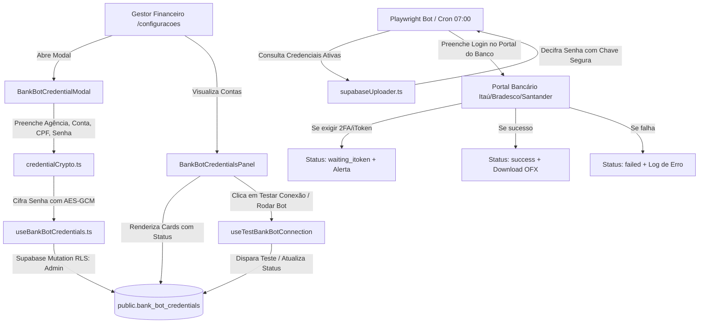

# Design: Painel de Credenciais Bancárias dos Bots de Automação (378)

## Arquitetura e Fluxo de Dados



---

## Interfaces TypeScript

```typescript
export type BankCode = 'itau' | 'bradesco' | 'santander' | 'bb' | 'caixa' | 'inter';
export type BankAccessType = 'full' | 'read_only';
export type BankConnectionStatus = 'untested' | 'success' | 'waiting_itoken' | 'failed' | 'testing';

export interface BankBotCredential {
  id: string;
  store_id: string;
  store_name?: string;
  bank_code: BankCode;
  bank_name: string;
  agency: string;
  account_number: string;
  operator_cpf: string;
  encrypted_password?: string;
  access_type: BankAccessType;
  is_active: boolean;
  last_sync_at: string | null;
  last_status: BankConnectionStatus;
  last_error: string | null;
  created_at: string;
  updated_at: string;
}

export interface BankBotCredentialInput {
  id?: string;
  store_id: string;
  bank_code: BankCode;
  bank_name: string;
  agency: string;
  account_number: string;
  operator_cpf: string;
  password?: string; // Senha em texto claro informada no form (será cifrada antes do save)
  access_type: BankAccessType;
  is_active: boolean;
}

export interface SupportedBankConfig {
  code: BankCode;
  name: string;
  shortName: string;
  primaryColor: string; // Ex: '#ec7000' para Itaú, '#cc092f' para Bradesco
  accentBg: string; // Ex: 'bg-orange-500/10'
  accentBorder: string; // Ex: 'border-orange-500/30'
  accentText: string; // Ex: 'text-orange-400'
  defaultUrl: string;
}
```

---

## Mutações em Arquivos Existentes [MODIFY]

### 1. `src/components/agente/ConfiguracoesPanel.tsx`
- Adicionar importação de `BankBotCredentialsPanel`.
- No render da aba `'motor'`, incluir `<BankBotCredentialsPanel />` diretamente integrado abaixo ou como bloco principal de automação financeira.

### 2. `bot/src/sync/supabaseUploader.ts`
- Implementar função `getBankBotCredentials(storeId?: string, bankCode?: string)`:
  - Consulta `bank_bot_credentials` onde `is_active = true`.
  - Descriptografa `encrypted_password` e retorna `{ store_id, bank_code, agency, account_number, operator_cpf, password }`.

---

## Novos Arquivos [NEW]

### 1. `src/lib/credentialCrypto.ts`
- `encryptBankPassword(raw: string): string`: Criptografia simétrica com vetor de inicialização (IV) e digest codificado em base64 com prefixo identificador `enc:v1:`.
- `decryptBankPassword(enc: string): string`: Descriptografia segura com validação de formato e fallback defensivo.
- `maskCpf(cpf: string): string`: Transforma `123.456.789-00` em `***.***.789-00` preservando a privacidade na tela.
- `cleanCpf(cpf: string): string`: Remove pontos e traços para envio padronizado.
- `formatCpf(cpf: string): string`: Aplica máscara em tempo real durante a digitação.

### 2. `src/hooks/useBankBotCredentials.ts`
- `useBankBotCredentials()`: Query com join com `stores(id, name)` e cache invalidation.
- `useCreateBankBotCredential()`: Mutation com cifra da senha e toast de confirmação.
- `useUpdateBankBotCredential()`: Mutation que preserva a senha existente caso o campo venha em branco.
- `useDeleteBankBotCredential()`: Mutation com confirmação de exclusão física.
- `useTestBankBotConnection()`: Mutation para disparar verificação e simulação de conexão com o banco.

### 3. `src/components/configuracoes/BankBotCredentialsPanel.tsx`
- Grade responsiva de cartões Dark UI Zinc-950 (`grid-cols-1 md:grid-cols-2 xl:grid-cols-3`).
- Filtros por busca (nome da loja, banco, conta) e pílulas de status (`Todas`, `🟢 Conectadas`, `🟡 Pendente iToken`, `🔴 Falhas`).
- Botão primário com ícone Plus: `[+ Conectar Nova Conta Bancária]`.
- Cada cartão com:
  - Ícone e gradiente temático do banco (ex: Itaú laranja, Bradesco vermelho, Santander rubro, BB amarelo).
  - Badge da filial correspondente (`Dom Pedro - DP`, `Jabaquara - JAB`, etc.).
  - Dados da conta com fonte mono espaçada e destacada.
  - CPF mascarado com botão toggle de exibição (`Eye` / `EyeOff`).
  - Badge de status dinâmico e timestamp da última extração.
  - Botão de ação direta: `[Testar Conexão / Rodar Bot]`.
  - Menus/botões de `[Editar]` e `[Excluir]`.

### 4. `src/components/configuracoes/BankBotCredentialModal.tsx`
- Diálogo modal moderno (`bg-zinc-950 border border-zinc-800 rounded-2xl`).
- Validação síncrona dos campos:
  - Banco obrigatório (select).
  - Loja obrigatória (select filtrado das 10 filiais).
  - Agência obrigatória (4 dígitos).
  - Conta Corrente obrigatória (com dígito).
  - CPF do Operador com validação de 11 dígitos e máscara automática.
  - Senha com indicador de obrigatoriedade (obrigatória no cadastro; opcional na edição).
  - Tipo de Acesso (`Acesso Completo` / `Apenas Consulta`).
  - Switch de ativação imediata para robôs.

---

## Cenários de Verificação (SCAN → INFER → VERIFY → FIX)

### Cenário 1: Cadastro de Nova Conta do Itaú e Validação Visual
- **SCAN**: Usuário acessa `/configuracoes` na aba "Motor & Lojas", visualiza o painel de credenciais bancárias e clica em `[+ Conectar Nova Conta Bancária]`.
- **INFER**: O modal se abre com a lista de bancos suportados e as 10 lojas ativas disponíveis no select.
- **VERIFY**: Usuário seleciona `Itaú Empresas PJ`, loja `Jabaquara - JAB`, agência `0263`, conta `81153-1`, CPF `123.456.789-00`, senha `123456` e clica em `Salvar`. O modal fecha, um toast verde de sucesso aparece e o novo cartão é renderizado com status `⚪ Não Testado`, agência `0263 | Conta 81153-1` e CPF `***.***.789-00`.

### Cenário 2: Teste de Conexão com Alerta de iToken
- **SCAN**: Usuário clica no botão `[Testar Conexão / Rodar Bot]` do cartão recém-criado.
- **INFER**: O status passa temporariamente para `testing` (com spinner de carregamento).
- **VERIFY**: Se a rotina detectar a tela de 2FA do Itaú, o status é atualizado para `🟡 Pendente iToken` e um toast informativo exibe: *"Robô do Itaú aguardando confirmação do iToken no celular!"*.

### Cenário 3: Edição com Preservação de Senha Criptografada
- **SCAN**: Usuário clica em `[Editar]` no cartão existente.
- **INFER**: Os dados da agência e conta são carregados no formulário; o campo de senha permanece vazio com placeholder explicativo *"•••••••• (manter senha atual)"*.
- **VERIFY**: Usuário altera apenas o CPF ou a agência e salva. A mutation atualiza os metadados mantendo a senha cifrada anterior intacta no banco de dados.

### Cenário 4: Exclusão com Confirmação Defensiva
- **SCAN**: Usuário clica em `[Excluir]`.
- **INFER**: O sistema solicita confirmação explícita antes de remover.
- **VERIFY**: Confirmada a ação, o registro é removido do Supabase e o card desaparece da tela instantaneamente sem necessidade de refresh manual da página.
