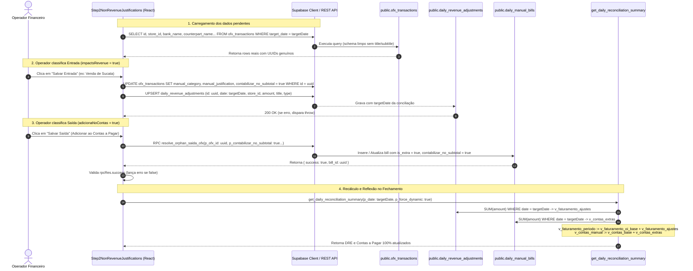

# Spec 382 — Design Técnico: Correção das Justificativas de Transações Órfãs (Faturamento e Contas a Pagar)

## 1. Fluxo de Dados e Ciclo de Vida da Justificativa



---

## 2. Especificação das Mudanças de Arquitetura

### 2.1. Schema e Queries do React Query
Em `Step2NonRevenueJustifications.tsx`:

```ts
// ANTES (Quebrava silenciosamente devido a 'title, subtitle')
const { data: dbOutflows = [] } = useQuery({
  queryKey: ['pending-ofx-outflows', targetDate],
  queryFn: async () => {
    const { data, error } = await supabase
      .from('ofx_transactions')
      .select('id, store_id, bank_name, type, amount, occurred_at, fitid, counterpart_name, title, subtitle, matched_bill_id, manual_category, manual_justification, target_date, contabilizar_no_subtotal, match_status')
      .eq('target_date', targetDate)
      .eq('type', 'out')
      .is('matched_bill_id', null);
    if (error) throw error;
    return data || [];
  }
});

// DEPOIS (Colunas canônicas reais)
const { data: dbOutflows = [] } = useQuery({
  queryKey: ['pending-ofx-outflows', targetDate],
  queryFn: async () => {
    const { data, error } = await supabase
      .from('ofx_transactions')
      .select('id, store_id, bank_name, type, amount, occurred_at, fitid, counterpart_name, matched_bill_id, manual_category, manual_justification, target_date, contabilizar_no_subtotal, match_status')
      .eq('target_date', targetDate)
      .eq('type', 'out')
      .is('matched_bill_id', null);
    if (error) throw error;
    return data || [];
  }
});
```
Idem para `pending-ofx-inflows` com `matched_os_number`.

### 2.2. Tratamento Fail-Fast e Anti-Ghost Toasts
```ts
// Em handleSaveInflow:
if (state.impactsRevenue && entry.amount > 0) {
  const { error: adjErr } = await supabase
    .from('daily_revenue_adjustments')
    .upsert({
      id: entry.id,
      date: targetDate, // SEMPRE targetDate da conciliação contábil
      store_id: entry.storeId || null,
      title: cleanCategory || 'Receita Avulsa OFX',
      description: cleanJustification || entry.description || 'Justificado no Wizard',
      type: 'venda_avulsa',
      amount: entry.amount
    }, { onConflict: 'id' });

  if (adjErr) throw adjErr; // NUNCA console.warn
} else {
  const { error: delErr } = await supabase
    .from('daily_revenue_adjustments')
    .delete()
    .eq('id', entry.id);
  if (delErr) throw delErr;
}

// Em handleSaveOutflow:
const { data: rpcRes, error } = await supabase.rpc('resolve_orphan_saida_ofx', { ... });
if (error) throw error;
if (rpcRes && rpcRes.success === false) {
  throw new Error(rpcRes.message || 'Não foi possível classificar a saída no banco');
}
```

### 2.3. Matemática Contábil Canônica na RPC `get_daily_reconciliation_summary`

```sql
-- CONTAS A PAGAR
SELECT 
    COALESCE(SUM(amount), 0),
    COALESCE(SUM(CASE WHEN category IN ('Pró-Labore', 'Distribuição Lucros', 'Extra') OR title ILIKE '%Pró-Labore%' OR title ILIKE '%Extra%' THEN amount ELSE 0 END), 0),
    COALESCE(SUM(CASE WHEN category NOT IN ('Pró-Labore', 'Distribuição Lucros', 'Extra') AND title NOT ILIKE '%Pró-Labore%' AND title NOT ILIKE '%Extra%' THEN amount ELSE 0 END), 0),
    COALESCE(jsonb_agg(...)),
INTO v_total_bills, v_contas_extras, v_contas_imported_bills, v_contas_itens
FROM daily_manual_bills
WHERE date = v_target_date::date AND COALESCE(contabilizar_no_subtotal, true) = true;

-- BASE + EXTRAS
IF v_snapshot_found AND v_snapshot.contas_a_pagar > 0 AND NOT p_force_dynamic THEN
    v_contas_base := v_snapshot.contas_a_pagar;
    v_contas_manual := v_contas_base + v_contas_extras;
ELSE
    IF v_contas_imported_bills > 0 THEN
        v_contas_base := v_contas_imported_bills;
    ELSE
        SELECT COALESCE(SUM(ABS(amount)), 0) INTO v_contas_base
        FROM ofx_transactions
        WHERE target_date = v_target_date::date AND type = 'out';
    END IF;
    v_contas_manual := v_contas_base + v_contas_extras;
END IF;

v_subtotal_contas := v_contas_manual + v_juros_rede;
v_diferenca_final := v_valor_disp_contas - v_subtotal_contas;
```

---

## 3. Invariantes de Consistência
1. **Invariante UUID:** Nenhuma operação de `update` ou `upsert` em `ofx_transactions` ou `daily_revenue_adjustments` deve utilizar chaves que não sejam UUIDs válidos.
2. **Invariante Temporal:** Lançamentos em `daily_revenue_adjustments` ou `daily_manual_bills` criados a partir da justificativa no Wizard do dia X DEVEM ter `date = X`.
3. **Invariante de Aditividade:**
   - $\text{Faturamento Total} = \text{Faturamento OI Base} + \sum \text{Ajustes de Faturamento}$
   - $\text{Contas a Pagar Total} = \text{Contas Base} + \text{Despesas Extras} + \text{Juros Rede}$
