# Design: Motores de Match Decoupling, Baixa de Lote Automática e Sanidade Contábil de "Entrou vs Não Entrou" (382)

## 1. Arquitetura e Fluxo de Dados

```mermaid
sequenceDiagram
    autonumber
    participant Operador as Operador / Central Import Wizard
    participant Parser as redeParser.ts (com FEBRABAN)
    participant Matcher as autoMatchingEngine.ts (2 Pernas)
    participant Hook as useConciliacao.ts
    participant Modulo1 as modulo1Calculations.ts

    Operador->>Parser: Upload de Rede_Rel_Vendas_04_09_2026-06_09_2026.xlsx
    Note over Parser: Extrai data da venda (04/09), lote (RO 76549981),<br/>prazo (1 d.u.) e calcula creditDate = 08/09/2026 (FEBRABAN)
    Parser-->>Matcher: Lista de RedeTransaction com creditDate e batchNumber

    Operador->>Matcher: Executa Conciliação com targetDate = 08/09/2026

    rect rgb(20, 30, 45)
        Note over Matcher: PERNA 1: OPERACIONAL (OS x Rede)
        Matcher->>Matcher: Cruza OS do pátio com vendas POS usando occurred_at (Janela D-3 a D)
        Matcher-->>Matcher: Vendas do sábado 05/09 casam com OSs de sábado 05/09
    end

    rect rgb(20, 45, 30)
        Note over Matcher: PERNA 2: FINANCEIRA (Lote Rede x OFX)
        Matcher->>Matcher: Agrupa vendas com creditDate = 08/09 em lotes (DB / AT)
        Matcher->>Matcher: Compara contra depósitos OFX de 08/09 (ex: RECEBIMENTO REDE MAST DB)
        Matcher->>Matcher: Checa KNOWN_POS_RENTAL_FEES (R$ 119 / 238)
        Matcher-->>Matcher: BAIXA DE LOTE AUTOMÁTICA (Micro-vendas = "entrou")
    end

    rect rgb(45, 35, 20)
        Note over Matcher: PERNA 3: PIX BANCÁRIO (OS PIX x OFX)
        Matcher->>Matcher: Extrai data "05/09" do memo do Itaú via regex
        Matcher->>Matcher: Valida tokens de cliente (matchClientTokens) na janela D-3
        Matcher-->>Matcher: PIX casado sem falso positivo
    end

    Matcher->>Hook: Retorna AutoMatchingResult com lotes liquidados
    Hook->>Modulo1: Alimenta StoreSaldoState com cartao_entrou real e cartao_nao_entrou real
    Note over Modulo1: Balanço Contábil Perfeito:<br/>Delta G21 = 0, Delta G23 = 0, Delta G31 = 0
```



---

## 2. Interfaces TypeScript

### Novas Estruturas e Extensões:

```typescript
// Em src/lib/parsers/redeParser.ts
export const BRAZILIAN_BANK_HOLIDAYS_2026 = new Set([
  '2026-01-01', // Confraternização Universal
  '2026-02-16', '2026-02-17', // Carnaval
  '2026-04-03', // Paixão de Cristo
  '2026-04-21', // Tiradentes
  '2026-05-01', // Dia do Trabalho
  '2026-06-04', // Corpus Christi
  '2026-09-07', // Independência do Brasil
  '2026-10-12', // N. Sra. Aparecida
  '2026-11-02', // Finados
  '2026-11-15', // Proclamação da República
  '2026-11-20', // Consciência Negra
  '2026-12-25', // Natal
]);

export function calculateExpectedCreditDate(saleDateStr: string, businessDays: number = 1): string {
  const [year, month, day] = saleDateStr.split('T')[0].split('-').map(Number);
  const date = new Date(Date.UTC(year, month - 1, day, 12, 0, 0));
  let added = 0;
  while (added < businessDays) {
    date.setUTCDate(date.getUTCDate() + 1);
    const dayOfWeek = date.getUTCDay(); // 0 = Dom, 6 = Sáb
    const isoDate = date.toISOString().split('T')[0];
    if (dayOfWeek !== 0 && dayOfWeek !== 6 && !BRAZILIAN_BANK_HOLIDAYS_2026.has(isoDate)) {
      added++;
    }
  }
  return date.toISOString().split('T')[0];
}
```

### Bucket de Deduções de Aluguel de POS:
```typescript
// Em src/lib/matchers/autoMatchingEngine.ts
export const KNOWN_POS_RENTAL_FEES = [119.00, 119.90, 120.00, 238.00, 239.80, 240.00, 357.00, 476.00];

export interface RedeBatchGroup {
  key: string;
  storeId: string;
  creditDate: string;
  modalityCode: 'DB' | 'AT' | 'CRED' | 'OUTROS';
  batchNumber?: string;
  grossAmount: number;
  netAmount: number;
  txCount: number;
  txIds: string[];
}
```

---

## 3. Mutações em Arquivos Existentes [MODIFY]

### `src/lib/parsers/redeParser.ts`
- **Cabeçalho:** Detectar colunas `resumo de vendas/número do lote`, `prazo de recebimento` e `data do crédito`.
- **Loop de Linhas:** Extrair a data de realização da venda (`date`) e a data prevista de crédito (`creditDate`). Se `creditDate` estiver ausente, invocar `calculateExpectedCreditDate(date, prazoDays)`.

### `src/lib/matchers/autoMatchingEngine.ts`
- **Fase 1 (OS x Rede):** Remover o `isSameDate(tx.date, targetDate)` restritivo. Permitir janela de busca de até 3 dias antes da data da venda para OSs de fim de semana/turno noturno.
- **Fase 2 (Rede x OFX):** Implementar o método `matchRedeBatchesVsOfx(redeTxs, ofxTxs, targetDate)`:
  - Agrupa as vendas por `${storeId}_${creditDate}_${modality}`.
  - Localiza os depósitos do OFX de adquirente correspondentes.
  - Verifica matching exato centesimal ($\le 0,10$) ou matching com dedução de aluguel de POS (`KNOWN_POS_RENTAL_FEES`).
  - Marca as vendas do lote com status `vinculada` / `entrou`.
- **Fase 3 (OS (PIX) x OFX):**
  - Aplicar regex `\b(\d{2})[/-](\d{2})\b` para capturar datas de fim de semana no memo do extrato Itaú.
  - Condicionar o pareamento a `matchClientTokens` para impedir transferências indevidas entre clientes com valores iguais.

### `src/hooks/useConciliacao.ts`
- **`useDailyConciliacao` (L603-L604):**
  - Eliminar o hardcode `cartao_nao_entrou: 0`.
  - Computar `cartao_entrou = sum(ofx.amount liquidados de adquirente)`.
  - Computar `cartao_nao_entrou = sum(rede.netAmount de lotes ainda não liquidados no banco)`.
- **`useReconciliationViews` (L324 e L573-L581):**
  - Remover o atalho `redeTxs.length === 1`.
  - Eliminar o `splice` cego por valor no PIX.

---

## 4. Cenários de Verificação (SCAN → INFER → VERIFY → FIX)

### Cenário 1: Fechamento Pós-Feriado 08/09/2026 com Vendas de Fim de Semana
- **SCAN:** Arquivo da Rede com vendas de 04/09 (sexta), 05/09 (sábado) e 06/09 (domingo). Extrato OFX do Itaú de 08/09 com depósito `RECEBIMENTO REDE MAST DB: R$ 4.072,37`.
- **INFER:** O prazo contratual de D+1 útil salta o fim de semana e o feriado de 07/09 (Independência). Todas as vendas de débito convergem para `creditDate = 2026-09-08`.
- **VERIFY:** A soma líquida do lote de débito para 08/09 bate exatamente R$ 4.072,37 com o depósito OFX. Baixa automática ativada.
- **FIX:** Nenhuma venda é descartada por filtro de data.

### Cenário 2: Retenção na Fonte de Aluguel de Maquininha (R$ 238,00)
- **SCAN:** Lote de vendas líquidas de R$ 5.238,00. Depósito no Itaú de R$ 5.000,00.
- **INFER:** A diferença de R$ 238,00 coincide com `KNOWN_POS_RENTAL_FEES` (aluguel de 2 terminais POS).
- **VERIFY:** O motor identifica o aluguel, baixa o lote de R$ 5.238 e registra R$ 238 em `juros_rede` / contas pagas.
- **FIX:** Diferença contábil $G31 = R\$ 0,00$.

### Cenário 3: PIX do Itaú com Memo de Sábado (05/09)
- **SCAN:** OFX de 08/09 com memo `PIX RECEBIDO ROBERT 05/09: R$ 1.539,72`. OS de 05/09 emitida para Robert Max Wolfrum.
- **INFER:** O cliente pagou no sábado, o banco consolidou na terça pós-feriado.
- **VERIFY:** O regex extrai `05/09`, a janela $D-3$ localiza a OS de sábado, e `matchClientTokens` confirma o cliente "ROBERT".
- **FIX:** Match automático com 100% de confiança, sem conflito com outros PIXs de mesmo valor.
