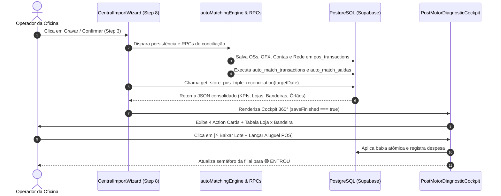

# Design: Cockpit de Diagnóstico 360° Pós-Motor (384)

## Arquitetura e Fluxo de Dados



---

## Interfaces TypeScript (`src/types/cockpit360.ts`)

```typescript
export type SettlementStatusType = 
  | 'entrou' 
  | 'nao_entrou' 
  | 'a_compensar' 
  | 'divergente' 
  | 'sem_movimento' 
  | 'parcial';

export type CockpitGlobalStatus = 'conforme' | 'atencao' | 'critico';

export interface CockpitBrandDetail {
  brand: string;
  bruto: number;
  liquido: number;
  taxas: number;
  taxa_efetiva_pct?: number;
  entrou: number;
  nao_entrou: number;
  a_compensar: number;
  tx_count: number;
  status: SettlementStatusType;
}

export interface CockpitStoreDetail {
  store_id: string;
  store_name: string;
  rede_bruto: number;
  rede_liquido: number;
  rede_taxas: number;
  rede_devolucoes: number;
  ofx_maquininhas: number;
  entrou_valor: number;
  nao_entrou_valor: number;
  a_compensar_valor: number;
  divergencia_valor: number;
  total_transacoes: number;
  transacoes_com_os: number;
  transacoes_sem_os: number;
  status_compensacao: SettlementStatusType;
  brands: CockpitBrandDetail[];
}

export interface CockpitFlaggedTransaction {
  id: string;
  store_id: string;
  store_name: string;
  brand: string;
  payment_method: string;
  gross_amount: number;
  net_amount: number;
  fee_amount: number;
  settlement_status: SettlementStatusType;
  matched_os_number: string | null;
  occurred_at: string;
}

export interface CockpitKpis {
  total_rede_bruto: number;
  total_rede_liquido: number;
  total_rede_taxas: number;
  total_rede_devolucoes: number;
  total_ofx_maquininhas: number;
  total_entrou: number;
  total_nao_entrou: number;
  total_a_compensar: number;
  total_divergente: number;
  taxa_efetiva_global_pct: number;
  status_geral: CockpitGlobalStatus;
}

export interface Cockpit360DiagnosticResponse {
  target_date: string;
  kpis: CockpitKpis;
  by_brand: CockpitBrandDetail[];
  stores: CockpitStoreDetail[];
  flagged_transactions: CockpitFlaggedTransaction[];
  // Retrocompatibilidade estrita:
  total_rede_bruto: number;
  total_rede_liquido: number;
  total_rede_taxas: number;
  total_rede_devolucoes: number;
  total_ofx_maquininhas: number;
  total_nao_entrou: number;
}
```

---

## Mutações em Arquivos Existentes [MODIFY]

### 1. `src/components/importacoes/CentralImportWizard.tsx`
- **Correção do Bug L1870:**
  - *Antes:*
    ```typescript
    await supabase.from('pos_transactions')
      .update({ settlement_status: 'entrou', settled_date: targetDate })
      .eq('store_id', sId)
      .eq('target_date', targetDate);
    ```
  - *Depois:*
    ```typescript
    const matchedPosIds = entrouItems.map(i => i.id).filter(Boolean);
    if (matchedPosIds.length > 0) {
      await supabase.from('pos_transactions')
        .update({ settlement_status: 'entrou', settled_date: targetDate })
        .in('id', matchedPosIds);
    }
    ```
- **Integração do Cockpit no Step 8 (linhas ~3400):**
  - Quando `saveFinished === true`, renderizar o `<PostMotorDiagnosticCockpit />` imediatamente acima do terminal de logs.

### 2. `src/components/conciliacao/MaquininhasDetailModal.tsx`
- Adicionar prop `initialStoreId?: string | null` na interface `MaquininhasDetailModalProps`.
- No estado inicial do modal, se `initialStoreId` for fornecido, pré-selecionar e rolar suavemente até a filial especificada.

### 3. `supabase/migrations/20260909000041_cockpit_pos_triple_reconciliation_brand.sql`
- Adicionar colunas `brand`, `expected_credit_date`, `nsu`, `authorization_code` em `pos_transactions`.
- Atualizar a função `public.get_store_pos_triple_reconciliation` com a lógica das CTEs isoladas.

---

## Cenários de Verificação (SCAN → INFER → VERIFY → FIX)

### Cenário 1: Fechamento com Lote Consolidado e Retenção de Aluguel POS
- **Estado Inicial:** Loja Mauá com R$ 5.000,00 de vendas líquidas na Rede (Visa R$ 1.830, Master R$ 2.450, Elo R$ 720). Extrato do Itaú acusa crédito de R$ 4.881,00 (diferença de R$ 119,00 de aluguel de maquininha).
- **Ação:** Executar a importação e aguardar a conclusão do motor no Step 8.
- **Resultado Esperado:** 
  1. O Cockpit 360° renderiza a Loja Mauá com status 🟡 `ATENÇÃO / PARCIAL`.
  2. O accordion inline exibe as 3 bandeiras e identifica a retenção de R$ 119,00.
  3. O Action Card exibe: `[⚡ Baixar Lote e Lançar R$ 119,00 de Aluguel POS]`.
  4. Ao confirmar, o status transiciona para 🟢 `ENTROU` e a diferença diária fecha em R$ 0,00.

### Cenário 2: Blindagem de Vendas Futuras ($D+30$) e Prevenção de Ativo Fantasma
- **Estado Inicial:** Venda de R$ 5.200,00 em cartão de crédito parcelado realizada hoje, com previsão de liquidação para daqui a 30 dias.
- **Ação:** Inspecionar o Cockpit 360° pós-motor.
- **Resultado Esperado:**
  1. A venda de R$ 5.200,00 é classificada como 🟡 `A COMPENSAR (Ciclo Normal)`.
  2. Ela **não** é apontada como divergência e **não** é considerada inadimplência da Rede.
  3. O valor entra legitimamente no Pilar 1 como Cartões a Compensar, sem colapsar o caixa diário.
