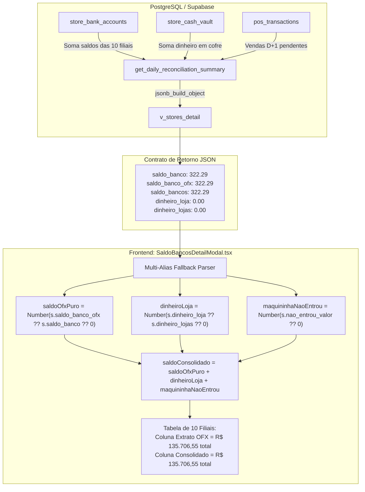

# Design Técnico: Correção de Mapeamento de Saldo OFX no Modal Raio-X por Filial (Spec 384)

## 1. 📐 Fluxo de Dados e Arquitetura



---

## 2. 🧩 Interfaces TypeScript Reais

### A. Tipos Atualizados em `src/hooks/useBackendConciliacao.ts`
```typescript
export interface StoreReconciliationSummary {
  store_id: string;
  store_name: string;
  color?: string;
  saldo_banco: number;               // Saldo do banco ou consolidado
  saldo_banco_ofx?: number;          // Saldo puro do extrato OFX (Itaú)
  saldo_banco_itau?: number;         // Alias canônico Itaú
  saldo_bancos?: number;             // Alias retornado pelo agrupamento SQL
  saldo_total?: number;              // Alias de compatibilidade
  saldo_banco_positivo?: number;     // Subtotal de filiais credoras
  saldo_negativo_itau?: number;      // Cheque especial devedor
  saldo_devedor_real?: number;
  saldo_positivo_real?: number;
  dinheiro_loja?: number;            // Dinheiro no cofre (singular)
  dinheiro_lojas?: number;           // Dinheiro no cofre (plural da RPC)
  saldo_cofre?: number;              // Alias de cofre
  vault_entries?: Array<{ id: string; amount: number; status: string; entry_date: string; description?: string }>;
  nao_entrou_valor?: number;         // Vendas de cartão a compensar
  cartoes_a_compensar?: number;
  rede_bruto?: number;
  rede_liquido?: number;
  rede_total?: number;
  rede_devolucoes?: number;
  ofx_maquininhas?: number;
  status_compensacao?: 'entrou' | 'parcial' | 'nao_entrou' | 'sem_movimento' | string;
  status_banco?: 'credor' | 'devedor' | 'compensado_rede' | string;
  maquininha?: number;
  pix?: number;
  na_loja_os?: number;
  patio_os?: number;
  previsto_ofx?: number;
  diferenca?: number;
  status?: 'approved' | 'divergence' | 'conciliado' | 'pending';
}
```

---

## 3. 🛠️ Módulos a Modificar

### 1. `src/components/conciliacao/SaldoBancosDetailModal.tsx`
- **Linhas 53-72:**
  Substituir a extração simplista por parser multi-alias defensivo:
  ```tsx
  const saldoOfxPuro = Number(s.saldo_banco_ofx ?? s.saldo_banco ?? s.saldo_bancos ?? s.saldo_banco_itau ?? s.saldo_total ?? 0);
  const dinheiroLoja = Number(s.dinheiro_loja ?? s.dinheiro_lojas ?? s.cofre_total ?? s.saldo_cofre ?? 0);
  const maquininhaNaoEntrou = Number(s.nao_entrou_valor ?? s.cartoes_a_compensar ?? 0);
  const saldoConsolidado = Number(s.saldo_consolidado ?? (saldoOfxPuro + dinheiroLoja + maquininhaNaoEntrou));
  ```
- **Linhas 81-98 (`totals`):**
  Garantir que:
  - `ofxPositivo`: acumula `curr.saldoOfxPuro > 0 ? curr.saldoOfxPuro : 0`
  - `ofxNegativo`: acumula `curr.saldoOfxPuro < 0 ? Math.abs(curr.saldoOfxPuro) : 0`
  - `ofxTotal`: acumula `curr.saldoOfxPuro`
  - `positivosReal`: `acc.positivosReal + (curr.saldoConsolidado >= 0 ? curr.saldoConsolidado : 0)`
  - `devedorReal`: `acc.devedorReal + (curr.saldoConsolidado < 0 ? Math.abs(curr.saldoConsolidado) : 0)`
  - `dinheiro`: `acc.dinheiro + curr.dinheiroLoja`
  - `maquininhas`: `acc.maquininhas + curr.maquininhaNaoEntrou`
  - `total`: `acc.total + curr.saldoConsolidado`

### 2. `src/hooks/useBackendConciliacao.ts`
- Atualizar a interface `StoreReconciliationSummary` com os aliases de segurança.

### 3. `supabase/migrations/20260911000042_add_store_balance_aliases_to_rpc.sql`
- Na RPC `get_daily_reconciliation_summary`:
  Incluir no `jsonb_build_object`:
  ```sql
  'saldo_banco_ofx', COALESCE(bancos.saldo_bancos, 0),
  'saldo_banco_itau', COALESCE(bancos.saldo_bancos, 0),
  'dinheiro_loja', COALESCE(cofre.saldo_cofre, 0),
  'nao_entrou_valor', 0,
  ```

---

## 4. 🧪 Plano de Verificação & Visual QA

### Cenário 1: Grade de Filiais no Modal Aberto
- **Ação:** Acessar a tela `/conciliacao?date=2026-09-10`, clicar no card de "Saldo Bancos + Cartões" para abrir o modal `SaldoBancosDetailModal`.
- **Verificação Visual:**
  - A coluna "Extrato OFX (Itaú)" deve listar os saldos individuais de cada uma das 10 filiais (ex: Jorge Beretta R$ 55.400,75, Planalto R$ 322,29, Jabaquara -R$ 10.453,68 com badge de cheque especial).
  - O rodapé "TOTAIS CONSOLIDADOS" na coluna "Extrato OFX (Itaú)" deve exibir **R$ 135.706,55** (e não `R$ 0,00`).
  - A coluna "Saldo Consolidado" deve exibir **R$ 135.706,55**.
  - Os cards de resumo no cabeçalho do modal continuam consistentes:
    - Bancos Positivos: `R$ 146.160,23`
    - (-) Cheque Especial: `- R$ 10.453,68`
    - Dinheiro no Cofre: `+ R$ 0,00`
    - A Compensar: `+ R$ 0,00`
    - Líquido Holding: `R$ 135.706,55`

### Cenário 2: Script Automatizado Headless
- Executar script via Node/Puppeteer abrindo o modal, aguardando a renderização e capturando screenshot de alta resolução para auditoria.
