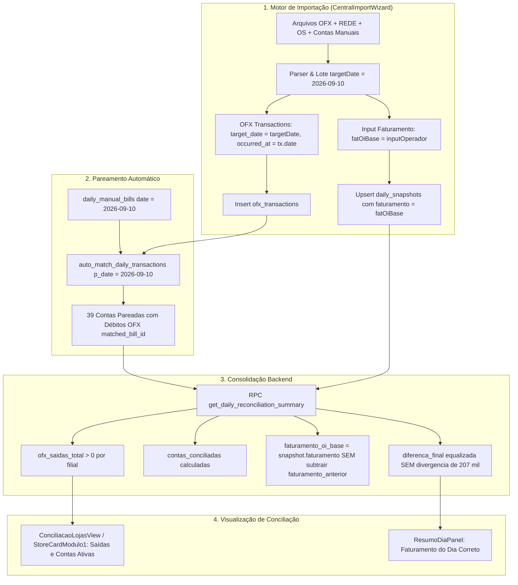

# 📐 SDD Design: Spec 391 — Correção Canônica do Faturamento Input e Re-ancoragem Temporal de Saídas/Entradas OFX

## 1. Arquitetura e Fluxo de Dados Ponta a Ponta



---

## 2. Mutações em Arquivos Existentes [MODIFY]

### A. `supabase/migrations/20260910000045_fix_faturamento_input_and_ofx_target_date.sql`
1. Atualiza a RPC `get_daily_reconciliation_summary(p_date text, p_force_dynamic boolean DEFAULT false)`:
   - Elimina o trecho:
     ```sql
     ELSIF v_faturamento_anterior > 0 AND v_snapshot.faturamento >= v_faturamento_anterior THEN
         v_faturamento_oi_base := v_snapshot.faturamento - v_faturamento_anterior;
     ```
   - Substitui por:
     ```sql
     IF v_snapshot_found AND v_snapshot.faturamento > 0 THEN
         IF (v_snapshot.metadata->>'faturamento_oi_base')::numeric > 0 THEN
             v_faturamento_oi_base := (v_snapshot.metadata->>'faturamento_oi_base')::numeric;
         ELSE
             v_faturamento_oi_base := v_snapshot.faturamento;
         END IF;
     ```
   - Define `v_faturamento_anterior := COALESCE((v_prev_snapshot.metadata->>'odometro_hoje')::numeric, v_prev_snapshot.faturamento, 0)` para manter a coerência caso odômetro seja consultado.
2. Executa backfill corretivo para o lote `ae7764bc-62fe-4d50-b0c3-b880a7550ad0` (10/09/2026):
   - `UPDATE ofx_transactions SET target_date = '2026-09-10' WHERE import_batch_id = 'ae7764bc-62fe-4d50-b0c3-b880a7550ad0';`
   - Aciona `SELECT public.auto_match_daily_transactions('2026-09-10');`
   - Saneia o snapshot de 10/09 com o Faturamento Base real e liquidação das contas.

### B. `src/components/importacoes/CentralImportWizard.tsx`
1. **Ancoragem de OFX ao Batch:**
   - Na linha 1308, substituir:
     ```ts
     // ANTES:
     const effectiveOfxDate = tx.date ? String(tx.date).split('T')[0] : targetDate;
     target_date: effectiveOfxDate,

     // DEPOIS:
     target_date: targetDate, // O lote de conciliação define a competência da transação
     occurred_at: tx.date || `${targetDate}T12:00:00Z`, // Data de postagem real preservada
     ```
2. **Soberania do INPUT de Faturamento:**
   - Linhas 1770-1782: garantir que se o operador informou o faturamento no input (`faturamentoAtual` ou `odometroHoje` no modo direto), esse valor seja o `fatOiBase` soberano:
     ```ts
     const fatOiBase = faturamentoAtual > 0 ? faturamentoAtual : (odometroHoje > 0 && fatAnt > 0 && odometroHoje > fatAnt ? (odometroHoje - fatAnt) : (odometroHoje > 0 ? odometroHoje : faturamentoAtual));
     ```

### C. `src/components/conciliacao/ResumoDiaPanel.tsx`
1. Blindar a inicialização de `faturamentoDiaInput` para priorizar `summary?.faturamento_oi_base` e `snapshot.metadata.faturamento_oi_base`.
2. Assegurar que `faturamentoAnteriorInput` exiba o odômetro acumulado anterior real (`odometro_hoje` de ontem, 235.023,20) e não o líquido do dia (64.930,73).

---

## 3. Cenários de Verificação (SCAN → INFER → VERIFY → FIX)

### Cenário 1: Fechamento por Filial com Saídas e Contas Conciliadas
- **Estado Inicial:** Todas as 10 lojas exibem R$ 0,00 de saídas OFX e R$ 0,00 de contas conciliadas no dia 10/09.
- **Ação:** Atualizar as transações do lote de 10/09 para `target_date = '2026-09-10'` e rodar `auto_match_daily_transactions`.
- **Resultado Esperado:** As 10 filiais passam a exibir os débitos bancários reais (ex: st-03 com R$ 111.195,17 de saídas e R$ 11.195,17 de contas conciliadas; st-06 com R$ 2.000,00 de saídas e contas pareadas).

### Cenário 2: Faturamento do Dia e Divergência de 207 Mil Eliminada
- **Estado Inicial:** RPC `get_daily_reconciliation_summary` retorna diferença final de +R$ 207.840,99 e faturamento recalculado para R$ 151.456,22 / R$ 216.386,95.
- **Ação:** Aplicar migration da RPC removendo a subtração arbitrária `faturamento - anterior` e equalizar snapshot.
- **Resultado Esperado:** `faturamento_oi_base` reflete o input exato do dia, `valor_disp_contas` converge com o subtotal de contas a pagar, e a diferença final é saneada.
