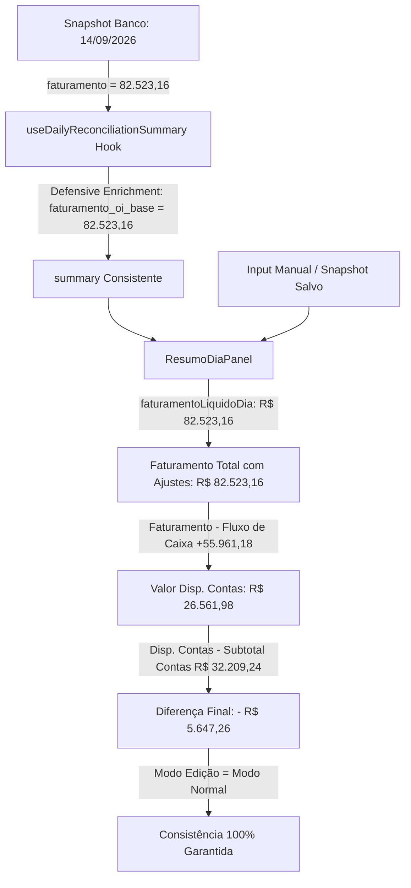

# 📐 Design — Spec 391: Correção da Divergência Edit vs Normal no Faturamento e Encadeamento do Odômetro

## 1. Arquitetura de Fluxo Reativo (Zero Discrepância entre Modos)



---

## 2. Regras de Precedência em `ResumoDiaPanel.tsx`

```typescript
// Faturamento Líquido do Dia:
// 1. Se em edição ativa: input digitado pelo usuário (faturamentoDiaInput)
// 2. Se modo normal: snapshot salvo no banco (metadata.faturamento_oi_base ou faturamento)
// 3. Fallback: summary ou faturamentoDiaInput
const faturamentoLiquidoDia = isEditing 
  ? faturamentoDiaInput 
  : (() => {
      const snapMeta = (currentSnapshot?.metadata as any) || {};
      const raw = Number(
        snapMeta.faturamento_oi_base 
        ?? (currentSnapshot?.faturamento && Number(currentSnapshot.faturamento) < 100000 ? currentSnapshot.faturamento : null)
        ?? summary?.faturamento_oi_base 
        ?? faturamentoDiaInput
      );
      const sanitized = Math.round((raw + Number.EPSILON) * 100) / 100;
      return Math.abs(sanitized) < 0.01 ? 0 : sanitized;
    })();

// Fórmulas Invioláveis (Idênticas em ambos os modos):
const valorDispContasCalculado = faturamentoTotalComAjustes - fluxoCaixaCalculado;
const diferencaFinalCalculada = valorDispContasCalculado - subtotalContasCalculado;
```

---

## 3. Enriquecimento Defensivo em `useDailyReconciliationSummary`

```typescript
// Busca snapshot de daily_snapshots para imunizar contra subtrações incorretas de RPC
const { data: snapshotData } = await supabase
  .from('daily_snapshots')
  .select('faturamento, metadata')
  .eq('date', date)
  .maybeSingle();

const snapMeta = (snapshotData?.metadata as any) || {};
const finalFatOiBase = Number(snapMeta.faturamento_oi_base ?? (snapshotData?.faturamento && Number(snapshotData.faturamento) < 100000 ? snapshotData.faturamento : rawSummary.faturamento_oi_base) ?? 0);
const finalFatPeriodo = finalFatOiBase + Number(rawSummary.faturamento_ajustes || 0);

// Recalcula DRE consolidada no hook:
const finalValorDisp = finalFatPeriodo - finalFluxoCaixa;
const finalDiferenca = finalValorDisp - finalSubtotalContas;
```

---

## 4. Cenários de Teste Verificáveis
1. **Edição vs Visualização**: Ao alternar o botão "Editar Fechamento" / "Salvar Alterações" / "Cancelar", os números exibidos nos cards permanecem rigorosamente os mesmos:
   - Faturamento do Dia: **R$ 82.523,16**
   - Valor Disp. Contas: **R$ 26.561,98**
   - Diferença Final: **- R$ 5.647,26**
2. **Terminal Build Gate**: `npm run build` compila sem nenhum erro de tipagem.
