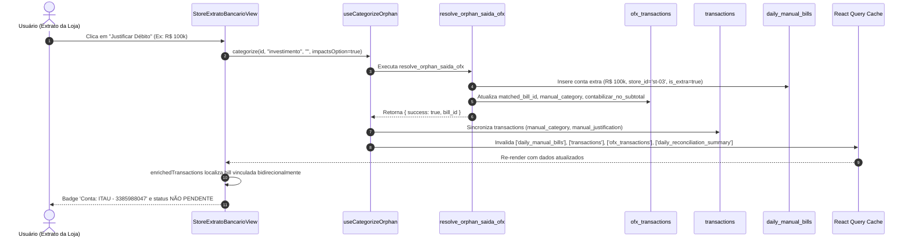

# Design: Spec 392 - Arquitetura de Sincronização e Resolução de Justificativas OFX

## 1. Diagrama de Fluxo Ponta a Ponta



---

## 2. Detalhamento Técnico das Modificações

### 2.1 Hook `useHistoricalReconciledTransactions` (`src/hooks/useTransactions.ts`)
- **Problema:** A tabela `ofx_transactions` possui `counterpart_name` e `bank_name`, mas não `title`.
- **Modificação:**
  ```typescript
  // ANTES:
  let query = supabase
    .from('ofx_transactions')
    .select('id, fitid, store_id, target_date, occurred_at, manual_category, manual_justification, matched_os_number, match_status, title, amount')
    .order('occurred_at', { ascending: false })
    .limit(200);

  // DEPOIS:
  let query = supabase
    .from('ofx_transactions')
    .select('id, fitid, store_id, target_date, occurred_at, manual_category, manual_justification, matched_os_number, match_status, counterpart_name, bank_name, amount')
    .order('occurred_at', { ascending: false })
    .limit(200);

  // Mapeamento compatível para que consumidores que usam .title continuem funcionando:
  return (data || []).map((t: any) => ({
    ...t,
    title: t.counterpart_name || t.bank_name || ''
  })).filter((t: any) => t.manual_category || t.os_number || t.matched_os_number);
  ```

### 2.2 Sincronização e Invalidação em `useCategorizeOrphan.ts`
- **Problema:**
  1. `resolve_orphan_saida_ofx` só atualiza `ofx_transactions` e `daily_manual_bills`. `transactions` ficava órfã sem os dados de categoria e justificativa.
  2. Invalidação de queryKeys inconsistente (`['daily-manual-bills']` vs `['daily_manual_bills']`).
- **Modificação:**
  1. Após o sucesso de `resolve_orphan_saida_ofx`, executar update em `transactions`:
     ```typescript
     await supabase
       .from('transactions')
       .update({
         manual_category: finalCategory,
         manual_justification: finalJustification
       })
       .eq('id', transactionId);
     ```
  2. Unificar as invalidações no `Promise.all`:
     ```typescript
     await Promise.all([
       queryClient.invalidateQueries({ queryKey: ['justified_transactions'] }),
       queryClient.invalidateQueries({ queryKey: ['daily_reconciliation_summary'] }),
       queryClient.invalidateQueries({ queryKey: ['daily-reconciliation-summary'] }),
       queryClient.invalidateQueries({ queryKey: ['backend-conciliacao'] }),
       queryClient.invalidateQueries({ queryKey: ['daily_snapshots'] }),
       queryClient.invalidateQueries({ queryKey: ['daily-snapshot'] }),
       queryClient.invalidateQueries({ queryKey: ['reconciliations'] }),
       queryClient.invalidateQueries({ queryKey: ['transactions'] }),
       queryClient.invalidateQueries({ queryKey: ['ofx_transactions'] }),
       queryClient.invalidateQueries({ queryKey: ['reconciliation_views'] }),
       queryClient.invalidateQueries({ queryKey: ['daily_manual_bills'] }),
       queryClient.invalidateQueries({ queryKey: ['daily-manual-bills'] }),
       queryClient.invalidateQueries({ queryKey: ['open-bills-for-step2'] }),
       queryClient.invalidateQueries({ queryKey: ['extrato'] })
     ]);
     ```

### 2.3 Detecção Bidirecional e UI em `StoreExtratoBancarioView.tsx`
- **Problema:**
  - `const linkedBill = tx.matched_bill_id ? dailyBills.find((b: any) => b.id === tx.matched_bill_id) : null;` falha se `tx.matched_bill_id` for nulo na tabela `transactions`.
- **Modificação:**
  ```typescript
  const linkedBill = tx.matched_bill_id 
    ? dailyBills.find((b: any) => b.id === tx.matched_bill_id) 
    : dailyBills.find((b: any) => b.matched_ofx_id === tx.id);
  ```
- **Badges de Exibição:**
  - Se `tx.manual_category` ou `linkedBill` estiverem presentes, renderizar distintamente:
    ```tsx
    {matchedBill ? (
      <Badge variant="outline" className="h-5 py-0 px-2 bg-teal-500/10 text-teal-300 border-teal-500/30 text-[10px] font-semibold">
        <Receipt size={10} className="mr-1" />
        Conta: {matchedBill.recipient_name || matchedBill.title}
      </Badge>
    ) : tx.manual_category ? (
      <Badge variant="outline" className="h-5 py-0 px-2 bg-purple-500/10 text-purple-300 border-purple-500/30 text-[10px] font-semibold">
        <Check size={10} className="mr-1" />
        {String(tx.manual_category).replace('_', ' ')}
      </Badge>
    ) : null}
    ```
  - Isso garante que a transação nunca mais caia no bloco `isPending` quando já possui uma categoria ou conta vinculada.
