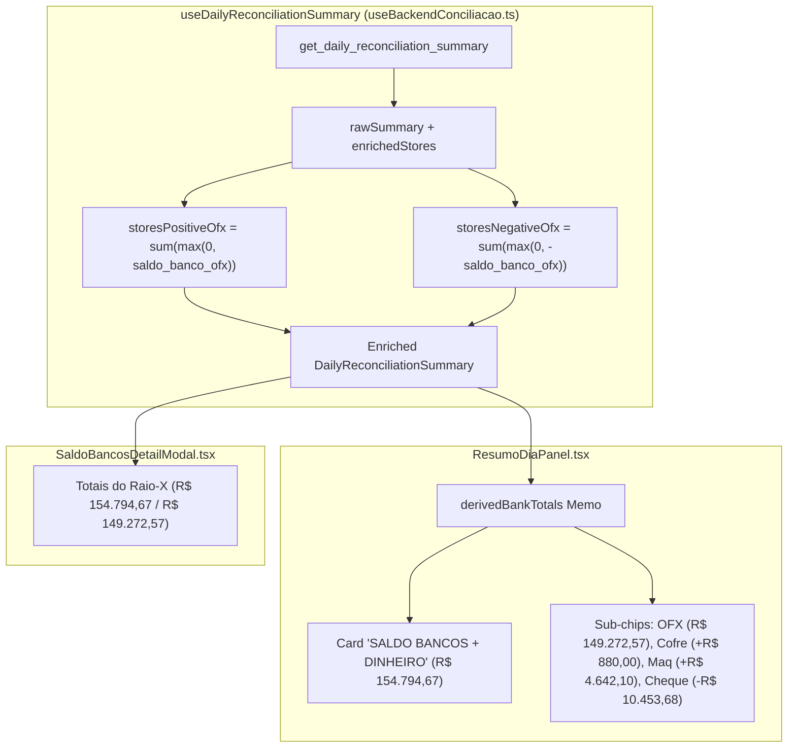

# Design — Spec 396: Sincronização Canônica do Card "Saldo Bancos + Dinheiro" com o Modal Raio-X

## Arquitetura de Fluxo de Dados



---

## Interfaces TypeScript

```typescript
export interface DerivedBankTotals {
  ofxPositivo: number;          // R$ 149.272,57
  ofxNegativo: number;          // R$ 10.453,68
  dinheiro: number;             // R$ 880,00
  maquininhas: number;          // R$ 4.642,10
  totalPositivoConsolidado: number; // R$ 154.794,67 (Bancos Positivos + Dinheiro + Maquininhas)
  saldoLiquidoTotal: number;    // R$ 144.340,99 (Consolidado - Cheque Especial)
}
```

---

## Mutações em Arquivos Existentes [MODIFY]

### 1. `src/hooks/useBackendConciliacao.ts`
- Dentro de `useDailyReconciliationSummary`:
  ```typescript
  const storesPositiveOfx = enrichedStores.reduce((sum: number, s: any) => 
    sum + (Number(s.saldo_banco_ofx || 0) > 0 ? Number(s.saldo_banco_ofx) : 0), 0
  );
  const storesNegativeOfx = enrichedStores.reduce((sum: number, s: any) => 
    sum + (Number(s.saldo_banco_ofx || 0) < 0 ? Math.abs(Number(s.saldo_banco_ofx)) : 0), 0
  );

  const baseBancoPositivo = storesPositiveOfx > 0 
    ? storesPositiveOfx 
    : Number(rawSummary.saldo_bancos_positivo ?? rawSummary.saldo_bancos_ofx_positivo ?? 0);
  const baseBancoNegativo = storesNegativeOfx > 0 
    ? storesNegativeOfx 
    : Number(rawSummary.saldo_negativo_itau ?? 0);
  ```
- Atualizar o objeto de retorno para incluir:
  - `saldo_bancos_ofx_positivo: baseBancoPositivo`
  - `saldo_bancos_positivo: baseBancoPositivo`
  - `saldo_negativo_itau: baseBancoNegativo`
  - `total_saldo_banco_positivo: baseBancoPositivo + finalDinheiroLojas + finalCartoesACompensar`

### 2. `src/components/conciliacao/ResumoDiaPanel.tsx`
- Criar `derivedBankTotals` que extrai as métricas de `summary?.stores || storesData || []`:
  ```typescript
  const derivedBankTotals = useMemo(() => {
    const list = (summary?.stores && summary.stores.length > 0) ? summary.stores : (storesData || []);
    let ofxPositivo = 0;
    let ofxNegativo = 0;
    let dinheiro = 0;
    let maquininhas = 0;

    list.forEach((s: any) => {
      const ofx = Number(s.saldo_banco_ofx ?? s.saldo_banco_itau ?? s.saldo_banco ?? 0);
      if (ofx > 0) ofxPositivo += ofx;
      else if (ofx < 0) ofxNegativo += Math.abs(ofx);

      const d = Number(s.dinheiro_loja ?? 0);
      dinheiro += d;

      const m = Number(s.nao_entrou_valor ?? s.cartao_nao_entrou ?? (s.status_compensacao === 'nao_entrou' ? (s.maquininha || s.rede_liquido) : 0) ?? 0);
      maquininhas += m;
    });

    const fallbackPos = Number(summary?.saldo_bancos_ofx_positivo ?? summary?.saldo_bancos_positivo ?? 0);
    const effectiveOfxPos = ofxPositivo > 0 ? ofxPositivo : fallbackPos;
    const effectiveDinheiro = dinheiro > 0 ? dinheiro : Number(summary?.dinheiro_em_lojas ?? summary?.dinheiro_lojas ?? 0);
    const effectiveMaq = maquininhas > 0 ? maquininhas : Number(summary?.cartoes_a_compensar ?? 0);
    const effectiveNeg = ofxNegativo > 0 ? ofxNegativo : Number(summary?.saldo_negativo_itau ?? 0);

    const totalPositivoConsolidado = Number((effectiveOfxPos + effectiveDinheiro + effectiveMaq).toFixed(2));

    return {
      ofxPositivo: Number(effectiveOfxPos.toFixed(2)),
      ofxNegativo: Number(effectiveNeg.toFixed(2)),
      dinheiro: Number(effectiveDinheiro.toFixed(2)),
      maquininhas: Number(effectiveMaq.toFixed(2)),
      totalPositivoConsolidado,
      saldoLiquidoTotal: Number((totalPositivoConsolidado - effectiveNeg).toFixed(2))
    };
  }, [summary, storesData]);
  ```
- Atualizar o valor principal do Card (linha 624):
  ```tsx
  <AnimatedNumber 
    value={derivedBankTotals.totalPositivoConsolidado > 0 ? derivedBankTotals.totalPositivoConsolidado : (summary?.total_saldo_banco_positivo || saldoBancosValor || 0)} 
    format="currency" 
  />
  ```
- Atualizar o sub-chip "Extrato OFX (Positivo)" (linha 642):
  ```tsx
  <AnimatedNumber 
    value={derivedBankTotals.ofxPositivo > 0 ? derivedBankTotals.ofxPositivo : (summary?.saldo_bancos_ofx_positivo || summary?.saldo_bancos_positivo || 0)} 
    format="currency" 
  />
  ```
- Atualizar as condicionais dos sub-chips:
  - `hasCofre = derivedBankTotals.dinheiro > 0` (exibe `+ formatCurrency(derivedBankTotals.dinheiro)`)
  - `hasMaq = derivedBankTotals.maquininhas > 0` (exibe `+ formatCurrency(derivedBankTotals.maquininhas)`)
  - `hasNeg = derivedBankTotals.ofxNegativo > 0` (exibe `- formatCurrency(derivedBankTotals.ofxNegativo)`)

---

## Cenários Obrigatórios

### Happy Path (Cenário Nominal — 10/09/2026)
- **Estado Inicial:** Usuário navega para a data `10/09/2026`.
- **Ação:** O painel renderiza o Hero Card "SALDO BANCOS + DINHEIRO".
- **Resultado Esperado:**
  - Valor em destaque (azul): **`R$ 154.794,67`**.
  - Sub-chip 1: **Extrato OFX (Positivo): `R$ 149.272,57`**.
  - Sub-chip 2: **Dinheiro no Cofre: `+ R$ 880,00`**.
  - Sub-chip 3: **Maquininhas (D+1): `+ R$ 4.642,10`**.
  - Sub-chip 4: **Cheque Especial: `- R$ 10.453,68`**.
  - Ao clicar em "Ver Lojas ↗", os 5 cartões do modal coincidem 100% com os valores do card.

### Edge Case (Dia sem Movimentação / Dados Vazios)
- **Estado Inicial:** Usuário seleciona uma data onde nenhuma loja possui movimentação ou snapshot (`stores` vazio).
- **Ação:** O painel carrega a data.
- **Resultado Esperado:**
  - O card exibe `R$ 0,00` de forma segura, sem travar por erro de `TypeError (cannot read properties of undefined)` e sem disparar renderização anômala de sub-chips.

---

## Critérios de Aceitação Verificáveis
1. O valor em destaque no card "SALDO BANCOS + DINHEIRO" para 10/09/2026 é compulsoriamente **R$ 154.794,67**.
2. O sub-chip "Extrato OFX (Positivo)" para 10/09/2026 é compulsoriamente **R$ 149.272,57**.
3. Os chips adicionais "Dinheiro no Cofre" (+ R$ 880,00), "Maquininhas (D+1)" (+ R$ 4.642,10) e "Cheque Especial" (- R$ 10.453,68) são visíveis e formatados corretamente.
4. `npm run build` compila com sucesso absoluto e código de saída 0.
