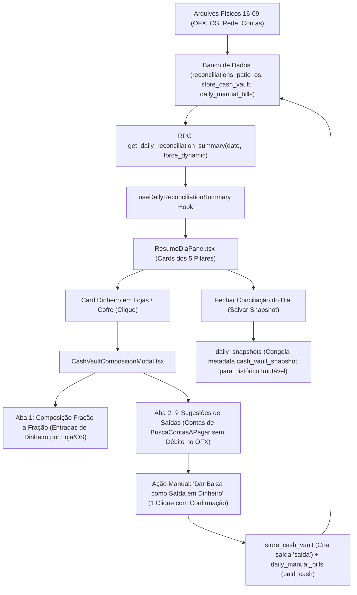

# Design: Fechamento Contábil Estrito 16/09, Gestão Rastreável de Dinheiro em Cofre & Sugestão Inteligente de Contas não-OFX (411)

## Arquitetura e Fluxo de Dados



---

## Estrutura do Banco de Dados & Extensões de Schema

```sql
-- 1. Extensão de store_cash_vault para suportar saídas e vínculo com contas
ALTER TABLE public.store_cash_vault
  ADD COLUMN IF NOT EXISTS entry_type text DEFAULT 'entrada' CHECK (entry_type IN ('entrada', 'saida')),
  ADD COLUMN IF NOT EXISTS expense_category text,
  ADD COLUMN IF NOT EXISTS paid_to text,
  ADD COLUMN IF NOT EXISTS bill_id uuid REFERENCES public.daily_manual_bills(id) ON DELETE SET NULL;

-- 2. Extensão de daily_manual_bills para rastreio de pagamento em dinheiro
ALTER TABLE public.daily_manual_bills
  ADD COLUMN IF NOT EXISTS matched_cash_vault_id uuid REFERENCES public.store_cash_vault(id) ON DELETE SET NULL;

-- 3. Índices para performance
CREATE INDEX IF NOT EXISTS idx_store_cash_vault_lookup 
  ON public.store_cash_vault (entry_date, store_id, status);

CREATE INDEX IF NOT EXISTS idx_daily_manual_bills_match_lookup 
  ON public.daily_manual_bills (date, match_status);
```

---

## Interfaces TypeScript

```typescript
export interface CashVaultEntry {
  id: string;
  store_id: string;
  store_name?: string;
  amount: number;
  entry_date: string;
  status: 'em_transito' | 'depositado' | 'gasto';
  entry_type: 'entrada' | 'saida';
  description: string;
  os_number_ref?: string;
  client_name?: string;
  plate?: string;
  patio_os_id?: string;
  expense_category?: string;
  paid_to?: string;
  bill_id?: string;
  created_at?: string;
}

export interface UnmatchedBillSuggestion {
  id: string;
  title: string;
  description: string;
  category: string;
  amount: number;
  store_id?: string;
  due_date?: string;
  payment_date?: string;
  recipient_name?: string;
  installment?: string;
}

export interface CashVaultSnapshotData {
  total_em_transito: number;
  total_depositado: number;
  total_saidas: number;
  saldo_liquido_cofre: number;
  entries: CashVaultEntry[];
}
```

---

## Mutações em Arquivos Existentes [MODIFY]

1. **`supabase/migrations/20260916000001_enhance_store_cash_vault_and_rpc.sql`**:
   - Ajustar a RPC `get_daily_reconciliation_summary`:
     - Calcula o dinheiro em cofre como: `SUM(entradas em_transito) - SUM(saidas)` até `p_date`.
     - Preserva o isolamento de snapshots fechados via `metadata.cash_vault_snapshot`.
2. **`src/hooks/useBackendConciliacao.ts`**:
   - Retorna as frações de cofre `vault_entries` e disponibiliza a query para buscar contas sem match no OFX da data.
3. **`src/components/conciliacao/ResumoDiaPanel.tsx`**:
   - Adiciona clique e tooltip no card "Dinheiro em Lojas / Cofre", abrindo o modal.
4. **`src/components/conciliacao/CashVaultCompositionModal.tsx` [NEW]**:
   - Componente modal Dark UI (Zinc-950) com:
     - **Aba 1: Entradas no Cofre**: lista detalhada de frações (Loja, OS #, Cliente, Placa, Data, Valor, Status).
     - **Aba 2: 💡 Sugestões de Saída em Dinheiro**: lista de contas do contas a pagar sem saída bancária no OFX.
       - Ações: "Dar Baixa como Saída em Dinheiro" (com seleção de loja e confirmação) e "Ignorar".

---

## Cenários de Verificação (SCAN → INFER → VERIFY → FIX)

- **Cenário 1 (Visualização das Sugestões de Contas não-OFX):**
  - Usuário clica no card de Dinheiro.
  - Abre a aba "💡 Sugestões de Saídas (Contas sem OFX)".
  - O sistema exibe as contas importadas de `BuscaContasAPagar.xls` que não tiveram débito bancário no dia.
- **Cenário 2 (Baixa Consciente em 1 Clique):**
  - Usuário escolhe uma conta sugerida (ex: R$ 850,00 de adiantamento ou despesa de loja) e clica "Dar Baixa como Saída em Dinheiro".
  - O sistema debita R$ 850,00 do cofre da loja e marca a conta como liquidada em dinheiro (`paid_cash`).
  - O saldo em cofre diminui imediatamente na tela, ajustando o Caixa Atual.
- **Cenário 3 (Isolamento Histórico no Snapshot):**
  - Ao fechar o dia, a foto do cofre e das contas baixadas é salva em `daily_snapshots.metadata`.
  - Ao recarregar uma data fechada, a conciliação histórica é preservada sem recálculos ou interferências de dias futuros.
