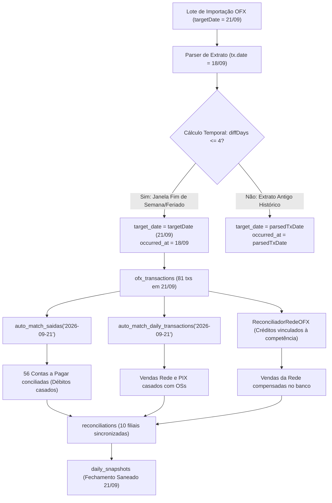

# Design — Incidente de 21/09: Reparo Determinístico e Blindagem Temporal OFX

## 1. Arquitetura de Fluxo de Dados



---

## 2. Especificação da Correção de Código (`CentralImportWizard.tsx`)

### 2.1 Regra de Atribuição da Competência OFX
Na iteração de extratos OFX (`CentralImportWizard.tsx`):
```typescript
// Janela de Fechamento Contábil:
// Se a transação ocorreu em até 4 dias antes da data do fechamento (cobre fim de semana e feriados),
// a competência contábil de fechamento (target_date) é targetDate.
// Ex: Fechamento Segunda 21/09 com extratos de Sexta 18/09, Sábado 19/09, Domingo 20/09 e Segunda 21/09.
const parsedTxDate = tx.date ? String(tx.date).split('T')[0] : targetDate;
const diffDays = Math.round((new Date(targetDate + 'T12:00:00Z').getTime() - new Date(parsedTxDate + 'T12:00:00Z').getTime()) / 86400000);
const isWeekendOrClosingWindow = parsedTxDate <= targetDate && diffDays >= 0 && diffDays <= 4;
const isRecentClosingTx = !tx.date || isWeekendOrClosingWindow;
const effectiveOfxDate = isRecentClosingTx ? targetDate : parsedTxDate;
```

### 2.2 Reconciliador Rede x OFX (linhas 2186-2195)
Permitir que transações que pertencem à competência de fechamento sejam consideradas para conciliação dos créditos da adquirente:
```typescript
const ofxRawCredits = storeOfx.flatMap(o => o.transactions.filter((t: any) => {
  const isCredit = t.type === 'in' || t.amount > 0;
  const cleanDate = (t.date || '').replace(/[-/]/g, '').slice(0, 8);
  const cleanTarget = targetDate.replace(/[-/]/g, '').slice(0, 8);
  const txParsed = t.date ? String(t.date).split('T')[0] : targetDate;
  const diffDays = Math.round((new Date(targetDate + 'T12:00:00Z').getTime() - new Date(txParsed + 'T12:00:00Z').getTime()) / 86400000);
  const isMatchWindow = cleanDate === cleanTarget || (diffDays >= 0 && diffDays <= 4);
  return isCredit && isMatchWindow;
}))
```

---

## 3. Especificação do Script de Reparo Forense (`scratch/repair_2109_incident.cjs`)

O script executa em transação lógica com validação prévia e pós-execução:
1. **Passo 1 — Backup de Segurança:**
   Lê e grava o estado prévio dos 81 registros de `ofx_transactions` e do snapshot de `2026-09-21` em `.tmp/backup_2109_pre_repair.json`.
2. **Passo 2 — Reatribuição do `target_date`:**
   ```sql
   UPDATE public.ofx_transactions
   SET target_date = '2026-09-21'
   WHERE import_batch_id = 'a083037a-82a6-43fe-b634-361ec00f8954';
   ```
3. **Passo 3 — Execução das RPCs de Pareamento:**
   ```typescript
   await supabase.rpc('auto_match_saidas', { p_date: '2026-09-21' });
   await supabase.rpc('auto_match_daily_transactions', { p_date: '2026-09-21' });
   ```
4. **Passo 4 — Reconciliação das Lojas (`reconciliations`):**
   Calcula os totais reais de entradas e saídas OFX por loja para `date = '2026-09-21'` e atualiza:
   - `ofx_imported = true`
   - `financial_total = somatório das saídas pareadas`
   - `divergence = diferença real após matching`
5. **Passo 5 — Saneamento do Snapshot (`daily_snapshots`):**
   Atualiza o snapshot de `2026-09-21`:
   - `saldo_bancario = 82512.00` (mantido)
   - `is_closed = false` (reabre para que o painel exiba as conferências em tempo real sem trava prévia de divergência corrompida).

---

## 4. Cenários Obrigatórios

### Happy Path
1. O script de reparo executa.
2. Os 81 OFX passam a ter `target_date = '2026-09-21'`.
3. `auto_match_saidas('2026-09-21')` casa as saídas bancárias de R$ 82.309,39 com as 56 contas a pagar (R$ 73.509,19).
4. Na tela de conciliação de 21/09, as filiais (Dom Pedro, Jabaquara, Beretta, Kennedy, Mauá, Piraporinha, etc.) exibem Entradas OFX e Saídas OFX povoadas, eliminando o falso débito órfão total.
5. Novas importações de segunda-feira após fins de semana ou feriados atribuem automaticamente `target_date = targetDate` para extratos de até 4 dias antes.

### Edge Case
- **Extrato antigo histórico importado por engano:**
  Se o usuário importar um arquivo OFX com transações de 30 dias atrás (ex: agosto), `diffDays > 4`. A regra `isWeekendOrClosingWindow` avalia como `false`, preservando a data histórica e impedindo que movimentações antigas contaminem a competência atual.

---

## 5. Critérios de Aceitação Verificáveis

1. **[DB_QUERY_PASS]:** Consulta a `ofx_transactions` com `import_batch_id = 'a083037a-82a6-43fe-b634-361ec00f8954'` retorna exatamente 81 registros com `target_date = '2026-09-21'`.
2. **[RPC_MATCH_PASS]:** `auto_match_saidas('2026-09-21')` e `auto_match_daily_transactions('2026-09-21')` executam com sucesso retornando saídas e entradas vinculadas > 0.
3. **[SNAPSHOT_SANEADO]:** `daily_snapshots` de 21/09 reflete a presença do OFX e não mais a falsa divergência de R$ 18.069,08 decorrente de extrato ausente.
4. **[TERMINAL_GATE]:** `cmd.exe /c "npm run build"` finaliza com exit code 0 sem erros de compilação ou types.

---

## 6. Cenários de Teste [SCAN -> INFER -> VERIFY -> FIX]

1. **Cenário 1 — Integridade dos Dados de 18/09:**
   - **SCAN:** Verificar se o snapshot e as transações legítimas de 18/09 foram preservados.
   - **INFER:** O total de OFX de 18/09 deve ser exatamente 159 - 81 = 78 transações (as originais de 18/09), e seu snapshot deve permanecer intacto.
   - **VERIFY:** Query `select count(*) from ofx_transactions where target_date = '2026-09-18'` retorna 78.
   - **FIX:** Isolamento garantido por `import_batch_id`.

2. **Cenário 2 — Visualização das Filiais em 21/09:**
   - **SCAN:** Verificar as 10 lojas em `reconciliations` de 21/09.
   - **INFER:** Nenhuma loja deve exibir `OFX Saídas: R$ 0,00` enquanto houver contas a pagar com comprovante bancário no mesmo dia.
   - **VERIFY:** Query em `reconciliations` confirma `ofx_imported = true` nas lojas com movimento.
