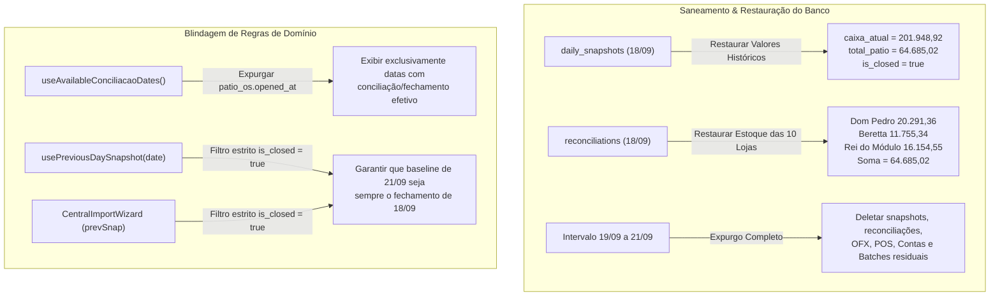

# Design — Spec 424: Restauração Forense de 18/09, Expurgo de 19 a 21 e Filtro de Datas Efetivas

## 1. Arquitetura de Fluxo e Estado do Banco



---

## 2. Especificação Técnica das Modificações de Código

### 2.1 `src/hooks/useDailySnapshot.ts` — `useAvailableConciliacaoDates`
Remover o scan sobre `patio_os.opened_at`. Manter apenas tabelas que registram ações contábeis efetivas de conciliação:
```typescript
export function useAvailableConciliacaoDates() {
  return useQuery({
    queryKey: ['available_conciliacao_dates'],
    queryFn: async () => {
      const dates = new Set<string>();

      // Executa queries em paralelo considerando apenas datas com ações contábeis efetivas
      const [snapshotsRes, reconRes, batchesRes] = await Promise.allSettled([
        supabase.from('daily_snapshots').select('date').eq('is_closed', true),
        supabase.from('reconciliations').select('date').or('ofx_imported.eq.true,bank_total.gt.0'),
        supabase.from('import_batches').select('target_date'),
      ]);

      if (snapshotsRes.status === 'fulfilled' && snapshotsRes.value.data) {
        snapshotsRes.value.data.forEach(row => {
          if (row.date) dates.add(String(row.date));
        });
      }

      if (reconRes.status === 'fulfilled' && reconRes.value.data) {
        reconRes.value.data.forEach(row => {
          if (row.date) dates.add(String(row.date));
        });
      }

      if (batchesRes.status === 'fulfilled' && batchesRes.value.data) {
        batchesRes.value.data.forEach(row => {
          if (row.target_date) dates.add(String(row.target_date));
        });
      }

      // Retorna array ordenado de forma ascendente
      return Array.from(dates).filter(Boolean).sort();
    },
    staleTime: 60 * 1000,
    gcTime: 5 * 60 * 1000,
  });
}
```

### 2.2 `src/hooks/useDailySnapshot.ts` — `usePreviousDaySnapshot`
Filtrar estritamente por fechamento consolidado (`is_closed = true`):
```typescript
export function usePreviousDaySnapshot(date: string) {
  return useQuery({
    queryKey: ['daily_snapshots', 'previous', date],
    queryFn: async () => {
      // Busca o fechamento consolidado e aprovado mais recente antes da data solicitada
      const { data, error } = await supabase
        .from('daily_snapshots')
        .select('*')
        .lt('date', date)
        .eq('is_closed', true)
        .order('date', { ascending: false })
        .limit(1)
        .maybeSingle();
      if (error) throw error;
      return data as DailySnapshotRow | null;
    },
    enabled: !!date,
  });
}
```

### 2.3 `src/components/importacoes/CentralImportWizard.tsx` (linhas 2067-2073)
Garantir que a query do snapshot anterior no encerramento da importação exija `is_closed = true`:
```typescript
      // Puxa snapshot fechado anterior para compor DRE completa
      const { data: prevSnap } = await supabase
        .from('daily_snapshots')
        .select('*')
        .lt('date', targetDate)
        .eq('is_closed', true)
        .order('date', { ascending: false })
        .limit(1)
        .maybeSingle();
```

---

## 3. Especificação do Script de Saneamento (`scratch/restore_1809_and_purge_19_to_21.cjs`)

### Passo 1: Backup Transitório Pré-Execução
Salva todo o estado remanescente de 18 a 21 em `.tmp/backup_pre_spec424.json`.

### Passo 2: Restauração Atômica de 18/09
1. Atualizar `daily_snapshots` para `date = '2026-09-18'`:
   - `caixa_atual`: 201948.92
   - `faturamento`: 31200.97
   - `dinheiro_mp`: 28316.00
   - `total_recebiveis`: 36845.67
   - `total_patio`: 64685.02
   - `saldo_bancario`: 100418.23
   - `saldo_negativo_itau`: 27048.57
   - `contas_a_pagar`: 54945.40
   - `is_closed`: true
   - `closed_at`: '2026-09-18T21:30:00.000Z'
   - `metadata`:
     ```json
     {
       "is_closed": true,
       "caixa_atual": 201948.92,
       "dinheiro_mp": 28316,
       "fluxo_caixa": -58165.73,
       "source_mode": "odometro_os",
       "total_patio": 64685.02,
       "has_os_files": true,
       "status_geral": "approved",
       "odometro_hoje": 574828.52,
       "caixa_anterior": 260114.65,
       "diferenca_final": 34421.30,
       "subtotal_contas": 54945.40,
       "a_receber_manual": 8529.67,
       "manual_a_receber": 8529.67,
       "saldo_bancos_ofx": 100418.23,
       "total_saldo_banco": 127466.80,
       "valor_disp_contas": 89366.70,
       "manual_dinheiro_mp": 28316,
       "faturamento_ajustes": 0,
       "faturamento_oi_base": 31200.97,
       "faturamento_periodo": 31200.97,
       "saldo_negativo_itau": 27048.57,
       "faturamento_anterior": 543627.55,
       "saldo_bancos_positivo": 127466.80,
       "faturamento_mes_anterior": 1003745.57
     }
     ```
2. Atualizar os registros de `reconciliations` em `2026-09-18` restaurando os `na_loja_os`:
   - `st-01` (Dom Pedro): 20291.36
   - `st-02` (Jabaquara): 5020.60
   - `st-03` (Jorge Beretta): 11755.34
   - `st-04` (Kennedy): 3029.00
   - `3a3dd7ce-fa8c-4aee-bac4-42f30fa6899f` (Mauá): 1855.04
   - `st-05` (Piraporinha): 1549.60
   - `st-06` (Planalto): 5780.09
   - `st-09` (Rei do Módulo): 16154.55
   - `st-07` (Rudge Ramos): 1938.90
   - `st-08` (Santo André): 339.54
   - Somatório: exatamente R$ 64.685,02.

### Passo 3: Expurgo Seguro de 19/09 a 21/09
Executar delete nas seguintes tabelas com o filtro estrito:
```sql
DELETE FROM public.daily_snapshots WHERE date >= '2026-09-19' AND date <= '2026-09-21';
DELETE FROM public.reconciliations WHERE date >= '2026-09-19' AND date <= '2026-09-21';
DELETE FROM public.daily_manual_bills WHERE (target_date >= '2026-09-19' AND target_date <= '2026-09-21') OR (date >= '2026-09-19' AND date <= '2026-09-21');
DELETE FROM public.pos_transactions WHERE target_date >= '2026-09-19' AND target_date <= '2026-09-21';
DELETE FROM public.ofx_transactions WHERE target_date >= '2026-09-19' AND target_date <= '2026-09-21';
DELETE FROM public.import_batches WHERE target_date >= '2026-09-19';
DELETE FROM public.daily_reconciliation_matches WHERE target_date >= '2026-09-19' AND target_date <= '2026-09-21';
DELETE FROM public.conciliation_matches WHERE target_date >= '2026-09-19' AND target_date <= '2026-09-21';
```

---

## 4. Cenários Obrigatórios

### Happy Path
1. O script restaura o snapshot e o pátio de 18/09.
2. O intervalo de 19 a 21 fica 100% limpo no banco.
3. O seletor de datas de conciliação exibe apenas as datas efetivas trabalhadas (15/09, 16/09, 17/09, 18/09).
4. O usuário abre o CentralImportWizard para 21/09:
   - `previousSnapshot` é lido como `2026-09-18` com `caixa_atual = 201.948,92` e `odometro_hoje = 574.828,52`.
   - O usuário importa os arquivos de 21/09 do zero sem resíduos ou conflitos.

### Edge Case
- **Tentativa de consultar conciliação de uma data de fim de semana (ex: 19/09 ou 20/09):**
  Como não há snapshot consolidado, o seletor não a lista. Caso alguém navegue via URL direta, a tela exibe Empty State sem gerar ou forçar gravação de snapshot inválido.

---

## 5. Critérios de Aceitação Verificáveis

1. **[SNAP_18_RESTORED]:** Consulta ao Supabase confirma `daily_snapshots` de `2026-09-18` com `caixa_atual = 201948.92`, `total_patio = 64685.02` e `is_closed = true`.
2. **[RECONS_18_RESTORED]:** Somatório de `na_loja_os` nas 10 lojas em `reconciliations` de 18/09 é exatamente `64685.02`.
3. **[PURGE_19_21_VERIFIED]:** Contagem de registros nas datas `2026-09-19`, `2026-09-20` e `2026-09-21` em `daily_snapshots`, `reconciliations`, `ofx_transactions`, `pos_transactions` e `daily_manual_bills` é exatamente `0`.
4. **[PREV_SNAP_QUERY_VERIFIED]:** `usePreviousDaySnapshot('2026-09-21')` retorna o snapshot de `2026-09-18` (`caixa_atual = 201948.92`).
5. **[TERMINAL_GATE]:** `cmd.exe /c "npm run build"` finaliza com exit code 0.

---

## 6. Cenários de Teste [SCAN -> INFER -> VERIFY -> FIX]

1. **Cenário 1 — Integridade dos Carros em Pátio de 18/09:**
   - **SCAN:** Verificar `total_patio` e as 10 filiais em `reconciliations`.
   - **INFER:** O valor total deve bater exatamente com os R$ 64.685,02 autênticos de 2 dias atrás.
   - **VERIFY:** Query `select total_patio from daily_snapshots where date = '2026-09-18'` retorna 64685.02.
   - **FIX:** Restauração controlada via script.

2. **Cenário 2 — Isolamento Completo de 21/09:**
   - **SCAN:** Verificar se restou algum registro órfão ou batch de 21/09.
   - **INFER:** Nenhuma transação bancária, venda de máquina ou boleto deve persistir para 21/09 antes da nova importação.
   - **VERIFY:** Query em `ofx_transactions` para `target_date = '2026-09-21'` retorna 0.
   - **FIX:** Expurgo atômico em cascata.
