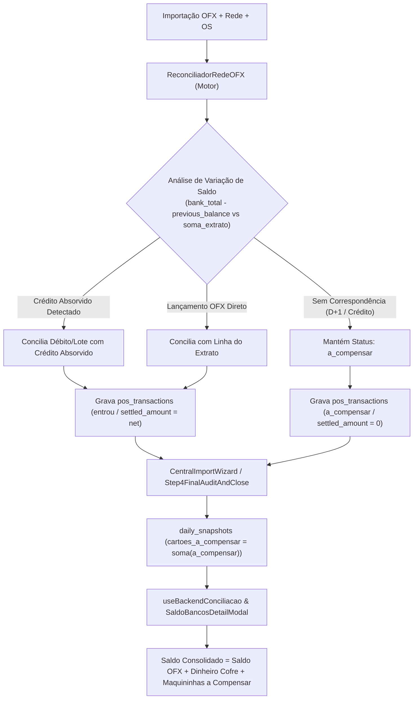

# 📐 SDD Design — Cartões a Compensar, Saldo do Extrato e Saldo Consolidado por Filial

- **Spec ID:** `436-cartoes-compensar-e-saldo-consolidado-filiais`
- **Data:** 2026-09-22
- **Autor:** Antigravity 2.0 (Single-Agent Direto)

---

## 1. Arquitetura de Fluxo de Dados (Data Flow)



---

## 2. Detalhes Matemáticos & Algorítmicos

### A. Detecção de Liquidação Absorvida no Saldo
No `ReconciliadorRedeOFX.ts`:
Para cada filial, recebemos:
- `bankTotal` ($S_F$): Saldo final oficial do extrato Itaú.
- `previousBalance` ($S_I$): Saldo inicial anterior.
- `ofxTransactions`: Lançamentos do extrato.
- `redeSales`: Vendas da adquirente do lote.

Calcula-se o delta bancário:
$$\Delta_{\text{banco}} = S_F - S_I$$
$$\Sigma_{\text{lancamentos}} = \sum_{\text{créditos}} \text{valor} - \sum_{\text{débitos}} \text{valor}$$
$$\text{Crédito Não Itemizado} = \Delta_{\text{banco}} - \Sigma_{\text{lancamentos}}$$

Se $\text{Crédito Não Itemizado} > 0.05$:
O motor cria uma entrada virtual de liquidação fiduciária para a filial com esse valor.
As vendas de Débito (ou antecipadas) que baterem com esse crédito absorvido (com tolerância de taxas MDR de até 2% ou R$ 0,05) são marcadas como `conciliadas` (`entrou`), com `fitidBancoVinculado = 'saldo-absorvido'`.

### B. Persistência de `pos_transactions`
Ao concluir a reconciliação no `CentralImportWizard.tsx`:
```ts
// Para vendas conciliadas:
await supabase.from('pos_transactions').update({
  settlement_status: 'entrou',
  settled_date: targetDate,
  settled_amount: netAmount
}).in('id', enteredIds);

// Para vendas pendentes (que não entraram e compõem o D+1):
await supabase.from('pos_transactions').update({
  settlement_status: 'a_compensar',
  settled_date: null,
  settled_amount: 0
}).in('id', pendingIds);
```

### C. Apuração no Hook `useBackendConciliacao.ts` e no Modal
```ts
// Apenas vendas pendentes que AINDA NÃO caíram no banco compõem a_compensar
const finalNaoEntrou = posUnsettledByStore[sid] ?? 0;

// Saldo Consolidado Oficial
const saldoConsolidado = Number((saldoOfxPuro + dinheiroLoja + maquininhaNaoEntrou).toFixed(2));
```

---

## 3. Cenários de Validação

### Happy Path (Mauá e Beretta 22/09)
1. **Mauá - MHE**:
   - Saldo OFX Itaú gravado: `-R$ 12.964,64`
   - Débito VISA R$ 992,20: Detectado na variação absorvida do saldo (`-13.956,84` vs `-12.964,64` = `+992,20`). Status: `entrou`.
   - Crédito MASTER R$ 3.679,12: Não caiu na conta no dia 22. Status: `a_compensar`.
   - Maquininhas (Rede) na tela: **R$ 3.679,12**
   - Saldo Consolidado: `-12.964,64 + 0 + 3.679,12 = -R$ 9.285,52` (Igual ao Saldo Final Contábil do Excel).
2. **Jorge Beretta - DHJV**:
   - Saldo OFX Itaú gravado: `R$ 48.111,02`
   - Débito MASTER R$ 382,00: Detectado na variação absorvida do saldo (`47.724,94` vs `48.111,02` = `+386,08`). Status: `entrou`.
   - Maquininhas (Rede) na tela: **R$ 0,00** (ou `-` / Conciliado)
   - Saldo Consolidado: `48.111,02 + 0 + 0 = R$ 48.111,02` (Igual ao Saldo Final Contábil do Excel).

### Edge Case: Loja com Débito Retido e Sem Absorção
- Filial realiza R$ 500,00 em débito, mas a variação de saldo bancário bate exatamente com os outros lançamentos (crédito não absorvido) e não há crédito no OFX.
- O sistema mantém os R$ 500,00 como `a_compensar`.
- O saldo consolidado soma os R$ 500,00 como direito a receber, sem duplicar saldo bancário.

---

## 4. Critérios de Aceitação Verificáveis

1. **Terminal Gate:** `npm run build` passa com 0 erros de compilação TypeScript.
2. **Exibição do Modal Raio-X:**
   - Mauá exibe Saldo Consolidado `-R$ 9.285,52` e Maquininhas `R$ 3.679,12`.
   - Jorge Beretta exibe Saldo Consolidado `R$ 48.111,02` e Maquininhas zerada / `R$ 0,00`.
3. **Persistência em Banco:** `pos_transactions` de débitos absorvidos recebem `settlement_status = 'entrou'` e `settled_amount = net_amount`.
