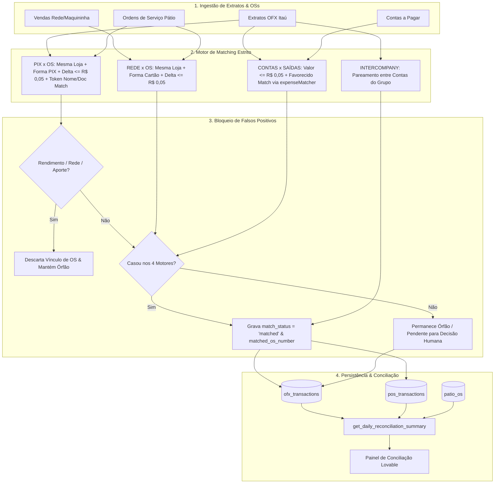

# 📐 Design Técnico — Spec 436: Motor de Matching Estrito & Eliminação de Falsos Positivos

## 1. Arquitetura de Fluxo de Dados



---

## 2. Especificação das Regras de Matching

### 2.1. Motor 1: Rede x OS
- **Fonte:** `pos_transactions` (Rede) x `patio_os` (Ordens de Serviço).
- **Condições:**
  1. `pos.store_id === os.store_id` (Isolamento por loja obrigatório).
  2. A OS deve possuir valor registrado em cartão (`parsed_credit + parsed_debit > 0` ou `payment_method` contendo tags de cartão).
  3. `Math.abs(os_card_amount - pos.net_amount) <= 0.05` ou `Math.abs(os_card_amount - pos.gross_amount) <= 0.05`.
  4. Uma OS casada é imediatamente removida do conjunto de candidatos para evitar colisões $1:N$.

### 2.2. Motor 2: PIX x OS (Duplo Fator Rigoroso)
- **Fonte:** `ofx_transactions` (`type = 'in'`) x `patio_os`.
- **Filtro Negativo Prévio (Eliminatória):**
  - Transação bancária é imediatamente ignorada para match de OS se a contraparte ou descrição contiver:
    `REDE`, `CIELO`, `GETNET`, `STONE`, `PAGSEGURO`, `REND PAGO`, `APLIC`, `RESG`, `CDB`, `LCI`, `LCA`, `JUROS`, `AUT APR`, `INTERCOMPANY`.
- **Condições de Match (Todas Cumulativas):**
  1. **Mesma Filial:** `ofx.store_id === os.store_id`. **PROIBIDO** buscar em outras lojas.
  2. **Forma de Pagamento PIX:** `os.parsed_pix_transfer > 0` ou `os.pix_transfer_value > 0` ou `os.payment_method` contendo `PIX` ou `TRANSF`. Se a OS for 100% Cartão, Cheque ou Dinheiro, ela é **SUMARIAMENTE INELÍGIVEL**.
  3. **Valor Exato:** `Math.abs(os_pix_amount - ofx.amount) <= 0.05`.
  4. **Identidade do Cliente (Token Match / Documento):**
     - Correspondência de CPF/CNPJ se presente em ambos; OU
     - Correspondência de pelo menos 1 token forte ($\ge 4$ caracteres) ou 2 tokens significativos ($\ge 3$ caracteres) entre o nome do cliente da OS (`os.client_name`) e a contraparte bancária (`ofx.counterpart_name` / `ofx.bank_name`), ignorando stopwords.
- **Caso Contrário:** A transação permanece com `matched_os_number = null` e `match_status = 'pending'`, listada como transação não conciliada na aba de justificativas do operador.

### 2.3. Motor 3: Contas x Faturamento / Saídas OFX
- **Fonte:** `daily_manual_bills` x `ofx_transactions` (`type = 'out'`).
- **Condições:**
  1. `Math.abs(bill.amount - Math.abs(ofx.amount)) <= 0.05`.
  2. Correspondência semântica de favorecido (`recipient_name`, `title`, `description`) via `expenseMatcher.ts`.
  3. Proibição absoluta de auto-criação de registros em `daily_revenue_adjustments`.

### 2.4. Motor 4: Entre Lojas (Intercompany)
- Preservar o detector existente de transferências entre contas bancárias do grupo (`intercompany_paired`), categorizando como `Transferência Entre Lojas [Apenas Conciliar]` com impacto zero no faturamento.

---

## 3. Interfaces TypeScript Reais

```typescript
export interface StrictPixOsMatchParams {
  ofxTx: {
    id: string;
    store_id: string;
    amount: number;
    title: string;
    counterpart_name?: string | null;
    bank_name?: string | null;
    date?: string;
  };
  storeOss: Array<{
    id: string;
    os_number: string;
    store_id: string;
    client_name?: string | null;
    total_value: number;
    paid_value: number;
    pix_transfer_value?: number;
    parsed_pix_transfer?: number;
    payment_method?: string | null;
  }>;
  matchedOsNumbers: Set<string>;
  tolerance?: number;
}

export interface StrictPixOsMatchResult {
  isMatched: boolean;
  matchedOsNumber?: string;
  matchedOs?: any;
  confidence: number;
  reason: string;
}
```

---

## 4. Cenários Obrigatórios

### 4.1. Happy Path: PIX Legítimo de Cliente da Mesma Loja
- **Entrada OFX:** R$ 1.860,00 na loja `st-06` (Planalto) com contraparte `FABIO RODRIGUES DE OLIVEIRA`.
- **Base de OS:** OS #18484 na loja `st-06` de cliente `FABIO RODRIGUES DE OLIVEIRA`, com pagamento `PIX: 1860.00`.
- **Resultado:** Match perfeito 100% validado. `matched_os_number = '18484'`, status `matched`.

### 4.2. Edge Case 1: PIX sem Relação de Nome ou com OS Paga em Cartão
- **Entrada OFX:** R$ 2.000,00 na loja `st-01` (Dom Pedro) com contraparte `FLAVIO ALLAN FREIRE BEZERRA`.
- **Base de OS:** OS #609 na loja `st-01` de cliente `EDMILSON JOSE RIBEIRO`, paga em `Credito: 1013.70`.
- **Resultado:** Match categoricamente **REJEITADO**. A transação permanece desvinculada (`matched_os_number = null`) e não infla o faturamento como recebimento de OS.

### 4.3. Edge Case 2: Rendimento Automático de R$ 0,01 do Itaú
- **Entrada OFX:** R$ 0,01 com descrição `REND PAGO APLIC AUT APR`.
- **Resultado:** Descarte sumário imediato pelo filtro negativo de adquirentes e rendimentos. Jamais é vinculada a qualquer OS.

---

## 5. Critérios de Aceitação Verificáveis

1. **Terminal Gate (Build / Typecheck):**
   - Execução de `npm run build` limpa, sem qualquer erro de tipagem no TypeScript.
2. **Auditoria Forense SQL Pós-Aplicação:**
   - Query em `ofx_transactions` confirma zero transações do tipo adquirente ou rendimento com `matched_os_number`.
   - Query em `ofx_transactions` confirma que nenhum PIX está vinculado a OS com cliente divergente e forma de pagamento não-PIX.
   - Query em `daily_revenue_adjustments` confirma zero registros criados de forma arbitrária/automática sem justificação humana.
3. **RPC `get_daily_reconciliation_summary`:**
   - Retorna faturamento e conciliação perfeitamente segregados sem transações órfãs embutidas como OS.
