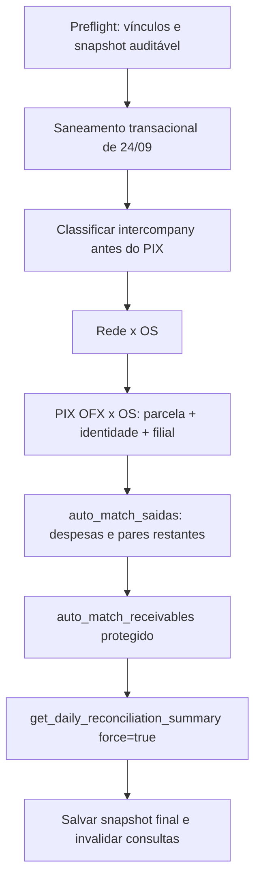

# Design — Spec 438

## Fluxo canônico


## Contrato de cálculo do fechamento por filial
O resumo persistido é o único lugar que calcula dinheiro. Todos os valores monetários são normalizados para centavos antes da subtração e arredondados uma única vez. Para cada loja, o contrato devolve os totais efetivos e os resíduos já resolvidos:
```text
dif_entradas = round_cent(ofx_entradas_total - entradas_conciliadas - justificativas_excluidas_entradas)
dif_saidas   = round_cent(ofx_saidas_total - contas_conciliadas - justificativas_excluidas_saidas)
```
`justificativas_excluidas_*` só pode conter lançamentos que não estejam simultaneamente em `entradas_conciliadas`/`contas_conciliadas`. O frontend não escolhe entre `dif_*`, `diferenca_*`, `previsto_*` ou totais alternativos e não recalcula `diferenca`; se o campo canônico estiver ausente, exibe `N/D`. Assim, valores iguais resultam em `R$ 0,00`, e o caso de R$ 2.003,00 do Kennedy reduz o residual uma única vez.

## Invariantes por fase
- **Preflight/saneamento:** somente vínculos automáticos do escopo são tocados; `matched_manual` é imutável; todos os valores e campos anteriores são auditados.
- **Intercompany:** um crédito marcado como intercompany não pode ser candidato a OS. Uma regra sem evidência suficiente deixa a transação pendente.
- **PIX:** `type = 'in'`, valor positivo, filial igual, `pix_transfer_value > 0`, tolerância de R$ 0,05 e identidade inequívoca. Ausência de qualquer fator mantém a entrada órfã.
- **Saídas:** preserva a implementação de `auto_match_saidas`; o pareamento é idempotente e não converte crédito intercompany em receita.
- **Recebíveis:** não grava OS para transferência/Pix sem o predicado estrito. Um recebível não-OS pode ser atualizado sem escrever `matched_os_number`.
- **Resumo:** é recalculado somente depois de todas as mutações; o snapshot representa o estado final, nunca uma etapa intermediária.
- **Apresentação:** cards e painel diário formatam os números do resumo; nenhum componente calcula diferença, troca sinal ou usa fallback de outro campo.

## Exemplo do cenário real
No dia 24/09, o preflight encontra os vínculos automáticos das contrapartes MP. A classificação intercompany os remove do conjunto de candidatos PIX e o saneamento limpa OS #619 e #1894 de forma auditada. HD Centro R$ 5.000,00 permanece órfão. O motor Rede, o motor de saídas e os demais vínculos PIX comprovados continuam funcionando; o resumo final é calculado após todos eles.

## Casos de borda
- Nome contém `MP`, mas não corresponde a entidade/alias confiável: não bloquear automaticamente; manter pendente.
- Não existe débito correspondente entre lojas: ainda assim não casar com OS se a entidade intercompany for inequívoca; caso contrário, exigir decisão manual.
- Mesmo OFX é processado duas vezes: a segunda execução não altera estado nem cria nova linha de match.
- Vínculo manual existente: nunca desfazer durante limpeza ou rematch automático.
- Falha em qualquer RPC: não persistir snapshot final e devolver erro auditável para reprocessamento.
- Justificativa já contabilizada no conciliado: não subtrair novamente; o ledger do resumo informa sua origem e o campo em que foi incluída.

## Verificação de ponta a ponta
Os testes devem executar quatro cenários: (a) os créditos MP de R$ 1.510,00/R$ 1.000,00 e HD Centro R$ 5.000,00; (b) duas execuções completas com uma entrada válida por parcela PIX e identidade forte; (c) Kennedy com OFX R$ 4.006,29, conciliado R$ 2.003,29 e justificativa de R$ 2.003,00; (d) OFX e conciliado exatamente iguais para entradas e saídas. A verificação consulta diretamente `ofx_transactions`, `patio_os`, `conciliation_matches`, `receivables` e o resumo diário, além de confirmar que a segunda execução é estável e que nenhum componente contém cálculo local de diferença.
