# Design — Spec 439

## Fluxo de dados

```mermaid
flowchart LR
  OFX[OFX/PDF por conta] --> P[Parser: candidatos datados e movimentos separados]
  P --> M[Loja pela associação existente]
  M --> U[Wizard: fonte, MEMO, data, valor e validação]
  U --> R[Regra por conta + seleção por data]
  R --> RPC[RPC autorizada e transacional]
  RPC --> B[reconciliations.bank_total por loja]
  B --> S[Resumo e snapshot versionado]
  S --> V[Wizard e Raio-X de Saldos]
```

O parser existente em `src/lib/parsers/ofxParser.ts` é a única entrada OFX do fluxo principal. A extensão de `OfxParseResult` mantém `alias`, `transactions`, `bankBalance`, `previousBalance`, `accountLimit`, `fileName` e `closingDayBalance` para compatibilidade, mas adiciona `balanceCandidates` e identidade canônica da conta. Durante a migração, `bankBalance` torna-se apenas prévia legada; nenhuma escrita financeira nova deve escolhê-lo implicitamente.

### Extração e classificação

- `SALDO ANTERIOR` e `<PRVBAL>` são candidatos de abertura. `SALDO TOTAL DISPONÍVEL DIA` e equivalentes reconhecidos são candidatos de encerramento em `DTPOSTED`. `<LEDGERBAL>` e `<AVAILBAL>` têm `DTASOF` próprio. `SALDO DO DIA` é decidido pelo contexto e pela data, sem pertencer simultaneamente a abertura e encerramento.
- Cada candidato guarda texto bruto e normalizado, valor bruto e centavos com sinal, data original e fonte. Não converter `DTPOSTED`/`DTASOF` para UTC com `Z` artificial antes de decidir o dia bancário; guardar a data civil do extrato.
- As transações normais continuam com FITID/hash e deduplicação atuais. Linhas de saldo ficam fora de `transactions`, de receitas e de despesas.
- A equação de validação por data é `abertura + créditos - débitos = encerramento` quando todos os elementos cobrem o mesmo período. Falha acima de R$ 0,05 avisa; não muda o valor bancário automaticamente. `<LEDGERBAL>` de 27/09 não é inferido a partir de movimentos de 25/09.

### Resolução e persistência

1. Resolver `accountKey` com `BANKID`/`ACCTID` do OFX; agência/conta no nome do arquivo é fallback, nunca supera um identificador bancário válido. `store_file_mappings` continua a determinar `store_id`. Se a loja for alterada, a regra de saldo é revisada antes de recalcular ambas as lojas.
2. Persistir candidatos distintos por conta, data bancária, fonte e fingerprint do arquivo. A regra ativa é única por conta/loja e versionada. A seleção efetiva é única por conta/data de conciliação; uma escolha manual daquela data prevalece sobre a regra futura.
3. A resolução automática exige conta/loja confirmadas, `postedDate = targetDate`, fonte e MEMO compatíveis com a regra, e um único candidato. Valores monetários jamais são parte da chave da regra; servem à prévia e à checagem de consistência.
4. A RPC `apply_ofx_balance_selection` recebe IDs de candidatos e data/conta, confere no banco o valor e a autoria, bloqueia inconsistências, registra antes/depois e agrega as contas da loja. Nunca aceita `bank_total` fornecido pelo cliente como verdade.
5. Em correção posterior, a mesma RPC apresenta prévia de impacto; ao aplicar, cria uma revisão do fechamento com referência ao estado anterior e recalcula `reconciliations`, `get_daily_reconciliation_summary(p_date, true)` e o snapshot canônico. Se a data estiver fechada, o histórico antigo permanece recuperável. Invalida `store_file_mappings`, `ofx-balance-*`, `reconciliations`, `daily_snapshots`, `daily-reconciliation-summary`, `conciliacao-backend` e o modal de saldo.

### Esquema proposto para a migration

- `ofx_balance_candidates`: chave, `account_key`, `store_id`, `file_fingerprint`, `source_kind`, `memo_raw`, `memo_normalized`, `posted_date`, `amount_cents`, `raw_amount`, `balance_role`, metadados de extração. Índices em `(account_key, posted_date)` e `(store_id, posted_date)`; unicidade por fingerprint/conta/fonte/data/papel/valor.
- `ofx_balance_rules`: `account_key`, `store_id`, `source_kind`, `memo_normalized` (nulo para tags nativas), `date_role`, `is_active`, `version`, `updated_by`, `updated_at`. Uma regra ativa por conta; atualização concorrente exige versão esperada.
- `ofx_balance_selections`: `(account_key, reconciliation_date)` único, `candidate_id`, `selection_mode` (regra/manual), `rule_version`, `selected_by`, `selected_at`.
- `ofx_balance_selection_events`: evento append-only com candidato e total da loja antes/depois, usuário, motivo e referência ao snapshot revisado. RLS com leitura conforme as permissões do projeto e escrita apenas pela RPC autorizada; nada de política `anon FOR ALL` herdada de `store_file_mappings`.

Confirmar `store_id` e tipos no schema remoto antes de materializar DDL. O projeto usa Supabase direto no cliente e RPC PostgreSQL; não há Server Action nesse caminho.

### UI existente

No `CentralImportWizard`, a tabela “Auditoria de Saldos dos Extratos” ganha um controle por conta. Cada opção mostra “Origem • data • MEMO • valor”; opção recomendada e avisos de data/validação ficam próximos do seletor. `SaldoBancosDetailModal` permite abrir a conta, trocar a regra, fazer uma escolha pontual para a data e ver o histórico. Reusar `Modal`, `Button`, `Badge` e tokens de `DESIGN.md` (`bg-background`, `bg-card`, `text-foreground`, `text-muted-foreground`, `border-border`), com foco visível, estado de loading/erro e feedback inline. A mudança respeita a tabela atual, sem tela nova e sem redesenho amplo.

### Happy path

O operador importa os quatro OFX e concilia 25/09. Cada arquivo é associado à loja já mapeada. O wizard lista o MEMO de 25/09 como saldo elegível e o LEDGERBAL de 27/09 como valor de outra data. O operador escolhe o saldo desejado de cada conta, marca “lembrar esta fonte” quando apropriado e confirma. A RPC grava candidatos, regra e seleção, atualiza `bank_total` por loja e recalcula o resumo. Na próxima importação da mesma conta, a fonte com MEMO normalizado é sugerida mesmo com outro valor; ele pode trocar a regra no Raio-X de Saldos.

### Edge cases

- Para conciliar 27/09, a regra de MEMO de 25/09 não encontra candidato da data. O LEDGERBAL de 27/09 pode ser escolhido e lembrado. Seleção de fonte antiga requer escolha pontual com aviso e motivo; não vira regra automática fora da data.
- MEMOs iguais no mesmo dia com valores distintos, ausência de `DTASOF`, arquivo duplicado ou duas contas apontando para a mesma loja: não decidir por “última linha” nem por valor mais próximo. Exibir pendência ou agregação distinta por conta.
- Valor zero e saldo negativo permanecem elegíveis. Erro de persistência deixa a escolha anterior e o snapshot intactos; UI mostra erro e opção de tentar novamente.

### SCAN → INFER → VERIFY → FIX

1. **Troca da regra depois de fechar o dia:** SCAN localiza regra e seleção gravadas; INFER prevê que “Alterar mapeamento” mostrará conta/data/valor atual e novo; VERIFY confirma prévia, registro append-only e números novos no resumo após aplicar; FIX impede sucesso visual se a RPC falhar ou o cache ficar antigo.
2. **Fonte de outra data:** SCAN encontra MEMO de 25/09 e LEDGERBAL de 27/09 no mesmo arquivo; INFER exige que a data do candidato determine sua elegibilidade; VERIFY testa 25/09 e 27/09 separadamente, inclusive Planalto com diferença de R$ 3.200,00; FIX mantém pendência e explica o conflito, sem escolher pelo nome do arquivo ou por coincidência de valor.

## Verificação de aceitação

Os testes usam OFX sintéticos com estrutura e números equivalentes aos quatro exemplos, sem copiar transações reais. Validar que `bank_total` é soma de uma seleção por conta; reprocessar o mesmo arquivo não muda total; alterar a regra não altera histórico sem uma correção explícita; e a correção de dia fechado cria trilha auditável. Rodar `npm run build`, `npx tsc --noEmit`, lint nos arquivos tocados e os testes direcionados.
