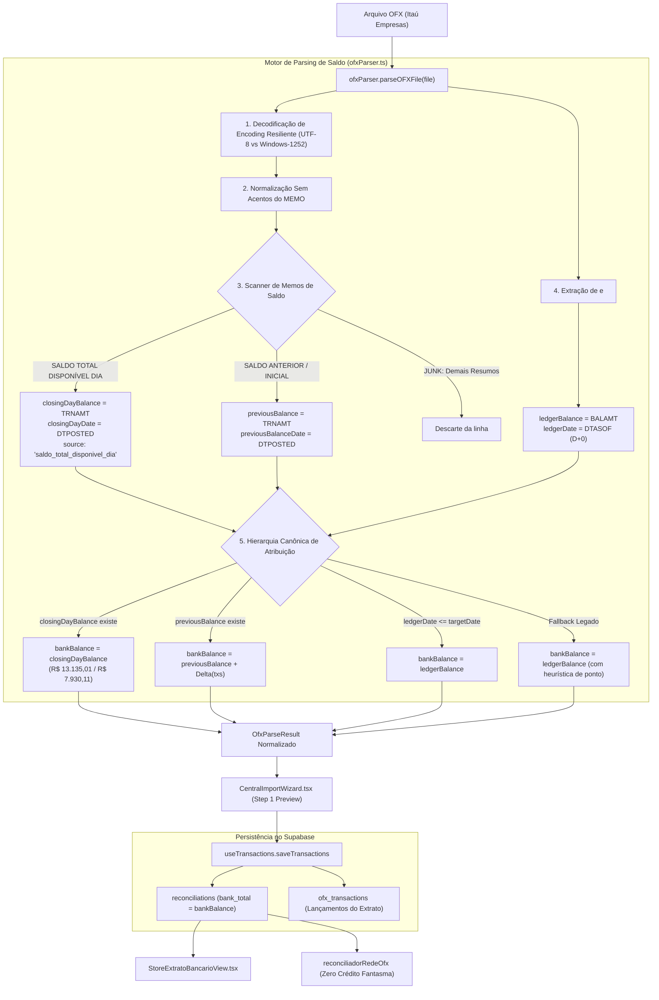

# Design — Spec 444: Âncora no Saldo do Dia (SALDO TOTAL DISPONÍVEL DIA) e Descarte de LEDGERBAL de D+0

## 1. Arquitetura de Fluxo Ponta a Ponta



---

## 2. Design System & UI Standards (Zinc-950)

Na visualização do Wizard (`CentralImportWizard.tsx`) e Extrato (`StoreExtratoBancarioView.tsx`):
- **Superfície do Card de Saldo:** `bg-card border border-border/50 rounded-xl p-4`
- **Valores Monetários:** `font-mono text-sm font-semibold`
- **Badge do Saldo do Dia:**
  - Classe: `bg-emerald-500/10 text-emerald-400 border border-emerald-500/20 text-[10px] px-2 py-0.5 rounded-full font-medium inline-flex items-center gap-1`
  - Texto: `✓ Saldo do Dia (Extrato Oficial)`
- **Alerta de LEDGERBAL Ignorado:**
  - Se `ledgerBalance !== bankBalance`, exibe tooltip discreto ou texto secundário:
    `text-[11px] text-muted-foreground font-mono`: `Saldo do arquivo (D+0): R$ 14.903,46 descartado para manter foto de ontem`.

---

## 3. Interfaces TypeScript Reais

### 3.1 `src/lib/parsers/ofxParser.ts`
```typescript
export interface OfxTransaction {
  storeName: string;
  amount: number;
  type: 'in' | 'out';
  date: string; // ISO 'YYYY-MM-DDTHH:mm:ssZ'
  title: string;
  fitid?: string;
  cnpj_cpf?: string;
  counterpart_name?: string;
}

export type BalanceSource = 
  | 'saldo_total_disponivel_dia' 
  | 'saldo_anterior_plus_tx' 
  | 'ledgerbal_exact' 
  | 'ledgerbal_fallback';

export interface OfxParseResult {
  alias: string;
  transactions: OfxTransaction[];
  bankBalance?: number;
  previousBalance?: number;
  previousBalanceDate?: string;
  accountLimit?: number;
  fileName?: string;
  closingDayBalance?: number;
  closingDayDate?: string;
  ledgerBalance?: number;
  ledgerBalanceDate?: string;
  calculatedClosingBalance?: number;
  balanceSource?: BalanceSource;
}
```

### 3.2 Lógica de Normalização e Extração
```typescript
// Normaliza texto para comparação imune a variações de UTF-8 / Windows-1252 / acentos
export function normalizeMemoText(text: string): string {
  return text
    .normalize('NFD')
    .replace(/[\u0300-\u036f]/g, '') // remove acentos
    .replace(/[^a-zA-Z0-9\s]/g, ' ') // remove caracteres de controle/corrompidos
    .replace(/\s+/g, ' ')           // colapsa múltiplos espaços
    .trim()
    .toUpperCase();
}

// Detecção estrita de Saldo do Dia
export function isClosingDayBalanceMemo(normalizedMemo: string): boolean {
  return (
    /SALDO\s*(?:TOTAL)?\s*DISPON[^\n\r<]*?DIA/i.test(normalizedMemo) ||
    /DISPON[IÍ]VEL\s*DIA/i.test(normalizedMemo) ||
    /SALDO\s*DO\s*DIA/i.test(normalizedMemo) ||
    /SDO\s*(?:FDO|FIM|FINAL)/i.test(normalizedMemo) ||
    /SALDO\s*FINAL/i.test(normalizedMemo)
  );
}

// Detecção estrita de Saldo Anterior
export function isPreviousBalanceMemo(normalizedMemo: string): boolean {
  return (
    normalizedMemo.includes('SALDO ANTERIOR') ||
    normalizedMemo.includes('SDO ANTERIOR') ||
    normalizedMemo.includes('SLD ANTERIOR') ||
    normalizedMemo.includes('SALDO INICIAL') ||
    normalizedMemo.includes('DISPONIVEL ANTERIOR')
  );
}
```

---

## 4. Cenários Obrigatórios

### 4.1 Happy Path: Extrato Itaú Real com Saldo do Dia
- **Entrada:**
  ```xml
  <STMTTRN>
    <TRNTYPE>CREDIT</TRNTYPE>
    <DTPOSTED>20260924100000[-03:EST]</DTPOSTED>
    <TRNAMT>13135.01</TRNAMT>
    <FITID>20260924005</FITID>
    <CHECKNUM>20260924005</CHECKNUM>
    <MEMO>SALDO TOTAL DISPONÍVEL DIA</MEMO>
  </STMTTRN>
  </BANKTRANLIST>
  <LEDGERBAL>
    <BALAMT>14903.46</BALAMT>
    <DTASOF>20260925100000[-03:EST]</DTASOF>
  </LEDGERBAL>
  ```
- **Processamento:**
  - O scanner identifica `isClosingDayBalanceMemo === true`.
  - `closingDayBalance = 13135.01`.
  - `closingDayDate = '2026-09-24'`.
  - `ledgerBalance = 14903.46`, `ledgerBalanceDate = '2026-09-25'`.
  - A linha é consumida como balanço e NÃO é adicionada como transação operacional.
  - `bankBalance = 13135.01`.
  - `balanceSource = 'saldo_total_disponivel_dia'`.
- **Resultado:** O saldo bancário salvo para 24/09 é exatamente R$ 13.135,01. O valor de R$ 14.903,46 de 25/09 é descartado com sucesso.

### 4.2 Edge Case: Extrato Sem Saldo do Dia (Apenas Saldo Anterior)
- **Entrada:**
  - Arquivo onde não há `SALDO TOTAL DISPONÍVEL DIA`, mas há `SALDO ANTERIOR` de R$ 17.026,91 em 23/09 e transações de ontem somando +R$ 1.500,00.
- **Processamento:**
  - Como `closingDayBalance` é undefined, aciona **Prioridade 2**.
  - `bankBalance = 17026.91 + 1500.00 = 18526.91`.
  - `balanceSource = 'saldo_anterior_plus_tx'`.
- **Resultado:** A conta é apurada deterministicamente sem depender de `<LEDGERBAL>`.

---

## 5. Critérios de Aceitação Verificáveis

1. **Terminal Gate (Build):** `npm run build` passa com zero erros de compilação TypeScript.
2. **Extração Exata dos 2 Arquivos Reais:**
   - Fixture 1: `bankBalance` deve ser estritamente `13135.01` (e não `14903.46`).
   - Fixture 2: `bankBalance` deve ser estritamente `7930.11` (e não `12874.36`).
3. **Imunidade a Encoding:** O parser deve identificar `SALDO TOTAL DISPONÍVEL DIA` com perfeição tanto se o buffer for decodificado em UTF-8 quanto em Windows-1252.
4. **Proteção de Transações:** A linha `SALDO TOTAL DISPONÍVEL DIA` NUNCA deve ser inserida em `ofx_transactions` como transação de receita ou movimentação de caixa.
5. **Zero Créditos Fantasmas na Rede:** No fechamento da filial, `unitemizedCredit` deve ser R$ 0,00.

---

## 6. Dois Cenários de Teste [SCAN -> INFER -> VERIFY -> FIX]

### Cenário A: Extrato Itaú 1 (R$ 13.135,01)
1. **SCAN:** Carregar bloco OFX contendo a transação `20260924005` com memo `SALDO TOTAL DISPONÍVEL DIA` e valor `13135.01`.
2. **INFER:** O parser deve retornar `bankBalance: 13135.01` e `balanceSource: 'saldo_total_disponivel_dia'`.
3. **VERIFY:** Executar teste automatizado conferindo se `result.bankBalance === 13135.01` e `result.transactions.length` não contém essa linha de saldo.
4. **FIX:** Ajustar regex para cobrir variações de espaços se o split de tags alterar o fim da linha.

### Cenário B: Extrato Itaú 2 com Encoding UTF-8 com Acento
1. **SCAN:** Criar arquivo OFX em buffer UTF-8 contendo caractere `Í` (`0xC3 0x8D`) em `DISPONÍVEL`.
2. **INFER:** A normalização de encoding deve extrair `7930.11` sem que o filtro JUNK descarte a linha.
3. **VERIFY:** Executar teste conferindo se `result.bankBalance === 7930.11`.
4. **FIX:** Garantir que o filtro JUNK seja avaliado estritamente após a checagem de saldo do dia.
