# Design Técnico — Spec 445: Motor Dedicado de Match Rede × OS por Loja (Valor Bruto Direto)

## 1. Fluxo de Execução Direto

```mermaid
sequenceDiagram
    autonumber
    actor Operador as Operador Financeiro
    participant Wizard as CentralImportWizard / Fase2
    participant RPC as match_stage2_rede_os (PostgreSQL)
    participant POS as pos_transactions
    participant PATIO as patio_os
    participant UI as Fase2RedeVsOsReview

    Operador->>Wizard: Sobe Arquivos de OS e Vendas da Rede
    Wizard->>POS: Grava vendas com gross_amount e store_id
    Wizard->>PATIO: Upsert das OSs (com credit_value, debit_value)
    Wizard->>RPC: Chama match_stage2_rede_os(target_date, null)
    
    rect rgb(20, 25, 35)
        Note over RPC: Varredura por Loja (store_id)
        RPC->>PATIO: Busca OS não casada com cartão = gross_amount
        alt Match 1:1 Único
            RPC->>POS: UPDATE matched_os_number = os_number
            RPC->>PATIO: UPDATE match_status = 'MATCHED'
        else Colisão (> 1 OS com mesmo valor)
            Note over RPC: Não chuta! Registra 'collision' com lista de candidatas
        else Nenhuma OS encontrada
            Note over RPC: Registra 'exhausted_orphan' (provado inexistente na loja)
        end
    end

    RPC-->>Wizard: Retorna JSON (matched, collisions, exhausted_orphans)
    Wizard->>UI: Exibe status transparente por transação
    UI-->>Operador: Verde (casada), Amarelo (colisão para escolher), Cinza (órfão provado)
```



---

## 2. Regra de Matching Simplificada (SQL)

```sql
-- Para cada venda v_pos da Rede:
SELECT id, os_number, client_name, total_value, paid_value
FROM public.patio_os
WHERE store_id = v_pos.store_id
  AND NOT (id = ANY(v_matched_os_ids))
  AND COALESCE(match_status, '') <> 'MATCHED'
  AND os_number NOT ILIKE '%faturamento%'
  AND os_number NOT ILIKE '%fat%'
  AND (
      -- Match direto por valor de cartão lançado na OS:
      ABS(COALESCE(credit_value, 0) - v_pos.gross_amount) <= 0.05
      OR ABS(COALESCE(debit_value, 0) - v_pos.gross_amount) <= 0.05
      OR ABS(COALESCE(credit_debit_value, 0) - v_pos.gross_amount) <= 0.05
      -- Ou match por saldo em aberto da OS:
      OR (
          (total_value - paid_value) > 0.05 
          AND ABS((total_value - paid_value) - v_pos.gross_amount) <= 0.05
      )
  );
```

### Decisão:
- **`COUNT = 1`**: vincula imediatamente.
- **`COUNT > 1`**: colisão registrada sem chute; usuário escolhe na UI.
- **`COUNT = 0`**: órfão garantido; carimbado como inexistente na loja.

---

## 3. Preservação Estrita do Caixa e Saldo Bancário

1. `pos_transactions.settlement_status` permanece estritamente como `'a_compensar'`. Vincular a OS **não liquida** a venda no extrato bancário.
2. O saldo bancário e o cofre continuam 100% íntegros.
