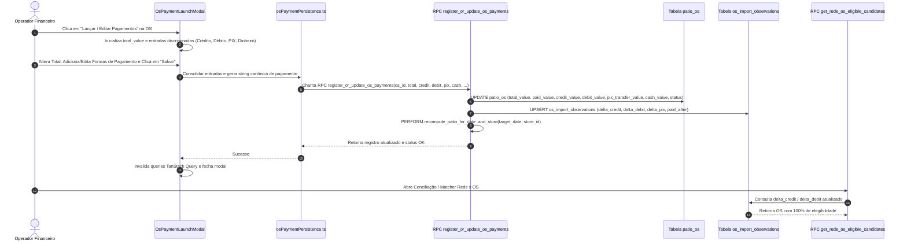

# 📐 Design Técnico & Especificação de Interface — Spec 456

## 1. Arquitetura de Fluxo Ponta a Ponta



---

## 2. Referências de Mercado Validadas (Lazyweb MCP)

- **Referência:** **Monarch Money** (`sites/monarch/monarch_65775635-f862-4b6f-82f3-0498d32d65d9.png`, siteId 242533, category: `goal-task`).
- **Padrão de UX Validado:**
  - Modal focado em split payment e reconciliação com listagem clara de linhas de lançamento.
  - Exibição do valor total original e cálculo em tempo real do valor restante a ser alocado.
  - Botão de ação rápida para preencher o valor restante na forma selecionada com 1 clique.
  - Alerta visual caso o total alocado ultrapasse ou fique abaixo do montante esperado, com indicação do status da transação.

---

## 3. Design System & UI Guardrails (Dark UI Zinc-950)

- **Superfícies e Elevação:**
  - Nível 0 (Fundo): `bg-background` (Zinc-950).
  - Nível 1 (Cartões e Modais): `bg-card border border-border/50` (Zinc-900).
  - Nível 2 (Popovers e Inputs): `bg-popover border border-border`.
- **Tipografia:**
  - Valores monetários em fonte mono tabular: `font-mono tabular-nums`.
  - Títulos semânticos em `font-display font-bold text-foreground`.
- **Badges Semânticos:**
  - Cartão Crédito: `bg-blue-500/10 text-blue-400 border border-blue-500/30`.
  - Cartão Débito: `bg-cyan-500/10 text-cyan-400 border border-cyan-500/30`.
  - PIX / Transferência: `bg-emerald-500/10 text-emerald-400 border border-emerald-500/30`.
  - Dinheiro: `bg-amber-500/10 text-amber-400 border border-amber-500/30`.
  - Boleto / Outros: `bg-zinc-800 text-zinc-300 border border-zinc-700`.
- **Micro-interações (≤ 200ms):**
  - Botões com transição de opacidade/cor instantânea (`transition-colors duration-150`).
  - Animação de entrada do modal suave via Framer Motion ou Tailwind (`animate-in fade-in zoom-in-95 duration-150`).

---

## 4. Interfaces TypeScript & Contratos de Backend

```typescript
// src/lib/osPaymentPersistence.ts

export type OsPaymentCategory = 
  | 'credito' 
  | 'debito' 
  | 'pix' 
  | 'dinheiro' 
  | 'transferencia' 
  | 'boleto' 
  | 'outro';

export interface OsPaymentEntry {
  id: string;
  category: OsPaymentCategory;
  label: string;
  value: number;
}

export interface OsPaymentFormData {
  osId: string;
  osNumber: string;
  storeId: string;
  clientName?: string;
  plate?: string;
  totalValue: number;
  entries: OsPaymentEntry[];
  targetDate?: string;
}

export interface SaveOsPaymentResult {
  success: boolean;
  osId: string;
  osNumber: string;
  totalValue: number;
  paidValue: number;
  openBalance: number;
  status: 'em_aberto' | 'pago_parcial' | 'finalizado';
  paymentMethod: string;
}
```

---

## 5. Cenários Obrigatórios

### 5.1. Happy Path
1. O operador abre a tela da loja na conciliação ou o Pátio e clica no botão "Lançar Pagamentos" da OS #8779 (Total: R$ 1.497,34).
2. O modal abre exibindo o total de R$ 1.497,34 e nenhuma forma cadastrada (Saldo em aberto: R$ 1.497,34).
3. O operador seleciona "Cartão Crédito", digita `1000.00` e clica em "Adicionar".
4. O saldo em aberto atualiza instantaneamente para R$ 497,34.
5. O operador seleciona "PIX", clica no botão "Completar Restante (R$ 497,34)" e clica em "Adicionar".
6. O saldo em aberto vai a R$ 0,00 e o status projetado muda para "Finalizado".
7. O operador clica em "Salvar Pagamentos".
8. A RPC atualiza `patio_os` (`credit_value = 1000`, `pix_transfer_value = 497.34`, `paid_value = 1497.34`, `payment_method = "Credito: 1000.00; PIX: 497.34"`, `status = "finalizado"`) e grava na `os_import_observations`.
9. O operador abre a aba de Cartões (Rede) da conciliação; a venda de R$ 1.000,00 na maquininha detecta a OS #8779 imediatamente como elegível (100% de conferência).

### 5.2. Edge Case
1. **OS com Valor Pago Maior que o Total da OS:**
   - O operador digita um pagamento de R$ 1.200,00 em uma OS cujo total era R$ 1.000,00 (ex: acréscimo de serviços).
   - O modal exibe um aviso em tempo real: "A soma dos pagamentos (R$ 1.200,00) excede o Total da OS (R$ 1.000,00). Deseja ajustar o Total da OS para R$ 1.200,00?".
   - Um botão de clique único "Ajustar Total da OS" sincroniza o `total_value` para R$ 1.200,00 antes do salvamento, prevenindo saldos negativos anômalos.

---

## 6. Critérios de Aceitação Verificáveis

1. **Persistência Fiel:**
   - Ao lançar R$ 1.000,00 em Crédito, `patio_os.credit_value` é exatamente `1000.00` no banco.
   - Ao lançar R$ 500,00 em PIX, `patio_os.pix_transfer_value` é exatamente `500.00` no banco.
   - O `paid_value` é a soma exata dos pagamentos lançados.
2. **Elegibilidade no Matcher:**
   - A chamada a `get_rede_os_eligible_candidates` para uma venda de maquininha de R$ 1.000,00 em crédito na data retorna a OS como `eligible` com motivo "confere 100% com o valor bruto".
3. **Substituição de Tela Inútil:**
   - O botão de cartão com ícone `CreditCard` que abria `CadastrarTransferenciaOsModal` é substituído pelo botão intuitivo de lançamento/edição de pagamentos da OS.
4. **Desbloqueio na Virada de Pátio:**
   - O campo de valor pago em `MissingPatioOsEditor.tsx` deixa de ter o bloqueio inoperante e passa a permitir o registro da forma de pagamento e valor.
5. **Quality Gate:**
   - Compilação limpa sem erros de TypeScript (`npm run build`).
   - Suíte de limites automatizada passando 100% com `node --test`.

---

## 7. Dois Cenários de Teste (SCAN -> INFER -> VERIFY -> FIX)

1. **Cenário 1 — Split Payment Misto (Crédito + PIX):**
   - **SCAN:** OS criada com total de R$ 1.500,00 em aberto.
   - **INFER:** Lançar R$ 1.000,00 no Crédito e R$ 500,00 no PIX deve produzir `status = 'finalizado'`, `credit_value = 1000.00`, `pix_transfer_value = 500.00`, `paid_value = 1500.00`.
   - **VERIFY:** Validação de asserção matemática estrita e formato de string de pagamento.
   - **FIX:** Normalização via helper `osPaymentPersistence.ts`.

2. **Cenário 2 — Lançamento Parcial e Saldo Residual:**
   - **SCAN:** OS de R$ 2.000,00 com entrada de R$ 500,00 no PIX.
   - **INFER:** A OS deve assumir `status = 'pago_parcial'`, com saldo em aberto de R$ 1.500,00 no pátio e `pix_transfer_value = 500.00`.
   - **VERIFY:** O recálculo do pátio (`recompute_patio_for_date_and_store`) deve manter R$ 1.500,00 no `na_loja_os`.
   - **FIX:** Sincronização atômica na RPC do banco.
