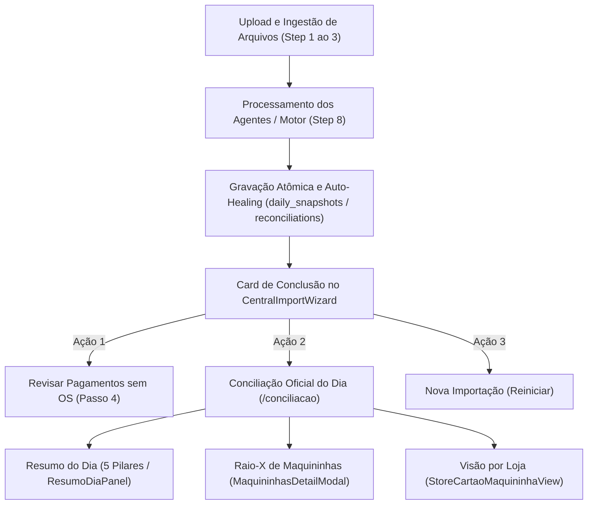

# Design Técnico: Remoção Completa do Cockpit (Spec 457)

Ref: GitHub Issue [#10: refactor/chore: remover Cockpit por completo](https://github.com/mktfun/mec-nica-financeiro/issues/10)

---

## 1. Arquitetura de Fluxo Pós-Remoção

Após a eliminação do Cockpit, o fluxo da aplicação financeira opera de forma mais limpa, rápida e canônica:



O Step 8 do `CentralImportWizard.tsx` deixa de carregar o componente secundário e pesado `PostMotorDiagnosticCockpit`, reduzindo o volume de consultas redundantes ao Supabase e o peso do bundle JavaScript.

---

## 2. Design System & UI Standards

- **Remoção sem Regressão Visual:** A remoção do bloco de renderização do Cockpit no Step 8 de `CentralImportWizard.tsx` preserva 100% da identidade visual Dark UI Zinc-950:
  - Fundo do Canvas: `bg-background` (Zinc-950).
  - Cards de Resumo e Auto-Healing: `bg-zinc-900/60 border border-zinc-800`.
  - Botões de Ação: `bg-emerald-500 text-zinc-950 hover:bg-emerald-400 font-bold`.
  - Terminal de Logs Profissional: `ImportExecutionTerminal.tsx` preservado imediatamente abaixo dos cards de ação.
- **Zero AI Slop:** Nenhuma classe arbitrária inserida; limpeza cirúrgica de código morto.

---

## 3. Interfaces TypeScript & Contratos de Dados

### 3.1 Tipos e Contratos a Serem Deletados
O arquivo [`src/types/cockpit360.ts`](file:///c:/Users/admin/.gemini/antigravity/scratch/financeiro/src/types/cockpit360.ts) será integralmente deletado. Seus tipos exclusivos são:
```typescript
// DELETADOS EM DEFINITIVO:
- SettlementStatusType ('entrou' | 'nao_entrou' | 'a_compensar' | 'divergente' | 'sem_movimento' | 'parcial')
- CockpitGlobalStatus ('conforme' | 'atencao' | 'critico')
- CockpitBrandDetail
- CockpitStoreDetail
- CockpitFlaggedTransaction
- CockpitKpis
- Cockpit360DiagnosticResponse
- CockpitFilterState
```

### 3.2 Contratos Compartilhados Preservados
Os contratos mantidos em [`src/hooks/useBackendConciliacao.ts`](file:///c:/Users/admin/.gemini/antigravity/scratch/financeiro/src/hooks/useBackendConciliacao.ts) e [`src/types/reconciliationContract.ts`](file:///c:/Users/admin/.gemini/antigravity/scratch/financeiro/src/types/reconciliationContract.ts):
```typescript
export interface StorePosDetail {
  store_id: string;
  store_name: string;
  rede_bruto: number;
  rede_liquido: number;
  rede_taxas: number;
  ofx_maquininhas: number;
  entrou_valor: number;
  nao_entrou_valor: number;
  a_compensar_valor: number;
  divergencia_valor: number;
  total_transacoes: number;
  status_compensacao: string;
  pos_transacoes: Array<{ id: string; amount: number; brand: string; settlement_status: string }>;
  ofx_transacoes: Array<{ id: string; amount: number; fitid: string; counterpart: string }>;
  os_cartao_transacoes: Array<{ id: string; os_number: string; plate: string; total_value: number; paid_value: number; credit_value?: number; debit_value?: number; payment_method: string }>;
}

export interface PosTripleReconciliationResult {
  target_date: string;
  total_rede_bruto: number;
  total_rede_liquido: number;
  total_rede_taxas: number;
  total_devolucoes: number;
  total_ofx_maquininhas: number;
  total_nao_entrou: number;
  stores: StorePosDetail[];
}

export function usePosTripleReconciliation(date: string);
```

---

## 4. Cenários Obrigatórios

### 4.1 Happy Path
1. O operador realiza a importação de planilhas e OFX no `CentralImportWizard.tsx`.
2. Ao concluir o processamento (Step 8), o estado `saveFinished` torna-se `true`.
3. O wizard exibe com precisão o resumo executivo, o card de auto-healing pericial, os botões de navegação ("Ir para a Conciliação do Dia", "Revisar Pagamentos sem OS") e o terminal de logs.
4. O operador clica em "Ir para a Conciliação do Dia" e acessa `/conciliacao` onde visualiza os 5 Pilares no `ResumoDiaPanel.tsx` e o batimento de maquininhas por loja, sem qualquer referência ao Cockpit obsoleto.

### 4.2 Edge Case
1. Falha no processamento durante a importação (ex.: erro de parse de arquivo):
   - O banner de erro estruturado (`ExecutionErrorBanner`) é exibido e os botões de retry funcionam normalmente.
   - O usuário pode reiniciar (`Nova Importação`) ou navegar livremente para outros módulos sem referências a componentes desmontados ou imports quebrados.

---

## 5. Critérios de Aceitação Verificáveis

1. **Eliminação Estrita de Artefatos:** Os arquivos `PostMotorDiagnosticCockpit.tsx`, `DiagnosticActionCards.tsx`, `StoreDiagnosticRow.tsx`, `src/types/cockpit360.ts`, `test-spec-384-cockpit.cjs` e `screenshot-cockpit-28.mjs` são completamente removidos do disco.
2. **Zero Imports Remanescentes:** Nenhuma menção a `PostMotorDiagnosticCockpit`, `cockpit360` ou tipos derivados existe no código TypeScript de `src/`.
3. **Preservação dos Fluxos Ativos:**
   - O hook `usePosTripleReconciliation` continua funcionando e tipado em `src/hooks/useBackendConciliacao.ts`.
   - As telas `/conciliacao`, `/lojas`, `/recebiveis`, `/patio` e `/importacoes` carregam e executam sem erros.
4. **Preservação de Dados Históricos:** Nenhuma linha de `pos_transactions`, `ofx_transactions`, `daily_snapshots` ou `reconciliations` é modificada ou deletada no banco.
5. **Quality Gate:** `npm run build` compila em modo produção com 0 erros de TypeScript e 0 warnings impeditivos.

---

## 6. Cenários de Teste Automatizados

Criar a suíte de testes `tests/e2e/tier2_boundary/spec457_remover_cockpit_audit.test.mjs`:
- **Teste 1 (Varredura de Imports & Artefatos):** Inspeciona a árvore de arquivos de `src/` e assegura que nenhum arquivo contém imports ou referências ativas a `cockpit360` ou `PostMotorDiagnosticCockpit`.
- **Teste 2 (Ausência Física de Arquivos Obsoletos):** Assegura que os 4 arquivos centrais do Cockpit não existem no sistema de arquivos.
- **Teste 3 (Integridade dos Serviços Compartilhados):** Valida que `usePosTripleReconciliation` e `PosTripleReconciliationResult` continuam exportados e funcionais em `useBackendConciliacao.ts`.
- **Teste 4 (Wizard de Importação Saudável):** Valida que `CentralImportWizard.tsx` possui a estrutura correta de renderização de Step 8 sem o nó filho órfão.
