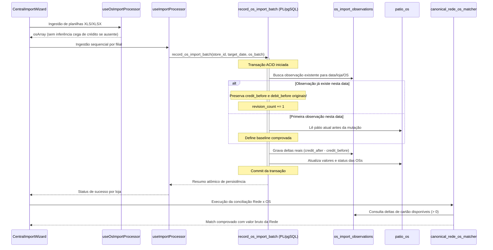

# Design: Preservar o Incremento Real dos Pagamentos da OS (Spec 460)

## Arquitetura de Fluxo



## Interfaces TypeScript Reais

```typescript
export interface OsImportItemPayload {
  os_number: string;
  plate?: string | null;
  client_name?: string | null;
  total_value: number;
  paid_value: number;
  payment_method?: string | null;
  status: 'em_aberto' | 'pago_parcial' | 'finalizado';
  raw_status?: string | null;
  credit_value: number;
  debit_value: number;
  pix_transfer_value: number;
  cash_value: number;
  opened_at?: string | null;
  closed_at?: string | null;
  last_payment_date?: string | null;
}

export interface RecordOsImportBatchResponse {
  success: boolean;
  store_id: string;
  target_date: string;
  total_processed: number;
  inserted_count: number;
  updated_count: number;
  observations_count: number;
  errors?: string[];
}

export interface OsImportObservationRecord {
  id: string;
  store_id: string;
  os_number: string;
  target_date: string;
  credit_before: number;
  credit_after: number;
  delta_credit: number;
  debit_before: number;
  debit_after: number;
  delta_debit: number;
  pix_before: number;
  pix_after: number;
  delta_pix: number;
  paid_before: number;
  paid_after: number;
  delta_paid: number;
  consumed_credit: number;
  consumed_debit: number;
  baseline_source: 'first_import' | 'historical_log' | 'existing_patio';
  revision_count: number;
  is_negative_correction: boolean;
}
```

## Cenários Obrigatórios

### 1. Happy Path: Incremento Comprovado e Reimportação Segura
- **Entrada:** OS 22622 em Mauá possuía base anterior comprovada de R$ 400,00 em crédito. Planilha de 30/09 traz crédito acumulado de R$ 2.727,00.
- **Processamento:** 
  1. A RPC identifica que a base inicial do dia é R$ 400,00.
  2. Grava `credit_before = 400.00`, `credit_after = 2727.00`, `delta_credit = 2327.00`.
  3. Atualiza `patio_os.credit_value = 2727.00`.
- **Reimportação:** Se o mesmo lote for reenviado mais tarde:
  1. A RPC detecta a observação existente de 30/09.
  2. Preserva `credit_before = 400.00`.
  3. Mantém `delta_credit = 2327.00` (não zera!).
- **Resultado na Conciliação:** Venda da Rede de valor bruto R$ 2.327,00 casa perfeitamente com a OS 22622.

### 2. Edge Case: Modalidade Ausente e Proteção Anti-Alucinação
- **Entrada:** OS importada possui total de R$ 1.500,00, mas a coluna de meio de pagamento está vazia ou sem menção a cartão/pix/dinheiro.
- **Processamento:** 
  1. O parser não infere crédito arbitrário: `parsed_credit = 0.00`, `parsed_debit = 0.00`.
  2. A observação registra `delta_credit = 0.00`, `delta_debit = 0.00`.
- **Resultado:** A OS não é considerada candidata para vendas de maquininhas Rede de R$ 1.500,00. O operador é informado de que a OS não possui pagamento em cartão comprovado.

### 3. Edge Case: Correção Negativa (Estorno / Redução de OS)
- **Entrada:** OS possuía R$ 1.000,00 de crédito. Nova planilha traz R$ 800,00 (retificação de R$ 200,00).
- **Processamento:**
  1. A RPC calcula delta real: $800 - 1000 = -200$.
  2. Não usa `Math.max(0, ...)`. Registra `delta_credit = -200.00` e `is_negative_correction = true`.
- **Resultado:** O sistema não cria crédito fantasma e audita a redução corretamente.

## Critérios de Aceitação Verificáveis

- [ ] **Incremento Real 400 → 2.727:** Mauá OS 22622 gera `delta_credit = 2327.00`. Reimportação do mesmo lote mantém a base anterior de 400 e não duplica consumo nem zera o delta.
- [ ] **Discriminação de Base Divergente:** Cenário 500 → 2.727 gera delta de 2.227 e **NÃO** vincula à venda da Rede de 2.327.
- [ ] **Atomicidade Total:** Falha na gravação de observação aborta a atualização de `patio_os`, impedindo que o pátio fique atualizado sem observação.
- [ ] **Concorrência Segura:** Duas importações para a mesma filial executam sequencialmente, sem sobrescrever a linha de base.
- [ ] **Remoção de Inferência Cega:** Planilha com meio de pagamento não identificado gera `parsed_credit = 0`, tornando a OS inelegível para match automático de maquininha.
- [ ] **Preservação de Integridade Contábil:** Vincular pagamento de OS não altera `paid_value` da OS já quitada e mantém o status de compensação bancária fidedigno.

## Cenários de Teste

### Teste 1: [SCAN -> INFER -> VERIFY -> FIX] — Linha de Base em Reimportações Múltiplas
1. **SCAN:** Criar OS no pátio com R$ 400,00 de crédito.
2. **INFER:** Importar lote que atualiza crédito para R$ 2.727,00. Observar criação de `os_import_observations` com delta 2.327,00.
3. **VERIFY:** Executar segunda importação com o mesmo arquivo (simulando reimportação diária).
4. **ASSERT:** Verificar se `credit_before` permanece 400,00 e `delta_credit` permanece 2.327,00 (e NÃO zero).

### Teste 2: [SCAN -> INFER -> VERIFY -> FIX] — Ausência de Meio de Pagamento
1. **SCAN:** Ingerir linha de OS com `total = 3.000` e campo de pagamento em branco.
2. **INFER:** O parser processa a linha sem inferir crédito.
3. **VERIFY:** Inspecionar `parsed_credit` e `delta_credit`.
4. **ASSERT:** `parsed_credit == 0` e `delta_credit == 0`. Candidatos da Rede com R$ 3.000,00 classificam a OS como `no_card_delta`.
