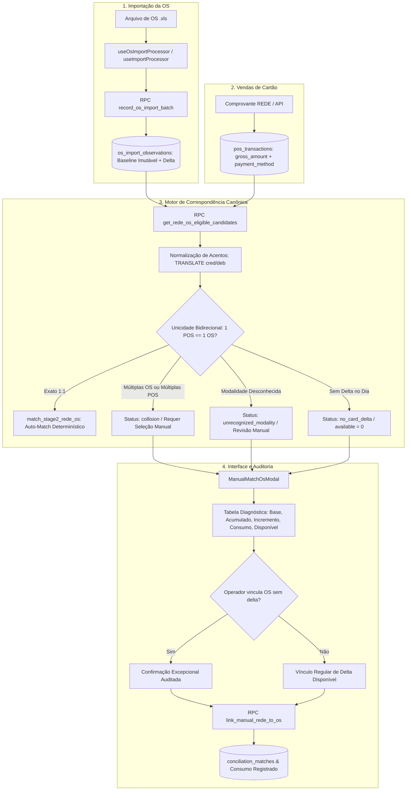

# Design: Unificar o Matcher Rede × OS, a Seleção Manual e o Diagnóstico (Spec 461)

## Arquitetura de Fluxo Ponta a Ponta



---

## Design System & UI Standards (Zinc-950)

Conforme as diretrizes de `DESIGN.md` e `skills/frontend-design-pro/SKILL.md`:
1. **Zero AI Slop & Honestidade Visual:**
   - Proibido badge verde/azul de "Match por Valor" quando `available_card_amount === 0`.
   - OSs sem incremento comprovado no dia recebem badge sóbrio em tom neutro/muted (`bg-muted text-muted-foreground border-border/40`).
   - OSs em colisão recebem destaque âmbar (`bg-amber-500/10 text-amber-400 border-amber-500/30`).
   - OSs com incompatibilidade de modalidade recebem destaque púrpura (`bg-purple-500/10 text-purple-400 border-purple-500/30`).
2. **Tokens Semânticos Obrigatórios:**
   - Superfície de fundo: `bg-background` (Zinc-950).
   - Cartões diagnósticos: `bg-card border border-border/50` (Zinc-900).
   - Popovers e modais: `bg-popover border border-border` com `shadow-2xl`.
   - Textos: `text-foreground`, `text-muted-foreground`, `text-primary`.
3. **Painel Diagnóstico de Linha de Base:**
   - No modal, para cada candidato, renderizar uma barra de decomposição financeira transparente:
     - `Base Anterior`: R$ X,XX
     - `Acumulado Atual`: R$ Y,YY
     - `Delta Importado`: R$ Z,ZZ
     - `Já Consumido`: R$ W,WW
     - `Disponível`: R$ D,DD
4. **Tratamento de Falha de Comunicação:**
   - Se a RPC falhar, exibir banner de erro recuperável (`bg-destructive/10 border border-destructive/30 text-destructive`) com botão "Tentar Novamente", sem renderizar listas de pátio genéricas fingindo serem candidatos elegíveis.

---

## Interfaces TypeScript Reais

```typescript
// src/hooks/useManualMatch.ts
export type CandidateMatchStatus =
  | 'eligible'
  | 'collision'
  | 'identity_mismatch'
  | 'modality_mismatch'
  | 'unrecognized_modality'
  | 'already_consumed'
  | 'divergent_value'
  | 'no_card_delta'
  | 'historical_no_delta';

export interface StoreOsCandidate {
  id: string;
  os_number: string;
  client_name: string;
  plate: string;
  total_value: number;
  paid_value: number;
  open_balance: number;
  payment_method: string;
  status: string;
  date: string;
  
  // Diagnóstico e Decomposição Contábil
  candidate_status: CandidateMatchStatus;
  reason_code: string;
  credit_before: number;
  credit_after: number;
  consumed_credit: number;
  delta_credit: number;
  debit_before: number;
  debit_after: number;
  consumed_debit: number;
  delta_debit: number;
  available_card_amount: number;
  pos_gross_amount: number;
  
  // Compatibilidade legada
  pix_transfer_value?: number;
  credit_value?: number;
  debit_value?: number;
  cash_value?: number;
}

export interface MatchStage2Result {
  success: boolean;
  target_date: string;
  matched_count: number;
  pos_matched: number;
  matched_pos_count: number;
  collisions_count: number;
  collisions: Array<{
    pos_id: string;
    store_id: string;
    gross_amount: number;
    payment_method: string;
    collision_type: 'multiple_os' | 'multiple_pos';
    candidates: any[];
  }>;
  exhausted_orphans_count: number;
  exhausted_orphans: any[];
  unmatched_pos_count: number;
  unmatched_os_cards_count: number;
  stage2_error?: string | null;
  totals: {
    rede_bruto: number;
    rede_liquido: number;
    rede_taxas: number;
  };
}

export interface AutoMatchDailyResult {
  success: boolean;
  date: string;
  pos_matched: number;
  matched_pos_count: number;
  pix_matched: number;
  matched_pix_count: number;
  collisions_prevented: number;
  corporate_tagged: number;
  stage2_error?: string | null;
  saidas_result?: any;
  receivables_result?: any;
}
```

---

## Cenários Obrigatórios

### 1. Happy Path: Pareamento Canônico 1:1 com Modalidade Acentuada
- **Cenário:**
  - Filial Mauá importa OS #22622 com `credit_before = 400.00`, `credit_after = 2727.00`, gerando `delta_credit = 2327.00`.
  - Arquivo da Rede contém 1 venda de valor bruto R$ 2.327,00 (NSU 171670498), modalidade: `"Cartão Crédito VISA"`.
  - Nenhuma outra venda de R$ 2.327,00 existe na filial para o dia, e nenhuma outra OS possui delta de R$ 2.327,00.
- **Resultado Nominal:**
  - A função de normalização converte `"Cartão Crédito VISA"` em `'cartao credito visa'`, ativando `v_is_credit = true`.
  - A verificação bidirecional confirma 1 única transação POS e 1 única OS com delta disponível de R$ 2.327,00.
  - `match_stage2_rede_os` vincula a transação, marca `pos_matched = 1`, consome `consumed_credit = 2327.00` e atualiza `patio_os.match_status = 'MATCHED'`.
  - O assistente de importação exibe no log: `🤖 Pareamento Concluído: 1 Venda(s) REDE casada(s) com OSs`.

### 2. Edge Case 1: Colisão Bidirecional (Duas Vendas Disputando Uma Única OS)
- **Cenário:**
  - Filial Santo André possui 1 OS (#501) com incremento de R$ 150,00 no débito.
  - No extrato da Rede da mesma data e filial, constam 2 vendas distintas de R$ 150,00 no débito (NSU 111111 e NSU 222222).
- **Comportamento Esperado:**
  - O motor detecta que ambas as transações POS competem pelo mesmo delta da OS #501.
  - Nenhuma das duas vendas é associada automaticamente (zero decisão por ordem arbitrária do loop).
  - Ambas são classificadas com `collision_type = 'multiple_pos'` e registradas em `collisions`.
  - No modal de conciliação manual, ao abrir qualquer uma das duas vendas, o operador visualiza o badge âmbar `Colisão Ambígua: 2 vendas disputando 1 OS` e decide manualmente qual transação corresponde ao atendimento real.

### 3. Edge Case 2: Falha de RPC e Interrupção de Fallback Deceptivo
- **Cenário:**
  - A conexão de rede oscila ou a chamada à RPC `get_rede_os_eligible_candidates` falha.
- **Comportamento Esperado:**
  - `useManualMatch.ts` não engole o erro e não faz consulta fallback em `patio_os`.
  - O hook retorna `isError: true` com a mensagem exata do erro.
  - O modal exibe um banner de alerta vermelho estruturado informando o erro de consulta e fornecendo botão "Tentar Novamente".
  - Nenhuma OS do pátio é exibida com o selo falso "Match por Valor".

### 4. Edge Case 3: OS do Histórico com Delta Zero ou Já Consumida
- **Cenário:**
  - O operador consulta uma OS antiga (#635) que teve `delta_credit = 0.00` ou cujo delta já foi 100% consumido por outro vínculo.
- **Comportamento Esperado:**
  - A coluna `available_card_amount` exibe `R$ 0,00`.
  - O modal exibe o motivo claro: `"Delta de cartão desta OS já foi consumido por outros vínculos"` ou `"OS importada nesta data sem novos lançamentos em cartão"`.
  - O botão de ação é estilizado como secundário: `Vincular (Excepcional / Manual)`.
  - Ao clicar, abre-se um diálogo de confirmação alertando que a OS não possui lançamento financeiro nesta data contábil.

---

## Critérios de Aceitação Verificáveis

1. **Eliminação do Erro 42702:**
   - A query `SELECT * FROM public.get_rede_os_eligible_candidates('5ec37de3-1c1b-4c4e-a987-9aaac670979f'::uuid, false)` executa com sucesso e retorna 0 erros no PostgreSQL.
2. **Normalização de Acentos Testada:**
   - Strings `"Cartão Crédito VISA"`, `"Crédito à Vista"`, `"Cartão Débito ELO"`, `"DÉBITO"` são classificadas corretamente em crédito e débito via testes automatizados.
3. **Unicidade Bidirecional Garantida:**
   - Teste automatizado com 2 vendas POS de mesmo valor disputando 1 OS comprova que nenhuma é vinculada de forma silenciosa ou arbitrária, gerando status `collision`.
4. **Consistência de Contratos de Resposta:**
   - `auto_match_daily_transactions` retorna `pos_matched` e `matched_pos_count` com valores idênticos.
   - O log do `CentralImportWizard.tsx` reporta o número real de vendas vinculadas sem jamais registrar 0 falso devido a discrepância de chaves.
5. **Erradicação do Falso "Match por Valor":**
   - No modal, nenhuma OS com `available_card_amount === 0` recebe badge de match ou destaque visual de sucesso.
6. **Alinhamento do `autoMatchingEngine.ts`:**
   - O motor em memória não soma `credit + debit` e não usa `paid_value`/`total_value` como fallback de maquininhas.
7. **Build e Testes Limpos:**
   - `npm run build` executa com 0 erros de TypeScript e 0 warnings impeditivos.
   - A suíte de testes `tests/integration/matcher-rede-os-diagnostics.test.mjs` passa com 100% de sucesso.

---

## Cenários de Teste [SCAN -> INFER -> VERIFY -> FIX]

### Cenário 1: Modal em Estado de Erro de Rede (Empty & Error State)
- **SCAN:** O operador abre o modal de correspondência manual para uma venda de maquininha durante instabilidade temporária do Supabase.
- **INFER:** O usuário não pode ver candidatos falsos do pátio acumulado e não pode ficar preso em loading infinito sem ação.
- **VERIFY:** O componente renderiza o banner de erro com ícone de alerta, código do erro e botão interativo "Tentar Novamente".
- **FIX:** Ao clicar em tentar novamente, a query do React Query é invalidada e repete a chamada à RPC sem poluir o estado local.

### Cenário 2: Confirmação de Ação Excepcional (Safety Dialogue)
- **SCAN:** O operador tenta forçar o vínculo manual de uma venda de R$ 500,00 a uma OS que possui `available_card_amount = 0` (por exemplo, OS que já estava paga ou que não teve lançamento de cartão no dia).
- **INFER:** Permitir o clique direto pode mascarar desvios operacionais ou duplicar baixas indevidas no financeiro da loja.
- **VERIFY:** O modal intercepta o clique e apresenta um diálogo modal secundário: *"Atenção: A OS #X não possui incremento de cartão nesta data. Vincular esta venda não consumirá deltas da importação. Deseja prosseguir com o vínculo manual excepcional?"*.
- **FIX:** O vínculo só é enviado para a RPC `link_manual_rede_to_os` após a confirmação expressa do operador.
